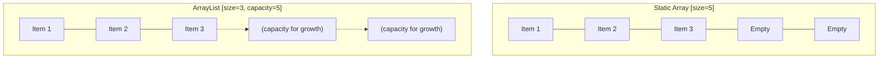

# 🔍 What is an ArrayList?

An ArrayList is a dynamic array-like data structure that automatically resizes itself as elements are added or removed. Unlike traditional arrays with fixed sizes, ArrayLists grow and shrink as needed, making them incredibly flexible for managing collections of data.

> [!NOTE]
> ArrayLists combine the best of both worlds: the random access efficiency of arrays with the flexibility of dynamic sizing.



## 🌍 Language-Specific Implementations

ArrayLists appear in many programming languages, often with different names but similar behavior:

- **Java**: `ArrayList<T>`
- **C#**: `List<T>`
- **Python**: `list` (built-in type)
- **JavaScript**: Standard arrays have ArrayList-like behavior
- **C++**: `std::vector<T>`
- **Kotlin**: `ArrayList<T>` or `MutableList<T>`

## 🤔 The Problem We're Solving

When working with data in programming, we often need to:
- Store a collection of related items
- Add new items over time
- Remove items when they're no longer needed
- Access items quickly by their position
- Modify items in the collection

Traditional arrays have limitations:
- Fixed size that must be declared upfront
- Cannot easily grow or shrink
- Require complex manual resizing operations

**This is where ArrayLists shine!** They handle all the resizing complexity behind the scenes, letting you focus on your data rather than memory management.

## 💡 Real-World Analogy

Think of a traditional array like a parking lot with a fixed number of spaces:
- Once full, no more cars can park
- Empty spaces waste valuable real estate
- To expand, you'd need to build a whole new lot and move all cars

An ArrayList is more like a valet parking service:
- Cars (elements) can be added without worrying about space
- When cars leave, the space is reclaimed
- The service handles all the logistics of finding or creating space

## 🚀 Real-World Applications

ArrayLists are used in countless applications:

- **Social Media Feeds**: Dynamically loading and displaying posts
- **Music Playlists**: Adding and removing songs from your queue
- **E-commerce Shopping Carts**: Managing items before checkout
- **Browser History**: Tracking pages you've visited
- **Game Development**: Managing collections of game objects

## 🎯 What We'll Learn

In this step-by-step guide, we'll explore:
1. How ArrayLists work internally
2. Basic operations: adding and removing elements
3. The efficiency of different operations
4. Common patterns and best practices
5. Practical implementation examples

> [!TIP]
> As you work through these lessons, try to think about how you might use ArrayLists in your own projects. What kind of data would benefit from this structure?

Let's dive in and master this fundamental data structure!

<details>
<summary>Want to see an ArrayList in action?</summary>

Here's a quick example in JavaScript:

```javascript
// Create a new ArrayList
const fruits = [];

// Add elements
fruits.push("Apple");   // ["Apple"]
fruits.push("Banana");  // ["Apple", "Banana"]
fruits.push("Orange");  // ["Apple", "Banana", "Orange"]

// Remove an element (at index 1)
fruits.splice(1, 1);    // ["Apple", "Orange"]

// Access an element
console.log(fruits[0]); // "Apple"
```

In this example, we didn't have to worry about the array's size - it automatically grew when we added elements and adjusted when we removed one!
</details>

Are you ready to explore how ArrayLists work under the hood? Let's continue to the next step! 