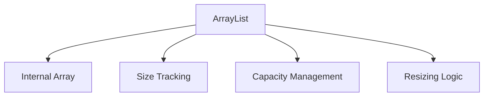
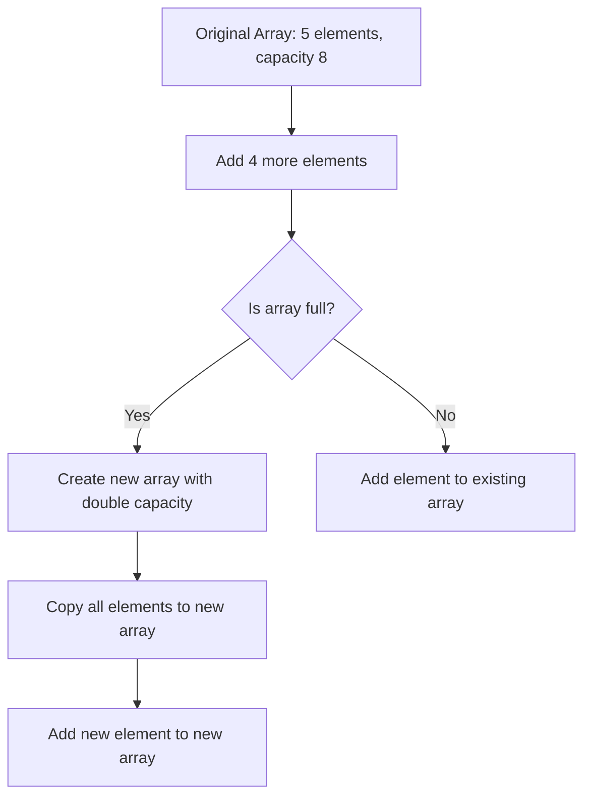
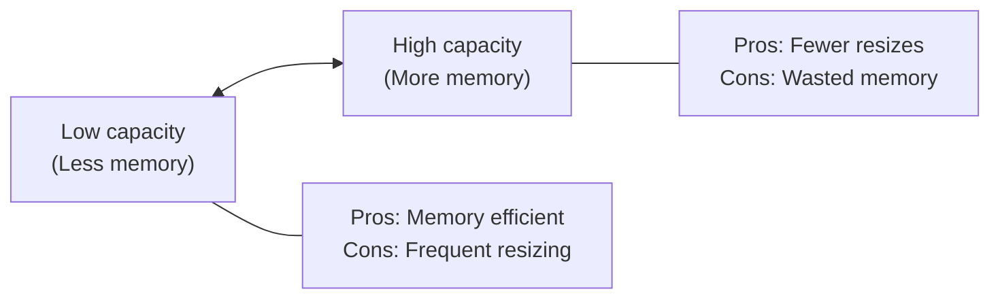

# 🔧 The Internal Structure of ArrayLists

To truly understand ArrayLists, we need to peek under the hood and see how they're built. This knowledge will help you make better decisions about when and how to use them.

## 🧱 The Building Blocks

At its core, an ArrayList is built on top of a regular array. However, it adds a layer of intelligence to manage that array dynamically:



Let's break down these components:

### 1️⃣ Internal Array

The actual data is stored in a regular array. This is why ArrayLists maintain the fast random access property - they can jump directly to any index in constant time.

### 2️⃣ Size Tracking

The ArrayList keeps track of how many elements are actually stored, which might be different from the capacity of the internal array.

### 3️⃣ Capacity Management

The ArrayList monitors how full the internal array is and decides when it needs more space.

### 4️⃣ Resizing Logic

When more space is needed, the ArrayList creates a new, larger array and copies all elements over.

## 🔄 The Resizing Process

The magic of ArrayLists happens during resizing. Let's visualize this process:



### Memory View: Before and After Resizing

```
Before Resizing (size=5, capacity=5):
Memory:  [A][B][C][D][E]
Indices:  0  1  2  3  4

Adding element 'F' triggers resize...

After Resizing (size=6, capacity=10):
Memory:  [A][B][C][D][E][F][_][_][_][_]
Indices:  0  1  2  3  4  5  6  7  8  9
```

### Resizing Strategies Across Languages

Different languages implement slightly different resizing strategies:

| Language | Initial Capacity | Growth Factor | Notes |
|----------|-----------------|--------------|-------|
| Java | 10 | 1.5x | Also has `ensureCapacity()` method |
| C# (List<T>) | 4 | 2x | Exponential growth |
| C++ (vector) | Varies | Typically 2x | Implementation-defined |
| Python (list) | Varies | ~1.125x | Growth is more gradual |
| JavaScript | Engine-dependent | Varies | Hidden from developer |

> [!NOTE]
> Most ArrayList implementations double the capacity when resizing. This amortizes the cost of resizing over many operations.

## 🧮 A Simple Implementation

Here's a simplified version of how an ArrayList might be implemented:

```javascript
class ArrayList {
  constructor(initialCapacity = 10) {
    this.data = new Array(initialCapacity); // Initial capacity of 10
    this.size = 0;             // Current number of elements
  }

  add(element) {
    // Check if we need to resize
    if (this.size === this.data.length) {
      // Create new array with double capacity
      const newArray = new Array(this.data.length * 2);
      
      // Copy all existing elements
      for (let i = 0; i < this.size; i++) {
        newArray[i] = this.data[i];
      }
      
      // Replace old array with new one
      this.data = newArray;
      console.log(`Resized from ${this.data.length/2} to ${this.data.length}`);
    }
    
    // Add the new element and increment size
    this.data[this.size] = element;
    this.size++;
  }
  
  get(index) {
    if (index < 0 || index >= this.size) {
      throw new Error("Index out of bounds");
    }
    return this.data[index];
  }
  
  size() {
    return this.size;
  }
}
```

> [!TIP]
> Notice how the `size` property tracks the number of elements, while the array's `length` represents its capacity.

## 🔍 Memory Efficiency

An important aspect of ArrayLists is the tradeoff between memory usage and performance:



For memory-constrained environments, some ArrayList implementations provide a `trimToSize()` method that reduces the internal array's capacity to exactly match the current size.

## 🤔 Think About It

<details>
<summary>Why not just resize the array by adding one more slot each time?</summary>

If we only increased the capacity by 1 each time, we'd need to resize and copy all elements for every single addition after the array is full. This would make adding elements an O(n) operation every time, which is very inefficient for large lists.

By doubling the capacity, we ensure that resizing happens less frequently. This makes the average cost of adding an element O(1) - much more efficient!

Consider adding 1000 elements:
- With +1 resizing: We'd resize 999 times, copying ~500,000 elements total
- With 2x resizing: We'd resize only ~10 times, copying ~2,000 elements total
</details>

<details>
<summary>What happens to the old array after resizing?</summary>

In garbage-collected languages like JavaScript, Java, or Python, the old array will be automatically cleaned up when there are no more references to it. In languages with manual memory management like C++, the implementation would need to explicitly free the memory used by the old array.

This is one reason why ArrayLists can be more memory-intensive than fixed arrays - during resizing, there might briefly be two copies of the data in memory.
</details>

## 🎯 Key Takeaways

- An ArrayList uses a regular array internally
- It tracks both size (elements used) and capacity (total available slots)
- When the array fills up, it creates a new, larger array and copies all elements
- This resizing strategy provides a good balance between memory usage and performance
- Different languages implement slightly different growth strategies

In the next lesson, we'll explore how to add elements to an ArrayList and understand the efficiency of this operation. 