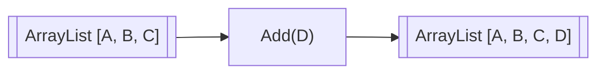
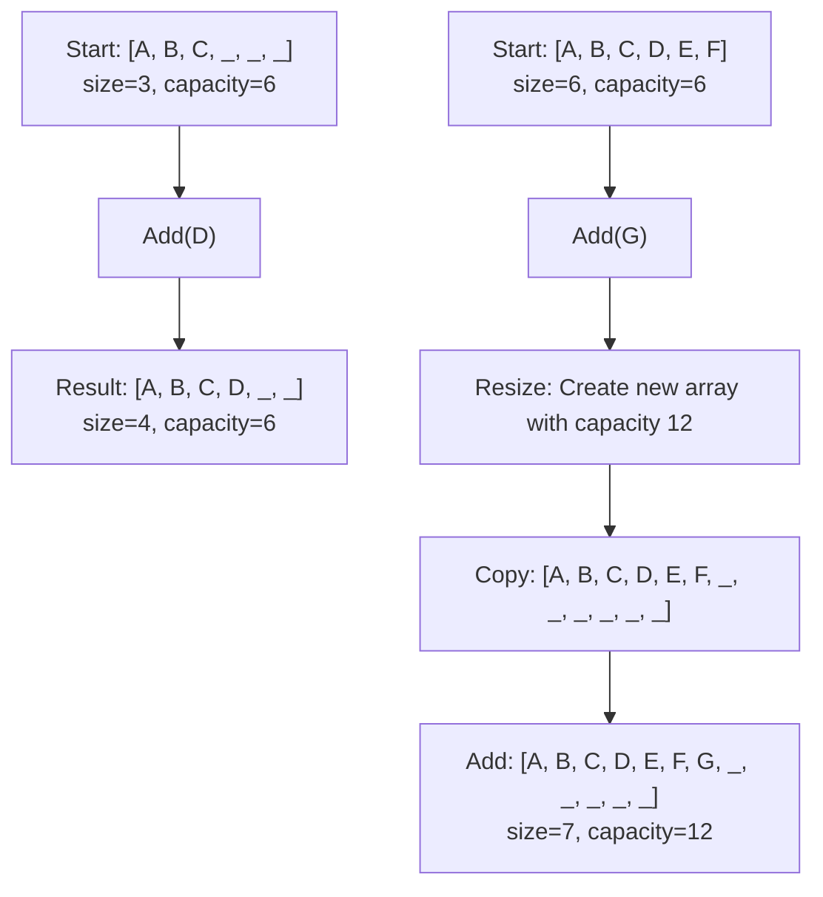
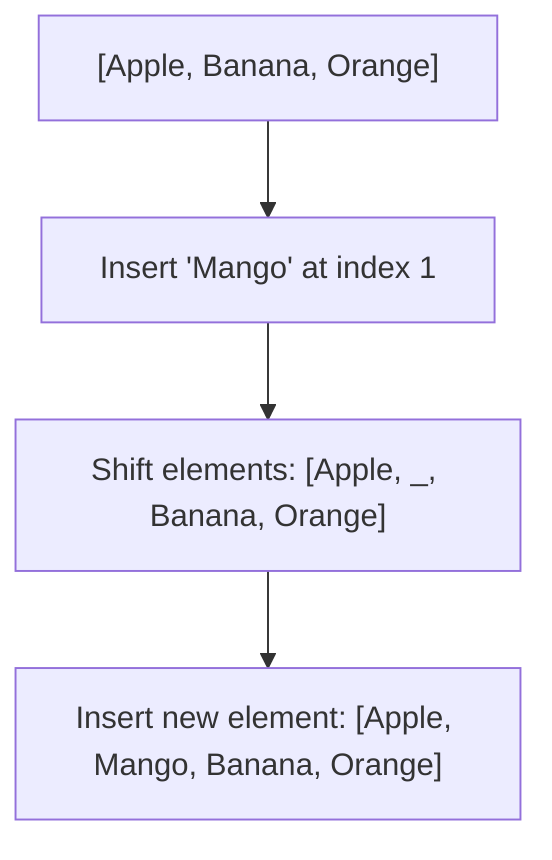

# ➕ Adding Elements to an ArrayList

One of the most common operations with ArrayLists is adding new elements. Let's explore how this works and why it's so efficient.

## 🎯 The Add Operation

Adding an element to an ArrayList typically means appending it to the end of the list. This operation is deceptively simple but has some interesting properties.



## 🧮 Implementation Deep Dive

Let's look at how the `add` method is implemented:

```javascript
add(element) {
  this.data.push(element);
}
```

That's it! In JavaScript, the native array's `push` method handles all the complexity for us. But what's happening under the hood?

1. Check if there's room in the internal array
2. If there's room, add the element at the next available position
3. If there's no room, resize the array first, then add the element

Let's visualize this process:



## ⏱️ Time Complexity Analysis

The time complexity of adding an element to an ArrayList depends on whether a resize is needed:

- **Best case (no resize needed)**: O(1) - constant time
- **Worst case (resize needed)**: O(n) - linear time, where n is the number of elements

However, the **amortized time complexity** is O(1). This means that while some individual operations might take longer, the average time across many operations is constant.

> [!NOTE]
> Amortized analysis considers the cost averaged over a sequence of operations, not just a single operation in isolation.

## 💡 Why Amortized O(1)?

Let's understand why adding elements is amortized O(1) with a simple thought experiment:

Imagine we start with an empty ArrayList with initial capacity 1:
- Add 1st element: No resize, cost = 1
- Add 2nd element: Resize to capacity 2, copy 1 element, cost = 1 + 1 = 2
- Add 3rd element: Resize to capacity 4, copy 2 elements, cost = 1 + 2 = 3
- Add 4th element: No resize, cost = 1
- Add 5th element: Resize to capacity 8, copy 4 elements, cost = 1 + 4 = 5
- ...and so on

If we add n elements, the total cost is approximately 3n operations. Dividing by n gives us an average cost of O(1) per operation!

## 🚀 Adding at Specific Positions

While adding to the end is most common, we can also insert elements at specific positions:

```javascript
// Insert "Mango" at index 1
fruits.splice(1, 0, "Mango");
```

This operation is more expensive because all elements after the insertion point need to be shifted:



> [!WARNING]
> Adding elements at the beginning or middle of an ArrayList is an O(n) operation because elements need to be shifted. If you frequently need to insert elements at arbitrary positions, consider using a LinkedList instead.

## 🧠 Practice Exercise

<details>
<summary>What would happen if we added 1000 elements one by one to an ArrayList with initial capacity 10?</summary>

The ArrayList would resize several times:
1. First resize at 10 elements (new capacity: 20)
2. Second resize at 20 elements (new capacity: 40)
3. Third resize at 40 elements (new capacity: 80)
4. Fourth resize at 80 elements (new capacity: 160)
5. Fifth resize at 160 elements (new capacity: 320)
6. Sixth resize at 320 elements (new capacity: 640)
7. Seventh resize at 640 elements (new capacity: 1280)

After adding all 1000 elements, the ArrayList would have a capacity of 1280 and a size of 1000. Despite needing 7 resize operations, the amortized cost per element is still O(1).
</details>

## 🎯 Key Takeaways

- Adding elements to the end of an ArrayList is usually very fast (amortized O(1))
- Occasional resizing operations are more expensive but happen infrequently
- Adding elements at specific positions is more expensive (O(n)) due to shifting
- The doubling strategy for resizing ensures good performance even as the list grows large

In the next lesson, we'll explore how to remove elements from an ArrayList. 