# ➖ Removing Elements from an ArrayList

Removing elements is another fundamental operation for ArrayLists. Let's explore how this works and what happens behind the scenes.

## 🎯 The Remove Operation

When we remove an element from an ArrayList, we typically specify the index of the element we want to remove. The ArrayList then needs to:
1. Remove the element at that index
2. Shift all subsequent elements to fill the gap
3. Update the size of the ArrayList


## 🧮 Implementation Deep Dive

Let's look at how the `remove` method is implemented:

```javascript
remove(index) {
  if (index < 0 || index >= this.size) {
    throw new Error("Index out of bounds");
  }
  
  // Save the removed element (optional, for returning)
  const removedElement = this.data[index];
  
  // Shift all elements after the removed element
  for (let i = index; i < this.size - 1; i++) {
    this.data[i] = this.data[i + 1];
  }
  
  // Clear the last position and update size
  this.data[this.size - 1] = undefined; // Help garbage collection
  this.size--;
  
  // Optionally shrink the array if it's too empty
  // this.shrinkIfNeeded();
  
  return removedElement;
}
```

This implementation:
1. Validates the index
2. Shifts all elements after the removed element one position to the left
3. Clears the last element to help with garbage collection
4. Updates the size

## 🎬 Step-by-Step Removal Visualization

Let's walk through removing an element at index 1 from `[Apple, Banana, Orange, Mango]`:

```
Initial state: [Apple, Banana, Orange, Mango]
              size=4, capacity=4

Step 1: Remove element at index 1 (Banana)
Step 2: Shift elements after index 1:
         - Move Orange from index 2 to index 1: [Apple, Orange, Orange, Mango]
         - Move Mango from index 3 to index 2: [Apple, Orange, Mango, Mango]
Step 3: Clear last element: [Apple, Orange, Mango, undefined]
Step 4: Decrement size: size=3, capacity=4
```

## ⏱️ Time Complexity Analysis

The time complexity of removing an element from an ArrayList depends on the position:

| Operation | Time Complexity | Elements Shifted |
|-----------|----------------|-----------------|
| Remove from end | O(1) | 0 |
| Remove from middle | O(n) | ~n/2 on average |
| Remove from beginning | O(n) | n-1 |

This performance difference is visualized below:



```mermaid
graph TD
    A["ArrayList [A, B, C, D, E, F, G, H]"] --> B["Remove from beginning<br>remove(0)"]
    A --> C["Remove from middle<br>remove(3)"]
    A --> D["Remove from end<br>remove(7)"]
    
    B --> E["Shift 7 elements ❌<br>High cost"]
    C --> F["Shift 4 elements ⚠️<br>Medium cost"]
    D --> G["Shift 0 elements ✅<br>Low cost"]
```

> [!WARNING]
> If you frequently need to remove elements from the beginning of a collection, consider using a data structure like a LinkedList or a Queue that can do this more efficiently.

## 🔄 Memory Management Considerations

Removing elements from an ArrayList involves several memory management aspects:

1. **Element References**: Most implementations set the vacated position to `null` or `undefined` to help garbage collection
2. **Capacity Shrinking**: Some implementations reduce capacity if the array becomes too empty (e.g., when size < capacity/4)
3. **Memory Fragmentation**: Frequent removals and additions can lead to memory fragmentation in some environments

```javascript
// Example shrinking implementation
shrinkIfNeeded() {
  if (this.size < this.data.length / 4 && this.data.length > 10) {
    // Shrink the array to half its current capacity
    const newArray = new Array(Math.floor(this.data.length / 2));
    for (let i = 0; i < this.size; i++) {
      newArray[i] = this.data[i];
    }
    this.data = newArray;
  }
}
```

## 🌍 Language-Specific Remove Operations

Different languages provide different ways to remove elements:

```java
// Java
list.remove(1);                 // Remove by index
list.remove("element");         // Remove by value (first occurrence)
list.removeIf(e -> e > 10);     // Remove with predicate (Java 8+)
```

```python
# Python
my_list.pop(1)                  # Remove by index and return
my_list.remove("element")       # Remove by value (first occurrence)
my_list = [x for x in my_list if x != "element"]  # Remove all occurrences
```

```javascript
// JavaScript
list.splice(1, 1);              // Remove by index
list.splice(list.indexOf("element"), 1);  // Remove by value (first occurrence)
list = list.filter(x => x !== "element"); // Remove all occurrences
```

## 🚀 Alternative Removal Strategies

### Removing by Value

Sometimes we want to remove an element based on its value rather than its index:

```javascript
function removeByValue(arrayList, value) {
  for (let i = 0; i < arrayList.size; i++) {
    if (arrayList.get(i) === value) {
      arrayList.remove(i);
      return true; // Element found and removed
    }
  }
  return false; // Element not found
}
```

### Removing Multiple Elements

If you need to remove multiple elements that match a certain condition, it's more efficient to traverse the list from back to front:

```javascript
function removeAllMatching(arrayList, condition) {
  for (let i = arrayList.size - 1; i >= 0; i--) {
    if (condition(arrayList.get(i))) {
      arrayList.remove(i);
    }
  }
}
```

> [!NOTE]
> Traversing backward avoids the issue of shifting indices during removal.

## ⚠️ Common Pitfalls

1. **Concurrent Modification**: Modifying an ArrayList while iterating over it can cause unexpected behavior

   ```javascript
   // Problematic code
   for (let i = 0; i < list.size(); i++) {
     if (shouldRemove(list.get(i))) {
       list.remove(i); // This modifies the indices of remaining elements!
     }
   }
   ```

2. **Inefficient Bulk Removal**: Removing multiple elements one by one

   ```javascript
   // Instead of:
   for (const item of itemsToRemove) {
     list.remove(list.indexOf(item));
   }
   
   // Consider:
   list.removeAll(itemsToRemove); // If available
   ```

3. **Not Checking Return Values**: Remove operations often return the removed element or a success indicator

   ```java
   boolean wasRemoved = list.remove("element"); // Always check this!
   ```

## 🧠 Practice Exercise

<details>
<summary>What happens if we remove elements from an ArrayList in a forward loop?</summary>

If you remove elements while iterating forward through an ArrayList, you'll encounter issues with shifting indices:

```javascript
// Problematic code
for (let i = 0; i < list.size(); i++) {
  if (list.get(i) % 2 === 0) { // Remove even numbers
    list.remove(i);
    // Problem: After removal, all elements shift left
    // The next element is now at the current index, but the loop will move to i+1
  }
}
```

This can cause elements to be skipped. For example, if you remove element at index 2, the element that was at index 3 moves to index 2, but your loop will proceed to index 3, skipping the element that moved.

The solution is to either:
1. Iterate backward: `for (let i = list.size() - 1; i >= 0; i--)`
2. Adjust the index after removal: `list.remove(i--);`
3. Use a while loop with a manual index increment:
   ```javascript
   let i = 0;
   while (i < list.size()) {
     if (shouldRemove(list.get(i))) {
       list.remove(i);
       // Don't increment i since elements shifted
     } else {
       i++; // Only increment if no removal happened
     }
   }
   ```
</details>

## 🎯 Key Takeaways

- Removing elements requires shifting all subsequent elements to fill the gap
- Removal from the end is O(1), while removal from elsewhere is O(n)
- When removing multiple elements, consider traversing the list backward
- Be careful when removing elements during iteration to avoid skipping elements
- Different languages offer various removal methods for different use cases
- Memory management is an important consideration for large collections

In the next lesson, we'll explore how to access and modify elements in an ArrayList. 