# ➖ Removing Elements from an ArrayList

Removing elements is another fundamental operation for ArrayLists. Let's explore how this works and what happens behind the scenes.

## 🎯 The Remove Operation

When we remove an element from an ArrayList, we typically specify the index of the element we want to remove. The ArrayList then needs to:
1. Remove the element at that index
2. Shift all subsequent elements to fill the gap
3. Update the size of the ArrayList


## 🧮 Implementation Deep Dive

Let's look at how the `remove` method is implemented:

```javascript
remove(index) {
  if (index >= 0 && index < this.data.length) {
    for (let i = index; i < this.data.length - 1; i++) {
      this.data[i] = this.data[i + 1];
    }
    this.data.pop();
  }
}
```

This implementation:
1. Checks if the index is valid
2. Shifts all elements after the removed element one position to the left
3. Removes the last element (which is now a duplicate) using `pop()`

Let's visualize this process:


## 🔄 Step-by-Step Example

Let's walk through removing an element at index 1 from `[Apple, Banana, Orange, Mango]`:

1. Verify index 1 is valid (it is)
2. Start shifting elements:
   - Move `Orange` from index 2 to index 1: `[Apple, Orange, Orange, Mango]`
   - Move `Mango` from index 3 to index 2: `[Apple, Orange, Mango, Mango]`
3. Remove the last element: `[Apple, Orange, Mango]`

> [!TIP]
> Some implementations might set the last element to `null` or `undefined` before removing it to help with garbage collection.

## ⏱️ Time Complexity Analysis

The time complexity of removing an element from an ArrayList depends on the position:

- **Removing from the end**: O(1) - constant time
- **Removing from the beginning or middle**: O(n) - linear time, where n is the number of elements after the removal point

This is because removing from anywhere except the end requires shifting elements to fill the gap.

## 🧠 Efficiency Considerations

The position from which you remove elements can significantly impact performance:

```mermaid
graph TD
    A["ArrayList [A, B, C, D, E, F, G, H]"] --> B["Remove from beginning<br>remove(0)"]
    A --> C["Remove from middle<br>remove(3)"]
    A --> D["Remove from end<br>remove(7)"]
    
    B --> E["Shift 7 elements ❌<br>High cost"]
    C --> F["Shift 4 elements ⚠️<br>Medium cost"]
    D --> G["Shift 0 elements ✅<br>Low cost"]
```



> [!WARNING]
> If you frequently need to remove elements from the beginning of a collection, consider using a data structure like a LinkedList or a Queue that can do this more efficiently.

## 🚀 Alternative Removal Strategies

### Removing by Value

Sometimes we want to remove an element based on its value rather than its index:

```javascript
function removeByValue(arrayList, value) {
  for (let i = 0; i < arrayList.size(); i++) {
    if (arrayList.get(i) === value) {
      arrayList.remove(i);
      return true; // Element found and removed
    }
  }
  return false; // Element not found
}
```

### Removing Multiple Elements

If you need to remove multiple elements that match a certain condition, it's more efficient to traverse the list from back to front:

```javascript
function removeAllMatching(arrayList, condition) {
  for (let i = arrayList.size() - 1; i >= 0; i--) {
    if (condition(arrayList.get(i))) {
      arrayList.remove(i);
    }
  }
}
```

> [!NOTE]
> Traversing backward avoids the issue of shifting indices during removal.

## 🧠 Practice Exercise

<details>
<summary>What happens if we remove elements from an ArrayList in a forward loop?</summary>

If you remove elements while iterating forward through an ArrayList, you'll encounter issues with shifting indices:

```javascript
// Problematic code
for (let i = 0; i < list.size(); i++) {
  if (list.get(i) % 2 === 0) { // Remove even numbers
    list.remove(i);
    // Problem: After removal, all elements shift left
    // The next element is now at the current index, but the loop will move to i+1
  }
}
```

This can cause elements to be skipped. For example, if you remove element at index 2, the element that was at index 3 moves to index 2, but your loop will proceed to index 3, skipping the element that moved.

The solution is to either:
1. Iterate backward: `for (let i = list.size() - 1; i >= 0; i--)`
2. Adjust the index after removal: `list.remove(i--);`
3. Use a while loop with a manual index increment
</details>

## 🎯 Key Takeaways

- Removing elements requires shifting all subsequent elements to fill the gap
- Removal from the end is O(1), while removal from elsewhere is O(n)
- When removing multiple elements, consider traversing the list backward
- Be careful when removing elements during iteration to avoid skipping elements

In the next lesson, we'll explore how to access and modify elements in an ArrayList. 