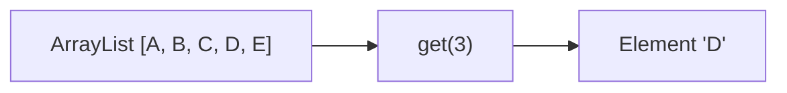
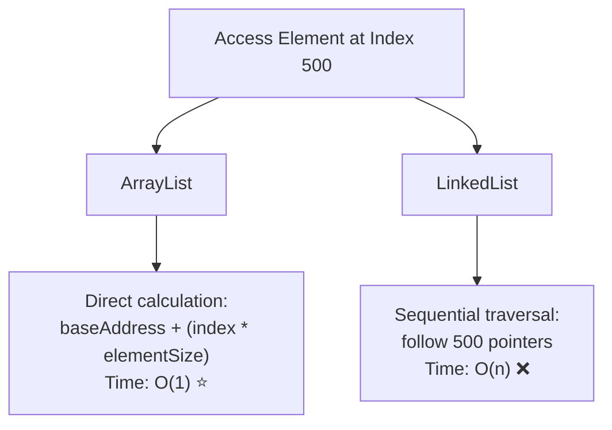

# 🔍 Accessing and Modifying ArrayList Elements

One of the greatest strengths of ArrayLists is their ability to provide fast, direct access to any element. Let's explore how to access and modify elements efficiently.

## 🎯 Random Access in ArrayLists

Unlike some other data structures (like LinkedLists), ArrayLists excel at random access - the ability to jump directly to any element by its index.



## 🧮 Implementation Deep Dive

The `get` and `set` methods are remarkably simple:

```javascript
get(index) {
  if (index < 0 || index >= this.size) {
    throw new Error("Index out of bounds");
  }
  return this.data[index];
}

set(index, element) {
  if (index < 0 || index >= this.size) {
    throw new Error("Index out of bounds");
  }
  const oldValue = this.data[index]; // Optional: save for returning
  this.data[index] = element;
  return oldValue; // Optional: return the replaced value
}
```

These methods:
1. Check if the index is valid
2. Directly access or modify the element at that index in the internal array

## ⏱️ Performance Comparison with Other Data Structures

Let's compare the access time of ArrayLists with other common data structures:

| Operation | ArrayList | LinkedList | HashMap | Tree |
|-----------|-----------|------------|---------|------|
| Access by index | O(1) ⭐ | O(n) | N/A | N/A |
| Access first element | O(1) | O(1) | N/A | O(log n) |
| Access last element | O(1) | O(1)* | N/A | O(log n) |
| Find by value | O(n) | O(n) | O(1) ⭐ | O(log n) |

*O(1) for doubly-linked lists with tail pointers, otherwise O(n)



This O(1) access time is a major advantage of ArrayLists over other data structures like LinkedLists, which require O(n) time to access arbitrary elements.

## 🔄 Common Access Patterns

### 1️⃣ Sequential Access

Iterating through all elements in order:

```javascript
// Standard for loop - most efficient for ArrayLists
for (let i = 0; i < arrayList.size(); i++) {
  console.log(arrayList.get(i));
}

// For-of loop (if supported by your implementation)
for (const element of arrayList) {
  console.log(element);
}

// Using forEach (if available)
arrayList.forEach(element => console.log(element));
```

### 2️⃣ Random Access

Jumping directly to specific elements:

```javascript
// Get the first element
const first = arrayList.get(0);

// Get the last element
const last = arrayList.get(arrayList.size() - 1);

// Get an element in the middle
const middle = arrayList.get(Math.floor(arrayList.size() / 2));

// Get elements at specific indices
const important = arrayList.get(importantIndex);
```

### 3️⃣ Modifying Elements

Changing the value of existing elements:

```javascript
// Double all values in the list
for (let i = 0; i < arrayList.size(); i++) {
  arrayList.set(i, arrayList.get(i) * 2);
}

// Capitalize strings
for (let i = 0; i < arrayList.size(); i++) {
  if (typeof arrayList.get(i) === 'string') {
    arrayList.set(i, arrayList.get(i).toUpperCase());
  }
}
```

## 🚀 Advanced Techniques

### Finding Elements

To find an element by its value rather than its index:

```javascript
function indexOf(arrayList, value) {
  for (let i = 0; i < arrayList.size(); i++) {
    if (arrayList.get(i) === value) {
      return i; // Return the index if found
    }
  }
  return -1; // Return -1 if not found
}

// For objects or custom equality
function findIndexOf(arrayList, predicate) {
  for (let i = 0; i < arrayList.size(); i++) {
    if (predicate(arrayList.get(i))) {
      return i;
    }
  }
  return -1;
}
```

### Transforming Elements

Applying a function to each element:

```javascript
function transform(arrayList, transformFn) {
  for (let i = 0; i < arrayList.size(); i++) {
    arrayList.set(i, transformFn(arrayList.get(i)));
  }
}

// Example usage:
transform(numberList, x => x * x); // Square all numbers
```

### Batch Operations

For improved performance, consider batching operations:

```javascript
// Less efficient: many individual get/set operations
for (let i = 0; i < arrayList.size(); i++) {
  let value = arrayList.get(i);
  value = process(value);
  arrayList.set(i, value);
}

// More efficient: minimize method calls
function batchProcess(arrayList, processFn) {
  // Get direct access to underlying array if possible
  const data = arrayList.getInternalArray();
  const size = arrayList.size();
  
  for (let i = 0; i < size; i++) {
    data[i] = processFn(data[i]);
  }
}
```

## 🧠 Performance Optimization Tips

1. **Prefer sequential access** when processing all elements - the CPU can better optimize for predictable memory access patterns

2. **Cache frequently accessed elements** rather than repeatedly calling `get()`

   ```javascript
   // Less efficient
   for (let i = 0; i < 100; i++) {
     doSomething(arrayList.get(mostUsedIndex));
   }
   
   // More efficient
   const mostUsedElement = arrayList.get(mostUsedIndex);
   for (let i = 0; i < 100; i++) {
     doSomething(mostUsedElement);
   }
   ```

3. **Use bulk operations** when available rather than element-by-element processing

4. **Consider array access patterns** for better CPU cache utilization - traversing in order is faster than random jumps

5. **Be cautious with nested loops** over the same ArrayList - they can lead to O(n²) complexity

## 🧠 Boundary Conditions

When accessing or modifying elements, always be mindful of these boundary conditions:

1. **Empty List**: What happens if the list has no elements?
2. **Invalid Index**: What if the index is negative or beyond the list size?
3. **Null Elements**: How does your code handle null or undefined values?

> [!WARNING]
> Always validate indices before accessing elements to prevent "index out of bounds" errors.

## 💡 Practical Example: Finding the Maximum Value

Let's implement a function to find the maximum value in an ArrayList:

```javascript
function findMax(arrayList) {
  if (arrayList.size() === 0) {
    return undefined; // Handle empty list
  }
  
  let max = arrayList.get(0);
  for (let i = 1; i < arrayList.size(); i++) {
    const current = arrayList.get(i);
    if (current > max) {
      max = current;
    }
  }
  return max;
}
```

This function:
1. Handles the empty list case
2. Starts with the first element as the maximum
3. Compares each subsequent element to the current maximum
4. Updates the maximum if a larger value is found

## 🌍 Language-Specific Access Features

Different languages offer various ways to access and modify elements:

```java
// Java
String element = list.get(5);
list.set(5, "new value");
```

```python
# Python
element = my_list[5]  # Pythonic indexing syntax
my_list[5] = "new value"
```

```javascript
// JavaScript
element = array[5];  // Direct array access
array[5] = "new value";
```

```csharp
// C#
string element = list[5];  // Indexer syntax
list[5] = "new value";
```

## 🧠 Practice Exercise

<details>
<summary>How would you implement a function to check if an ArrayList is sorted in ascending order?</summary>

```javascript
function isSorted(arrayList) {
  if (arrayList.size() <= 1) {
    return true; // Empty lists and single-element lists are always sorted
  }
  
  for (let i = 0; i < arrayList.size() - 1; i++) {
    if (arrayList.get(i) > arrayList.get(i + 1)) {
      return false; // Found elements out of order
    }
  }
  return true; // All elements are in order
}
```

This function checks each adjacent pair of elements to ensure they're in ascending order. If any pair is out of order, it returns false. Otherwise, it returns true.

An optimized version might look like:

```javascript
function isSorted(arrayList) {
  const size = arrayList.size();
  if (size <= 1) return true;
  
  // Get direct access to array if implementation allows
  const data = arrayList.getInternalArray();
  
  for (let i = 0; i < size - 1; i++) {
    if (data[i] > data[i + 1]) return false;
  }
  return true;
}
```

This optimized version reduces method calls for better performance with large lists.
</details>

## 🎯 Key Takeaways

- ArrayLists provide O(1) constant-time access to any element by index
- Both reading and modifying elements are very efficient operations
- Always validate indices to avoid out-of-bounds errors
- Sequential access patterns are common and efficient with ArrayLists
- Finding elements by value requires O(n) time as you need to check each element
- Consider performance optimization techniques for large lists
- Different languages provide various syntactic conveniences for element access

In the next lesson, we'll explore common algorithms and patterns used with ArrayLists. 