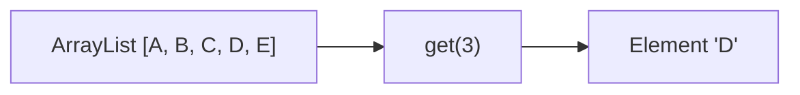

# 🔍 Accessing and Modifying ArrayList Elements

One of the greatest strengths of ArrayLists is their ability to provide fast, direct access to any element. Let's explore how to access and modify elements efficiently.

## 🎯 Random Access in ArrayLists

Unlike some other data structures (like LinkedLists), ArrayLists excel at random access - the ability to jump directly to any element by its index.



## 🧮 Implementation Deep Dive

The `get` and `set` methods are remarkably simple:

```javascript
get(index) {
  if (index >= 0 && index < this.size) {
    return this.data[index];
  }
  return undefined; // Or throw an error
}

set(index, element) {
  if (index >= 0 && index < this.size) {
    this.data[index] = element;
    return true;
  }
  return false; // Or throw an error
}
```

These methods:
1. Check if the index is valid
2. Directly access or modify the element at that index in the internal array

## ⏱️ Time Complexity Analysis

Both accessing and modifying elements in an ArrayList have:

- **Time Complexity**: O(1) - constant time

This is because ArrayLists store elements in contiguous memory locations, allowing direct calculation of each element's address.

> [!NOTE]
> This O(1) access time is a major advantage of ArrayLists over other data structures like LinkedLists, which require O(n) time to access arbitrary elements.

## 🔄 Common Access Patterns

### 1️⃣ Sequential Access

Iterating through all elements in order:

```javascript
for (let i = 0; i < arrayList.size(); i++) {
  console.log(arrayList.get(i));
}
```

### 2️⃣ Random Access

Jumping directly to specific elements:

```javascript
// Get the first element
const first = arrayList.get(0);

// Get the last element
const last = arrayList.get(arrayList.size() - 1);

// Get an element in the middle
const middle = arrayList.get(Math.floor(arrayList.size() / 2));
```

### 3️⃣ Modifying Elements

Changing the value of existing elements:

```javascript
// Double all values in the list
for (let i = 0; i < arrayList.size(); i++) {
  arrayList.set(i, arrayList.get(i) * 2);
}
```

## 🚀 Advanced Techniques

### Finding Elements

To find an element by its value rather than its index:

```javascript
function indexOf(arrayList, value) {
  for (let i = 0; i < arrayList.size(); i++) {
    if (arrayList.get(i) === value) {
      return i; // Return the index if found
    }
  }
  return -1; // Return -1 if not found
}
```

### Transforming Elements

Applying a function to each element:

```javascript
function transform(arrayList, transformFn) {
  for (let i = 0; i < arrayList.size(); i++) {
    arrayList.set(i, transformFn(arrayList.get(i)));
  }
}

// Example usage:
transform(numberList, x => x * x); // Square all numbers
```

## 🧠 Boundary Conditions

When accessing or modifying elements, always be mindful of these boundary conditions:

1. **Empty List**: What happens if the list has no elements?
2. **Invalid Index**: What if the index is negative or beyond the list size?
3. **Null Elements**: How does your code handle null or undefined values?

> [!WARNING]
> Always validate indices before accessing elements to prevent "index out of bounds" errors.

## 💡 Practical Example: Finding the Maximum Value

Let's implement a function to find the maximum value in an ArrayList:

```javascript
function findMax(arrayList) {
  if (arrayList.size() === 0) {
    return undefined; // Handle empty list
  }
  
  let max = arrayList.get(0);
  for (let i = 1; i < arrayList.size(); i++) {
    const current = arrayList.get(i);
    if (current > max) {
      max = current;
    }
  }
  return max;
}
```

This function:
1. Handles the empty list case
2. Starts with the first element as the maximum
3. Compares each subsequent element to the current maximum
4. Updates the maximum if a larger value is found

## 🧠 Practice Exercise

<details>
<summary>How would you implement a function to check if an ArrayList is sorted in ascending order?</summary>

```javascript
function isSorted(arrayList) {
  if (arrayList.size() <= 1) {
    return true; // Empty lists and single-element lists are always sorted
  }
  
  for (let i = 0; i < arrayList.size() - 1; i++) {
    if (arrayList.get(i) > arrayList.get(i + 1)) {
      return false; // Found elements out of order
    }
  }
  return true; // All elements are in order
}
```

This function checks each adjacent pair of elements to ensure they're in ascending order. If any pair is out of order, it returns false. Otherwise, it returns true.
</details>

## 🎯 Key Takeaways

- ArrayLists provide O(1) constant-time access to any element by index
- Both reading and modifying elements are very efficient operations
- Always validate indices to avoid out-of-bounds errors
- Sequential access patterns are common and efficient with ArrayLists
- Finding elements by value requires O(n) time as you need to check each element

In the next lesson, we'll explore common algorithms and patterns used with ArrayLists. 