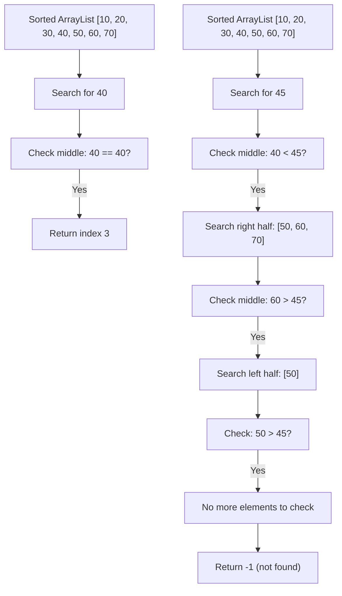

# 🧩 Common ArrayList Algorithms and Patterns

Now that we understand the basic operations of ArrayLists, let's explore some common algorithms and patterns that leverage this versatile data structure.

## 🔄 Traversal Patterns

### 1️⃣ Complete Traversal

The most basic pattern is visiting every element in the ArrayList:

```javascript
function traverse(arrayList, processFn) {
  for (let i = 0; i < arrayList.size(); i++) {
    processFn(arrayList.get(i));
  }
}
```

### 2️⃣ Filtered Traversal

Processing only elements that meet certain criteria:

```javascript
function traverseFiltered(arrayList, filterFn, processFn) {
  for (let i = 0; i < arrayList.size(); i++) {
    const element = arrayList.get(i);
    if (filterFn(element)) {
      processFn(element);
    }
  }
}
```

### 3️⃣ Early Termination

Stopping the traversal once a condition is met:

```javascript
function findFirst(arrayList, predicateFn) {
  for (let i = 0; i < arrayList.size(); i++) {
    const element = arrayList.get(i);
    if (predicateFn(element)) {
      return element; // Found what we're looking for
    }
  }
  return null; // Not found
}
```

## 🔍 Searching Algorithms

### Linear Search

Finding an element by checking each item sequentially:

```javascript
function linearSearch(arrayList, target) {
  for (let i = 0; i < arrayList.size(); i++) {
    if (arrayList.get(i) === target) {
      return i; // Return index if found
    }
  }
  return -1; // Return -1 if not found
}
```

> [!NOTE]
> Linear search has O(n) time complexity, which is the best we can do for unsorted lists.

### Binary Search (for sorted lists)

A much faster search algorithm for sorted ArrayLists:

```javascript
function binarySearch(sortedList, target) {
  let left = 0;
  let right = sortedList.size() - 1;
  
  while (left <= right) {
    const mid = Math.floor((left + right) / 2);
    const midValue = sortedList.get(mid);
    
    if (midValue === target) {
      return mid; // Found the target
    } else if (midValue < target) {
      left = mid + 1; // Target is in the right half
    } else {
      right = mid - 1; // Target is in the left half
    }
  }
  
  return -1; // Target not found
}
```



> [!TIP]
> Binary search has O(log n) time complexity, making it much faster than linear search for large lists. However, it requires the list to be sorted.

## 🔄 Transformation Algorithms

### Mapping

Creating a new ArrayList by transforming each element:

```javascript
function map(arrayList, transformFn) {
  const result = new ArrayList();
  for (let i = 0; i < arrayList.size(); i++) {
    result.add(transformFn(arrayList.get(i)));
  }
  return result;
}
```

### Filtering

Creating a new ArrayList containing only elements that meet a condition:

```javascript
function filter(arrayList, predicateFn) {
  const result = new ArrayList();
  for (let i = 0; i < arrayList.size(); i++) {
    const element = arrayList.get(i);
    if (predicateFn(element)) {
      result.add(element);
    }
  }
  return result;
}
```

### Reducing

Combining all elements into a single value:

```javascript
function reduce(arrayList, reducerFn, initialValue) {
  let accumulator = initialValue;
  for (let i = 0; i < arrayList.size(); i++) {
    accumulator = reducerFn(accumulator, arrayList.get(i));
  }
  return accumulator;
}
```

## 🔄 Sorting Algorithms

While there are many sorting algorithms, here are two common ones used with ArrayLists:

### Selection Sort

```javascript
function selectionSort(arrayList) {
  const n = arrayList.size();
  
  for (let i = 0; i < n - 1; i++) {
    // Find the minimum element in the unsorted portion
    let minIndex = i;
    for (let j = i + 1; j < n; j++) {
      if (arrayList.get(j) < arrayList.get(minIndex)) {
        minIndex = j;
      }
    }
    
    // Swap the found minimum with the first element
    if (minIndex !== i) {
      const temp = arrayList.get(i);
      arrayList.set(i, arrayList.get(minIndex));
      arrayList.set(minIndex, temp);
    }
  }
}
```

### Insertion Sort

```javascript
function insertionSort(arrayList) {
  const n = arrayList.size();
  
  for (let i = 1; i < n; i++) {
    const key = arrayList.get(i);
    let j = i - 1;
    
    // Move elements greater than key one position ahead
    while (j >= 0 && arrayList.get(j) > key) {
      arrayList.set(j + 1, arrayList.get(j));
      j--;
    }
    
    arrayList.set(j + 1, key);
  }
}
```

> [!WARNING]
> These simple sorting algorithms have O(n²) time complexity. For large lists, consider using more efficient algorithms like QuickSort or MergeSort, or use the built-in sorting methods provided by your language.

## 🧠 Advanced Patterns

### Two-Pointer Technique

Using two pointers to solve problems efficiently:

```javascript
function removeDuplicates(sortedList) {
  if (sortedList.size() <= 1) {
    return sortedList.size();
  }
  
  let writePointer = 1;
  
  for (let readPointer = 1; readPointer < sortedList.size(); readPointer++) {
    if (sortedList.get(readPointer) !== sortedList.get(readPointer - 1)) {
      sortedList.set(writePointer, sortedList.get(readPointer));
      writePointer++;
    }
  }
  
  // Truncate the list to remove duplicates
  while (sortedList.size() > writePointer) {
    sortedList.remove(sortedList.size() - 1);
  }
  
  return writePointer;
}
```

### Sliding Window

Processing subarrays of fixed or variable size:

```javascript
function maxSumSubarray(arrayList, windowSize) {
  if (arrayList.size() < windowSize) {
    return 0;
  }
  
  // Calculate sum of first window
  let windowSum = 0;
  for (let i = 0; i < windowSize; i++) {
    windowSum += arrayList.get(i);
  }
  
  let maxSum = windowSum;
  
  // Slide the window and update the max sum
  for (let i = windowSize; i < arrayList.size(); i++) {
    windowSum = windowSum - arrayList.get(i - windowSize) + arrayList.get(i);
    maxSum = Math.max(maxSum, windowSum);
  }
  
  return maxSum;
}
```

## 🧠 Practice Exercise

<details>
<summary>How would you implement a function to find the second largest element in an ArrayList?</summary>

```javascript
function findSecondLargest(arrayList) {
  if (arrayList.size() < 2) {
    return undefined; // Not enough elements
  }
  
  let largest = Number.NEGATIVE_INFINITY;
  let secondLargest = Number.NEGATIVE_INFINITY;
  
  for (let i = 0; i < arrayList.size(); i++) {
    const current = arrayList.get(i);
    
    if (current > largest) {
      secondLargest = largest;
      largest = current;
    } else if (current > secondLargest && current !== largest) {
      secondLargest = current;
    }
  }
  
  return secondLargest === Number.NEGATIVE_INFINITY ? undefined : secondLargest;
}
```

This algorithm:
1. Tracks both the largest and second largest values seen so far
2. Updates them as it traverses the list
3. Returns the second largest value, or undefined if there isn't one
</details>

## 🎯 Key Takeaways

- ArrayLists support a wide variety of algorithms and patterns
- Common operations include traversal, searching, transformation, and sorting
- For sorted lists, binary search offers significant performance improvements
- Advanced patterns like two-pointer and sliding window can solve complex problems efficiently
- Understanding these patterns helps you leverage ArrayLists effectively in your code

In the next lesson, we'll explore real-world applications of ArrayLists and when to use them. 