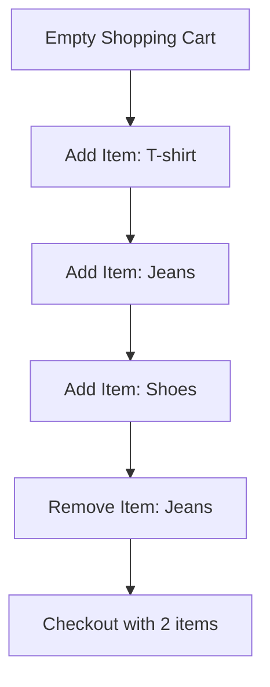
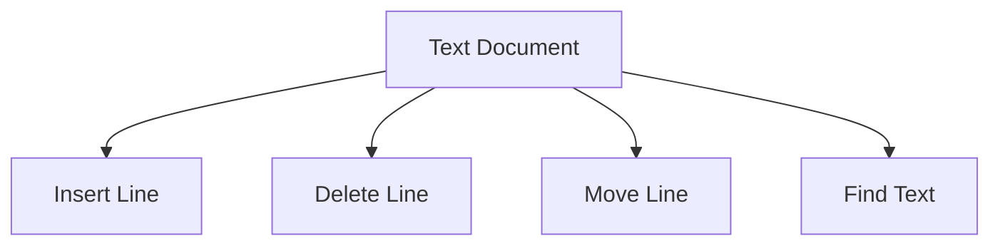

# 🌍 Real-World Applications of ArrayLists

ArrayLists aren't just theoretical data structures - they're used extensively in real-world applications. Let's explore some practical use cases and see how ArrayLists solve real problems.

## 🛒 E-commerce Shopping Carts

Shopping carts are a perfect use case for ArrayLists:



Why ArrayLists work well for shopping carts:
- Items can be added dynamically as the user shops
- Items can be removed at any time
- The cart needs to maintain the order of items added
- The total number of items is typically small to moderate

```javascript
class ShoppingCart {
  constructor() {
    this.items = [];
  }
  
  addItem(item) {
    this.items.push(item);
  }
  
  removeItem(index) {
    this.items.splice(index, 1);
  }
  
  getTotal() {
    return this.items.reduce((sum, item) => sum + item.price, 0);
  }
  
  getItemCount() {
    return this.items.length;
  }
}
```

### Case Study: Amazon's Shopping Cart

Amazon's shopping cart system uses ArrayList-like structures to manage billions of shopping sessions daily. Key features include:

- **Persistence**: Cart items are saved between sessions and across devices
- **Real-time updates**: Changes are reflected instantly across multiple tabs/devices
- **Personalized recommendations**: Based on cart contents
- **Save for later**: Moving items between "cart" and "saved for later" lists

The system needs to handle tremendous scale while maintaining fast access times, making the random-access properties of ArrayLists crucial for performance.

## 📝 Text Editors

Text editors use ArrayList-like structures to manage lines of text:



Why ArrayLists work well for text editors:
- Lines can be added and removed as the user edits
- Random access is needed to jump to specific line numbers
- The document needs to maintain the order of lines
- Operations like copy/paste involve adding or removing multiple lines

> [!NOTE]
> Advanced text editors might use more sophisticated data structures like piece tables or rope data structures for better performance with very large documents, but ArrayList-like structures work well for many scenarios.

### Case Study: Visual Studio Code's Text Buffer

Visual Studio Code uses a sophisticated variant of ArrayList called "piece table" for its text buffer implementation. This approach provides:

- Efficient edits (insertion/deletion) at any position
- Undo/redo history with minimal memory overhead
- Fast search operations
- Support for extremely large files

VS Code's implementation combines the benefits of ArrayList-like access with optimizations for the specific needs of a text editor, demonstrating how fundamental data structures can be adapted for specialized applications.

## 📱 Mobile App UI Components

Mobile apps use ArrayLists to manage UI components like lists, grids, and carousels:

```javascript
class RecyclerView {
  constructor() {
    this.items = [];
    this.visibleItems = [];
  }
  
  setItems(newItems) {
    this.items = [...newItems];
    this.refreshVisibleItems();
  }
  
  addItem(item) {
    this.items.push(item);
    this.refreshVisibleItems();
  }
  
  removeItem(index) {
    this.items.splice(index, 1);
    this.refreshVisibleItems();
  }
  
  refreshVisibleItems() {
    // Update the visible items based on scroll position
    // Only render items that are currently visible on screen
  }
}
```

Why ArrayLists work well for UI components:
- UI elements can be added or removed dynamically
- Only visible elements need to be rendered (windowing)
- Elements often need to be accessed by index
- The order of elements is important for display

### Performance Optimization: Recycling Views

Modern mobile UI frameworks like React Native and Android's RecyclerView optimize performance using a technique called "view recycling":

```javascript
class OptimizedList {
  constructor() {
    this.data = [];          // Full data ArrayList
    this.viewPool = [];      // Pool of reusable view objects
    this.visibleViews = [];  // Currently visible views
  }
  
  scrollTo(startIndex) {
    // Calculate which items should be visible
    const visibleRange = this.calculateVisibleRange(startIndex);
    
    // Recycle views that are no longer visible
    this.recycleNonVisibleViews(visibleRange);
    
    // Create or reuse views for newly visible items
    this.displayVisibleItems(visibleRange);
  }
  
  recycleNonVisibleViews(visibleRange) {
    // Move views that scrolled off-screen back to the pool
    // This avoids expensive creation/destruction of view objects
  }
}
```

This pattern allows for smooth scrolling through thousands of items with minimal memory usage and CPU overhead.

## 📊 Data Analysis and Processing

Data scientists and analysts use ArrayList-like structures to process and transform datasets:

```javascript
function processDataset(dataset) {
  // Filter out invalid data points
  const validData = dataset.filter(point => isValid(point));
  
  // Transform data points
  const transformedData = validData.map(point => transform(point));
  
  // Calculate statistics
  const average = transformedData.reduce((sum, point) => sum + point.value, 0) / transformedData.length;
  
  return {
    data: transformedData,
    stats: {
      count: transformedData.length,
      average: average,
      min: Math.min(...transformedData.map(p => p.value)),
      max: Math.max(...transformedData.map(p => p.value))
    }
  };
}
```

Why ArrayLists work well for data processing:
- Data points can be filtered, mapped, and reduced efficiently
- The order of data points is often important for time series or sequential data
- Random access allows for efficient statistical calculations
- Data transformations often create new collections of the same or different sizes

### Case Study: Pandas DataFrames

The popular Python data analysis library Pandas uses ArrayList-like structures as the foundation for its DataFrame object:

```python
import pandas as pd

# Create a DataFrame from a list of dictionaries
data = [
  {"name": "Alice", "age": 25, "score": 85},
  {"name": "Bob", "age": 30, "score": 92},
  {"name": "Charlie", "age": 22, "score": 78}
]

df = pd.DataFrame(data)

# Filter, transform, and analyze data
high_scorers = df[df['score'] > 80]
df['grade'] = df['score'].apply(lambda s: 'A' if s >= 90 else 'B' if s >= 80 else 'C')
average_age = df['age'].mean()
```

Pandas optimizes operations on these structures with techniques like:
- Vectorized operations instead of loops
- Lazy evaluation of transformations
- Optimized C implementations for core operations
- Specialized indexing structures for fast lookups

## 🎮 Game Development

Game developers use ArrayLists to manage game entities, events, and state:

```javascript
class GameEngine {
  constructor() {
    this.entities = [];
    this.pendingEntities = [];
    this.entitiesToRemove = [];
  }
  
  update(deltaTime) {
    // Add new entities
    this.entities.push(...this.pendingEntities);
    this.pendingEntities = [];
    
    // Update all entities
    for (const entity of this.entities) {
      entity.update(deltaTime);
      
      if (entity.shouldBeRemoved()) {
        this.entitiesToRemove.push(entity);
      }
    }
    
    // Remove entities marked for removal
    this.entities = this.entities.filter(entity => !this.entitiesToRemove.includes(entity));
    this.entitiesToRemove = [];
  }
  
  addEntity(entity) {
    this.pendingEntities.push(entity);
  }
  
  render() {
    for (const entity of this.entities) {
      entity.render();
    }
  }
}
```

Why ArrayLists work well for game development:
- Game entities can be added or removed dynamically
- All entities need to be updated each frame
- Entities often need to be processed in a specific order
- Collections of entities need to be filtered for collision detection or rendering optimizations

### Optimization Technique: Spatial Partitioning

Games with many entities use spatial partitioning to avoid checking collisions between every pair of objects:

```javascript
class SpatialGrid {
  constructor(worldWidth, worldHeight, cellSize) {
    this.cellSize = cellSize;
    this.columns = Math.ceil(worldWidth / cellSize);
    this.rows = Math.ceil(worldHeight / cellSize);
    
    // Create a 2D grid of ArrayLists
    this.grid = new Array(this.columns);
    for (let i = 0; i < this.columns; i++) {
      this.grid[i] = new Array(this.rows);
      for (let j = 0; j < this.rows; j++) {
        this.grid[i][j] = []; // ArrayList for each cell
      }
    }
  }
  
  insertEntity(entity) {
    // Calculate which cell this entity belongs to
    const cellX = Math.floor(entity.x / this.cellSize);
    const cellY = Math.floor(entity.y / this.cellSize);
    
    // Add to appropriate cell
    if (cellX >= 0 && cellX < this.columns && cellY >= 0 && cellY < this.rows) {
      this.grid[cellX][cellY].push(entity);
    }
  }
  
  getPotentialCollisions(entity) {
    // Only check entities in nearby cells
    // instead of all entities
  }
}
```

This technique reduces collision checks from O(n²) to O(n), dramatically improving performance for games with many objects.

## 🧠 When to Use ArrayLists

ArrayLists are ideal when:

1. **You need dynamic sizing**: The collection will grow or shrink over time
2. **Random access is important**: You need to access elements by index frequently
3. **Order matters**: The sequence of elements is significant
4. **Insertions/deletions happen primarily at the end**: Most modifications are appends or removals from the end
5. **The collection size is moderate**: Not extremely large or extremely small

## ⚠️ When to Consider Alternatives

Consider other data structures when:

1. **Frequent insertions/deletions in the middle**: LinkedList might be better
2. **Very large collections with sparse access patterns**: Specialized data structures might be more efficient
3. **Need for constant-time lookups by key**: HashMap/Dictionary would be better
4. **Strict memory constraints**: Fixed-size arrays might be more memory-efficient
5. **Need for unique elements only**: Sets might be more appropriate

## 🧠 Practice Exercise

<details>
<summary>Design a simple playlist manager using ArrayLists</summary>

```javascript
class Playlist {
  constructor(name) {
    this.name = name;
    this.songs = [];
    this.currentIndex = 0;
  }
  
  addSong(song) {
    this.songs.push(song);
  }
  
  removeSong(index) {
    if (index >= 0 && index < this.songs.length) {
      this.songs.splice(index, 1);
      
      // Adjust current index if necessary
      if (index < this.currentIndex) {
        this.currentIndex--;
      } else if (index === this.currentIndex && this.currentIndex === this.songs.length) {
        this.currentIndex = Math.max(0, this.currentIndex - 1);
      }
    }
  }
  
  getCurrentSong() {
    return this.songs.length > 0 ? this.songs[this.currentIndex] : null;
  }
  
  nextSong() {
    if (this.songs.length === 0) return null;
    this.currentIndex = (this.currentIndex + 1) % this.songs.length;
    return this.getCurrentSong();
  }
  
  previousSong() {
    if (this.songs.length === 0) return null;
    this.currentIndex = (this.currentIndex - 1 + this.songs.length) % this.songs.length;
    return this.getCurrentSong();
  }
  
  shuffle() {
    // Fisher-Yates shuffle algorithm
    for (let i = this.songs.length - 1; i > 0; i--) {
      const j = Math.floor(Math.random() * (i + 1));
      [this.songs[i], this.songs[j]] = [this.songs[j], this.songs[i]];
    }
    this.currentIndex = 0;
  }
}
```

This playlist manager demonstrates several ArrayList operations:
- Adding songs (append to end)
- Removing songs (remove at index)
- Navigating through songs (accessing by index)
- Shuffling the playlist (in-place modification)
</details>

## 🎯 Key Takeaways

- ArrayLists are used in countless real-world applications
- They excel in scenarios requiring dynamic collections with ordered elements
- Common applications include UI components, data processing, and game development
- Performance optimizations like view recycling and spatial partitioning build on ArrayList foundations
- Consider the access patterns and modification frequency when choosing ArrayLists
- Alternative data structures might be better for specific use cases

In the next and final lesson, we'll summarize what we've learned and provide some best practices for working with ArrayLists. 