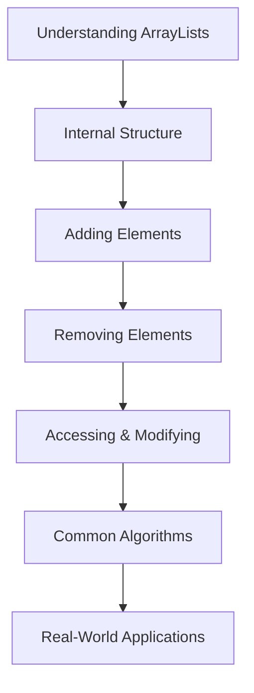
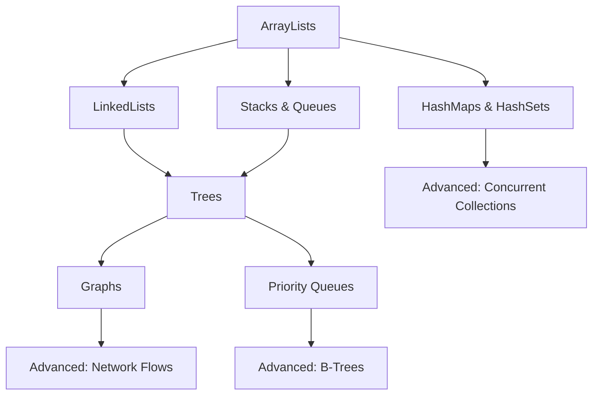

# 🏆 Mastering ArrayLists: Conclusion and Best Practices

Congratulations! You've completed our comprehensive guide to ArrayLists. Let's recap what we've learned and explore some best practices for using ArrayLists effectively in your projects.

## 🔄 What We've Learned



Throughout this journey, we've covered:

1. **The Fundamentals**: What ArrayLists are and how they differ from regular arrays
2. **Internal Structure**: How ArrayLists manage dynamic resizing
3. **Core Operations**: Adding, removing, accessing, and modifying elements
4. **Efficiency Considerations**: Time complexity of various operations
5. **Common Algorithms**: Searching, sorting, and transforming ArrayLists
6. **Real-World Applications**: How ArrayLists are used in practical scenarios

## 💡 Best Practices for Working with ArrayLists

### 1️⃣ Choose the Right Initial Capacity

If you know approximately how many elements you'll be storing, initialize your ArrayList with an appropriate capacity:

```javascript
// Instead of this:
const list = new ArrayList(); // Default capacity (often 10)

// Do this:
const list = new ArrayList(1000); // Initial capacity of 1000
```

This avoids unnecessary resizing operations as the list grows.

### 2️⃣ Be Mindful of Insertion/Removal Positions

Remember that operations at the end of an ArrayList are much more efficient than those at the beginning or middle:

```javascript
// Efficient (O(1) amortized)
list.add(element); // Adds to the end

// Less efficient (O(n))
list.add(0, element); // Adds to the beginning
```

If you frequently need to add or remove elements at the beginning, consider using a different data structure like a LinkedList or a Deque.

### 3️⃣ Use Bulk Operations When Possible

Many ArrayList implementations provide bulk operations that are more efficient than performing multiple individual operations:

```javascript
// Instead of this:
for (const item of items) {
  list.add(item);
}

// Do this:
list.addAll(items);
```

### 4️⃣ Clear References to Help Garbage Collection

When removing elements from an ArrayList, some implementations don't automatically clear the references to the removed objects. In such cases, explicitly setting references to null can help with garbage collection:

```javascript
// If your ArrayList implementation doesn't clear references
for (let i = 0; i < list.size(); i++) {
  if (shouldRemove(list.get(i))) {
    list.set(i, null); // Clear reference
    // Then remove the element
  }
}
```

### 5️⃣ Use Enhanced For Loops or Iterators for Traversal

When you don't need the index, use enhanced for loops or iterators for cleaner code:

```javascript
// Instead of this:
for (let i = 0; i < list.size(); i++) {
  process(list.get(i));
}

// Do this:
for (const item of list) {
  process(item);
}
```

### 6️⃣ Be Careful When Modifying During Iteration

Modifying an ArrayList while iterating over it can lead to unexpected results or exceptions. Use safe patterns for modification:

```javascript
// Safe removal pattern (iterating backward)
for (let i = list.size() - 1; i >= 0; i--) {
  if (shouldRemove(list.get(i))) {
    list.remove(i);
  }
}
```

### 7️⃣ Consider Thread Safety Needs

Standard ArrayList implementations are not thread-safe. If multiple threads will access the same ArrayList, use synchronized wrappers or concurrent collections:

```javascript
// In Java:
List<String> synchronizedList = Collections.synchronizedList(new ArrayList<>());
```

### 8️⃣ Profile and Benchmark for Your Specific Use Case

Different ArrayList implementations and usage patterns can have dramatically different performance characteristics depending on your specific workload:

```javascript
// Simple benchmarking function
function benchmark(operation, iterations) {
  const start = performance.now();
  for (let i = 0; i < iterations; i++) {
    operation();
  }
  const end = performance.now();
  return end - start;
}

// Compare different approaches
const appendTime = benchmark(() => {
  const list = new ArrayList();
  for (let i = 0; i < 100000; i++) {
    list.add(i);
  }
}, 10);

const preallocatedTime = benchmark(() => {
  const list = new ArrayList(100000);
  for (let i = 0; i < 100000; i++) {
    list.add(i);
  }
}, 10);

console.log(`Append time: ${appendTime}ms`);
console.log(`Preallocated time: ${preallocatedTime}ms`);
```

## 📊 Benchmarking ArrayList Operations

Here's a comparison of common ArrayList operations and their performance characteristics:

| Operation | Small List (100 items) | Medium List (10,000 items) | Large List (1,000,000 items) |
|-----------|------------------------|----------------------------|------------------------------|
| Add to end | Very fast (< 0.1ms) | Fast (< 1ms) | Fast (< 10ms) |
| Add to beginning | Fast (< 0.1ms) | Slow (10-100ms) | Very slow (1000+ ms) |
| Get by index | Instantaneous | Instantaneous | Instantaneous |
| Find by value | Fast (< 0.1ms) | Slow (1-10ms) | Very slow (100+ ms) |
| Remove from end | Very fast (< 0.1ms) | Fast (< 1ms) | Fast (< 10ms) |
| Remove from beginning | Fast (< 0.1ms) | Slow (10-100ms) | Very slow (1000+ ms) |
| Sort | Fast (< 1ms) | Medium (10-100ms) | Slow (1000+ ms) |

> [!TIP]
> These are approximate values and will vary based on hardware, implementation, and element complexity. Always benchmark with your actual data and operations.

## 🚀 Taking Your ArrayList Skills Further

To continue mastering ArrayLists and related concepts:

### Advanced Data Structures Learning Path



1. **Master Other Sequential Collections**:
   - LinkedList: Better for frequent insertions/deletions
   - Deque: Double-ended queues
   - ImmutableList: Thread-safe, unchangeable lists

2. **Explore Specialized Collections**:
   - SparseArrays: For lists with many empty positions
   - CircularBuffer: Fixed-size buffer that overwrites oldest elements
   - ObservableList: Lists that notify listeners of changes

3. **Learn Related Data Structures**:
   - Trees: Hierarchical organization of data
   - Graphs: Networks of interconnected elements
   - Hash-based structures: For fast lookups

4. **Study Advanced Algorithms**:
   - Parallel processing of collections
   - Streaming and lazy evaluation
   - Functional programming techniques for collections

5. **Dive Into Implementation Details**:
   - Memory management techniques
   - Cache optimization
   - Concurrent data structures

### Recommended Resources:

- **Books**:
  - "Algorithms" by Robert Sedgewick and Kevin Wayne
  - "Introduction to Algorithms" by Cormen, Leiserson, Rivest, and Stein
  - "Effective Java" by Joshua Bloch (for Java developers)

- **Online Courses**:
  - MIT OpenCourseWare: "Introduction to Algorithms"
  - Coursera: "Algorithms" by Princeton University
  - Udemy: "Data Structures and Algorithms: Deep Dive Using Java"

- **Practice Platforms**:
  - LeetCode: Array and ArrayList problems
  - HackerRank: Data Structures challenges
  - CodeWars: Kata challenges with collections

## 🧠 Final Challenge

<details>
<summary>Implement a circular buffer using an ArrayList</summary>

```javascript
class CircularBuffer {
  constructor(capacity) {
    this.buffer = new Array(capacity);
    this.capacity = capacity;
    this.size = 0;
    this.head = 0;
    this.tail = 0;
  }
  
  enqueue(item) {
    if (this.size === this.capacity) {
      // Buffer is full, overwrite oldest item
      this.buffer[this.tail] = item;
      this.tail = (this.tail + 1) % this.capacity;
      this.head = (this.head + 1) % this.capacity;
    } else {
      // Buffer has space
      this.buffer[this.tail] = item;
      this.tail = (this.tail + 1) % this.capacity;
      this.size++;
    }
  }
  
  dequeue() {
    if (this.size === 0) {
      return undefined; // Buffer is empty
    }
    
    const item = this.buffer[this.head];
    this.head = (this.head + 1) % this.capacity;
    this.size--;
    return item;
  }
  
  peek() {
    if (this.size === 0) {
      return undefined; // Buffer is empty
    }
    
    return this.buffer[this.head];
  }
  
  isEmpty() {
    return this.size === 0;
  }
  
  isFull() {
    return this.size === this.capacity;
  }
  
  clear() {
    this.buffer = new Array(this.capacity);
    this.size = 0;
    this.head = 0;
    this.tail = 0;
  }
}
```

This circular buffer uses an ArrayList-like structure to implement a fixed-size queue that overwrites the oldest elements when full. It's commonly used in scenarios like buffering data streams, implementing LRU caches, or managing event histories.
</details>

## 🎯 Key Takeaways

- ArrayLists are versatile data structures that balance flexibility and performance
- Understanding the internal workings helps you make better decisions about when and how to use them
- Different operations have different efficiency characteristics - choose the right ones for your use case
- Following best practices can significantly improve the performance and reliability of your code
- ArrayLists are foundational to many algorithms and applications in software development
- Performance testing and benchmarking are crucial for optimizing ArrayList usage in production applications

> [!TIP]
> The best way to master ArrayLists is through practice. Try implementing the examples and exercises from these lessons in your preferred programming language!

Thank you for completing this guide to ArrayLists! We hope you've gained a deeper understanding of this fundamental data structure and feel confident applying it in your own projects. 