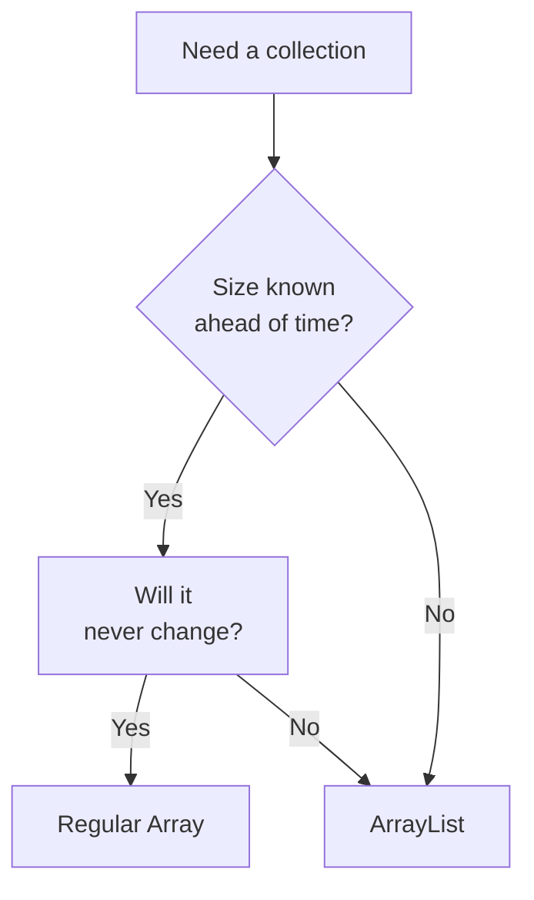
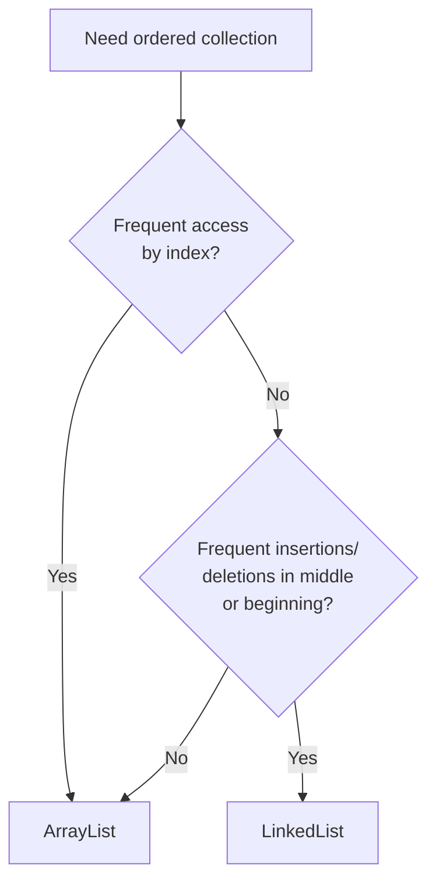
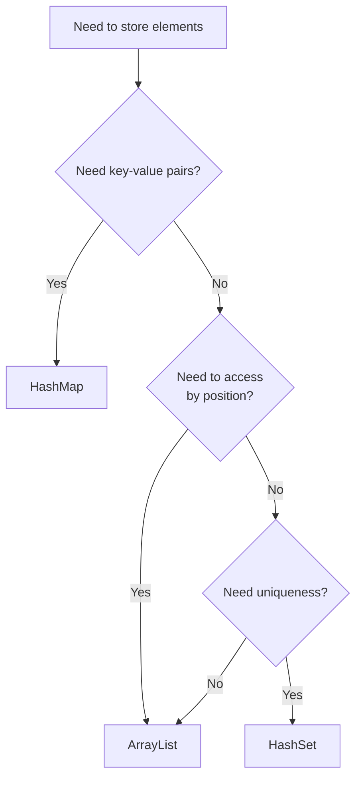

# 🔄 Choosing the Right Collection: ArrayList vs. Alternatives

While ArrayLists are versatile and widely used, they're not always the optimal choice for every scenario. In this lesson, we'll compare ArrayLists with alternative data structures to help you make informed decisions for your applications.

## 🏆 Data Structure Showdown

Let's start with a comprehensive comparison of the most common data structures:

| Operation | ArrayList | LinkedList | Array | HashSet | HashMap |
|----------|-----------|------------|-------|---------|---------|
| Access by index | O(1) ⭐ | O(n) | O(1) ⭐ | N/A | N/A |
| Insert at end | O(1)* ⭐ | O(1) ⭐ | O(1) if space | N/A | N/A |
| Insert at beginning | O(n) | O(1) ⭐ | O(n) | N/A | N/A |
| Insert in middle | O(n) | O(n)† | O(n) | N/A | N/A |
| Remove from end | O(1) ⭐ | O(n)‡ | O(1) ⭐ | N/A | N/A |
| Remove from beginning | O(n) | O(1) ⭐ | O(n) | N/A | N/A |
| Search by value | O(n) | O(n) | O(n) | O(1) ⭐ | O(1) ⭐ |
| Memory overhead | Low | High | None ⭐ | Medium | Medium |
| Memory contiguity | Yes ⭐ | No | Yes ⭐ | No | No |

*Amortized time (occasional resize operations)
†O(1) once position is found
‡O(1) for doubly-linked list with tail pointer

## 🔍 Deep Dive Comparison

### ArrayList vs. Regular Array



| Feature | ArrayList | Regular Array |
|---------|-----------|---------------|
| Size | Dynamic | Fixed |
| Memory allocation | Can grow/shrink | Static |
| Memory efficiency | Some overhead | Most efficient |
| Utility methods | Many built-in | Minimal |
| Performance | Very good | Excellent |
| Flexibility | High | Low |

**Choose ArrayList when:**
- Size will change during runtime
- You need built-in utility methods
- Flexibility is more important than absolute performance

**Choose Regular Array when:**
- Size is known and fixed
- Memory efficiency is critical
- Maximum performance is required
- Working with primitive types in languages that box/unbox

```javascript
// ArrayList (in JavaScript, array has ArrayList behavior)
const dynamicList = [];
dynamicList.push(1, 2, 3);
dynamicList.splice(1, 1);

// Fixed-size array (in languages with true fixed arrays)
const fixedArray = new Int32Array(10);
fixedArray[0] = 42;
```

### ArrayList vs. LinkedList



| Feature | ArrayList | LinkedList |
|---------|-----------|------------|
| Random access | O(1) ⭐ | O(n) |
| Memory layout | Contiguous | Scattered |
| Insert/delete at beginning | O(n) | O(1) ⭐ |
| Insert/delete at end | O(1) ⭐ | O(1) ⭐ |
| Memory overhead | Low | High (node pointers) |
| Cache performance | Good | Poor |
| Implementation complexity | Simpler | More complex |

**Choose ArrayList when:**
- Random access is frequent
- Most operations happen at the end
- Memory efficiency is important
- Cache performance matters

**Choose LinkedList when:**
- Frequent insertions/deletions at beginning or middle
- No need for random access
- Elements are frequently reordered
- List size is highly variable

```java
// ArrayList example (Java)
ArrayList<Integer> arrayList = new ArrayList<>();
arrayList.add(1);
arrayList.add(0, 2);  // O(n) operation
arrayList.get(0);     // O(1) operation

// LinkedList example (Java)
LinkedList<Integer> linkedList = new LinkedList<>();
linkedList.add(1);
linkedList.addFirst(2);  // O(1) operation
linkedList.get(0);       // O(1) for first element, O(n) generally
```

### ArrayList vs. HashSet/HashMap



| Feature | ArrayList | HashSet | HashMap |
|---------|-----------|---------|---------|
| Order preservation | Yes ⭐ | No* | No* |
| Duplicates allowed | Yes | No | Keys: No, Values: Yes |
| Lookup by value | O(n) | O(1) ⭐ | N/A |
| Lookup by key | N/A | N/A | O(1) ⭐ |
| Lookup by index | O(1) ⭐ | N/A | N/A |
| Memory efficiency | Good | Medium | Medium |
| Null elements | Yes† | One null† | One null key† |

*Some implementations like LinkedHashSet/Map preserve insertion order
†Depends on implementation

**Choose ArrayList when:**
- Order matters
- Elements need to be accessed by position
- Duplicates are allowed
- Sequential operations are common

**Choose HashSet when:**
- Fast lookup by value is needed
- Duplicates must be prevented
- Order is not important
- You need to check for existence quickly

**Choose HashMap when:**
- Key-value associations are needed
- Fast lookup by key is required
- Order is not important
- Values need to be updated frequently

```javascript
// ArrayList for ordered collection
const toDoList = ["Study", "Exercise", "Cook", "Study"];  // Duplicates allowed
const thirdTask = toDoList[2];  // Access by position

// HashSet for unique values
const uniqueVisitors = new Set();
uniqueVisitors.add("user123");
uniqueVisitors.add("user123");  // Ignored (already exists)
const hasVisited = uniqueVisitors.has("user123");  // Fast lookup

// HashMap for key-value pairs
const userScores = new Map();
userScores.set("Alice", 95);
userScores.set("Bob", 87);
const aliceScore = userScores.get("Alice");  // Fast lookup by key
```

### ArrayList vs. Tree-Based Structures

| Feature | ArrayList | TreeSet/TreeMap | 
|---------|-----------|-----------------|
| Insertion order | Preserved | Sorted order |
| Insert/delete | O(1) - O(n) | O(log n) |
| Search | O(n) | O(log n) ⭐ |
| Min/max element | O(n) | O(log n) ⭐ |
| Range queries | O(n) | O(log n) ⭐ |
| Memory usage | Low | Medium-High |

**Choose ArrayList when:**
- Insertion order needs to be preserved
- Most operations involve accessing by index
- Full sequential access is common

**Choose TreeSet/TreeMap when:**
- Elements need to be kept in sorted order
- You need fast access to min/max elements
- You need to perform range queries efficiently
- Balanced performance for insert/delete/search is important

```java
// ArrayList (unsorted)
ArrayList<Integer> numbers = new ArrayList<>();
numbers.add(5);
numbers.add(1);
numbers.add(8);
// Result: [5, 1, 8]

// TreeSet (automatically sorted)
TreeSet<Integer> sortedNumbers = new TreeSet<>();
sortedNumbers.add(5);
sortedNumbers.add(1);
sortedNumbers.add(8);
// Result: [1, 5, 8]
Integer firstGreaterThan2 = sortedNumbers.ceiling(2);  // Returns 5
```

## 🚀 Specialized Collections

Beyond the standard data structures, there are specialized collections worth considering:

### Deque (Double-Ended Queue)

Perfect when you need efficient operations at both ends:

```java
Deque<String> deque = new ArrayDeque<>();
deque.addFirst("First");  // O(1)
deque.addLast("Last");    // O(1)
String first = deque.removeFirst();  // O(1)
String last = deque.removeLast();    // O(1)
```

### PriorityQueue

Ideal when you need to repeatedly access the minimum/maximum element:

```java
PriorityQueue<Task> taskQueue = new PriorityQueue<>();
taskQueue.add(new Task("Low priority", 3));
taskQueue.add(new Task("High priority", 1));
taskQueue.add(new Task("Medium priority", 2));

// Always returns the highest priority task first
Task nextTask = taskQueue.poll();  // Returns "High priority" task
```

### ConcurrentCollections

Essential for multi-threaded environments:

```java
// Thread-safe ArrayList alternative
List<String> concurrentList = Collections.synchronizedList(new ArrayList<>());

// Better performance for concurrent access
ConcurrentHashMap<String, Integer> scoreMap = new ConcurrentHashMap<>();
CopyOnWriteArrayList<String> listeners = new CopyOnWriteArrayList<>();
```

## 🧠 Decision Making Framework

When choosing a data structure, ask yourself these questions:

1. **Access Pattern**:
   - Do I need to access elements by position?
   - Do I need to search for elements by value?
   - Do I need key-value associations?

2. **Modification Pattern**:
   - Where do most insertions happen? (Beginning, middle, end)
   - Where do most deletions happen?
   - How frequent are modifications?

3. **Order Requirements**:
   - Does insertion order matter?
   - Do I need elements in sorted order?
   - Do I need to maintain a specific sequence?

4. **Uniqueness**:
   - Can there be duplicate elements?
   - Do I need to ensure uniqueness?

5. **Performance Priorities**:
   - Which operations need to be fastest?
   - Is memory efficiency critical?
   - What are the expected sizes?

6. **Concurrency**:
   - Will multiple threads access the collection?
   - What kind of thread safety is needed?

## 🧪 Practical Examples

### Example 1: Building a Music Player Queue

**Requirements**:
- Add songs to the end of the queue
- Remove songs after playing (from beginning)
- Occasionally insert songs at specific positions
- View the upcoming songs in order

**Best Choice**: `ArrayList` or `ArrayDeque`

**Reasoning**: Order is important, and we need access by position. Most operations happen at the ends.

### Example 2: Implementing an Autocomplete Feature

**Requirements**:
- Store dictionary of words
- Fast prefix matching
- Suggestions should be in alphabetical order

**Best Choice**: `Trie` data structure or `TreeMap`

**Reasoning**: Need efficient prefix search and sorted results. An ArrayList would be inefficient for this.

### Example 3: Tracking Unique Visitors

**Requirements**:
- Track millions of visitor IDs
- Quick check if a visitor has been seen before
- Order doesn't matter

**Best Choice**: `HashSet`

**Reasoning**: Need fast lookup and uniqueness guarantee. An ArrayList would be slow for existence checks.

### Example 4: Implementing a Shopping Cart

**Requirements**:
- Add/remove items
- Modify quantities
- View items in the order they were added

**Best Choice**: `ArrayList`

**Reasoning**: Order matters, moderate size, and we need position-based access.

## 🎯 Key Takeaways

- ArrayLists are excellent general-purpose collections, but specialized needs may require alternatives
- The best data structure depends on your specific access and modification patterns
- Consider both time complexity and real-world factors like cache performance and memory usage
- Sometimes using multiple data structures together provides the best solution
- Be willing to change data structures if your requirements evolve
- Profile and benchmark when performance is critical

> [!TIP]
> Start with ArrayList as your default collection and move to more specialized structures only when you have specific needs or performance requirements. 