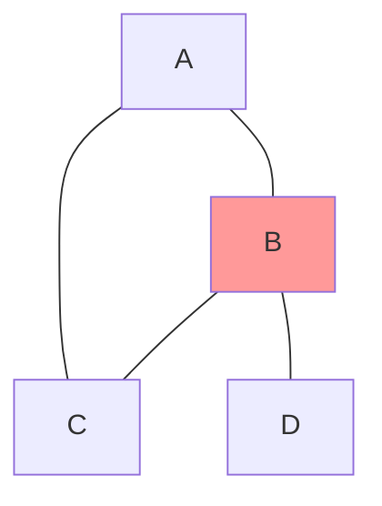
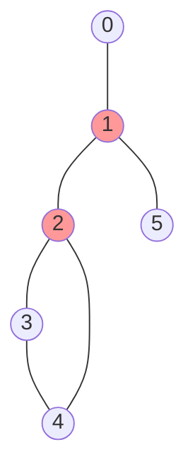

# 🔍 Articulation Points: Finding Critical Nodes in Networks

> [!NOTE]
> In this lesson, we'll explore what articulation points are and why they matter in graph theory and real-world applications.

## Graph Connectivity Fundamentals

Before we dive into articulation points, let's understand what makes a graph "connected":

- A graph is **connected** if there's a path between any two vertices
- The **connected components** of a graph are its maximal connected subgraphs
- Connectivity is crucial in networks where we need to ensure information, people, or resources can flow between any two points

Articulation points represent vulnerabilities in this connectivity—places where a single failure can fragment the network.

## What Are Articulation Points? 🤔

Imagine a busy city with neighborhoods connected by bridges. If a particular bridge collapses, some neighborhoods might become completely isolated from others. In graph theory, we call such critical connection points **articulation points** (also known as cut vertices).

**Definition**: An articulation point is a vertex in an undirected graph which, when removed along with its associated edges, increases the number of connected components in the graph.

## Why Are They Important? 🌟

Articulation points represent vulnerabilities or critical junctures in networks:

- In computer networks, they might be routers whose failure would disconnect parts of the network
- In social networks, they could be individuals who bridge different communities
- In transportation systems, they might be crucial intersections or bridges
- In electrical circuits, they could be components whose failure would break the circuit

## Visual Example



In this graph:
- Vertex B is an articulation point
- If B is removed, vertex D becomes disconnected from the rest of the graph
- Vertices A and C form a cycle, so neither is an articulation point

## The Challenge 🎯

**Given an undirected graph, find all articulation points.**

### Example 1:
```
Input: Graph with edges [(0,1), (1,2), (2,0), (1,3)]
Output: [1]
```
*Explanation: Removing vertex 1 disconnects vertex 3 from the rest of the graph.*

### Example 2:
```
Input: Graph with edges [(0,1), (1,2), (2,3), (3,0)]
Output: []
```
*Explanation: The graph forms a cycle, and removing any single vertex doesn't disconnect the graph.*

### Example 3: A Less Obvious Case

*Can you identify why both vertices 1 and 2 are articulation points in this graph? It's not always immediately obvious by visual inspection!*

> [!TIP]
> Before diving into the algorithm, try to identify articulation points in simple graphs by hand. This will help build your intuition!

## Think About It 🧠

<details>
<summary>What makes a vertex an articulation point?</summary>

A vertex is an articulation point if removing it (and its incident edges) increases the number of connected components in the graph. This happens when the vertex serves as the only connection between different parts of the graph.
</details>

<details>
<summary>Can a leaf node (degree 1) be an articulation point?</summary>

No, a leaf node cannot be an articulation point. Removing a leaf node doesn't disconnect any other parts of the graph since it's only connected to one other vertex.
</details>

<details>
<summary>In Example 3, why is vertex 2 an articulation point?</summary>

Vertex 2 is an articulation point because it's the only connection between vertices 3 and 4 and the rest of the graph. If vertex 2 is removed, vertices 3 and 4 would form a separate connected component, disconnected from vertices 0, 1, and 5.
</details>

In the next lesson, we'll explore the key concepts needed to efficiently find articulation points! 