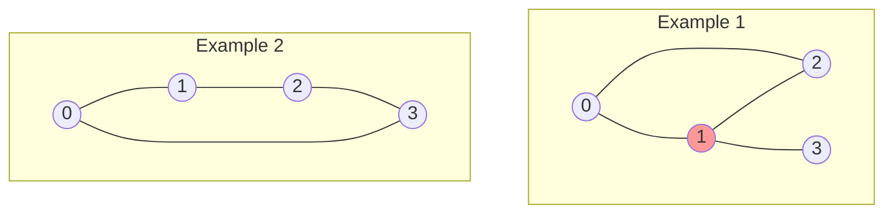

# 📊 Graph Representation for Finding Articulation Points

> [!NOTE]
> Before diving into the algorithm, we need to understand how to represent our graph in code.

## Graph Representation Options 🗺️

When working with graphs in algorithms, we have several ways to represent them:

### 1. Adjacency List

```
Graph:
0 -- 1 -- 3
|    |
2 -- 4
```

Represented as:
```
[
  [1, 2],    // Neighbors of vertex 0
  [0, 3, 4], // Neighbors of vertex 1
  [0, 4],    // Neighbors of vertex 2
  [1],       // Neighbors of vertex 3
  [1, 2]     // Neighbors of vertex 4
]
```

### 2. Adjacency Matrix

```
[
  [0, 1, 1, 0, 0], // Connections from vertex 0
  [1, 0, 0, 1, 1], // Connections from vertex 1
  [1, 0, 0, 0, 1], // Connections from vertex 2
  [0, 1, 0, 0, 0], // Connections from vertex 3
  [0, 1, 1, 0, 0]  // Connections from vertex 4
]
```

### 3. Edge List

```
[(0,1), (0,2), (1,3), (1,4), (2,4)]
```

## Which Representation Is Best for Articulation Points? 🤔

For the articulation points algorithm, we'll use an **adjacency list** representation because:

1. It provides efficient access to a vertex's neighbors (O(1) to find the list, then O(degree) to iterate)
2. It's space-efficient for sparse graphs (O(V+E) space)
3. It makes depth-first traversal straightforward

## Why Adjacency List is Perfect for Articulation Points

The articulation points algorithm heavily relies on:

1. **Neighbor exploration**: We need to quickly iterate through each vertex's neighbors during DFS
2. **Sparse access patterns**: We only need to access a vertex's direct connections
3. **Memory efficiency**: Many real-world graphs where we search for articulation points are sparse

The adjacency list gives us O(degree(v)) access to a vertex's neighbors, which is exactly what our DFS-based algorithm needs. In contrast, an adjacency matrix would waste space and time checking non-existent edges.

> [!TIP]
> The adjacency list is the most common representation for graph algorithms that need to explore neighbors, like DFS and BFS.

## Choosing the Right Representation: Quick Reference

| Graph Characteristic | Best Representation | Why |
|----------------------|---------------------|-----|
| Sparse graph (few edges) | Adjacency List | Saves space, faster neighbor iteration |
| Dense graph (many edges) | Adjacency Matrix | Faster edge lookup, simple implementation |
| Need fast edge existence check | Adjacency Matrix | O(1) lookup for any edge |
| Need to iterate through neighbors | Adjacency List | Direct access to neighbors |
| Memory-constrained environment | Edge List | Minimal memory for very sparse graphs |

## Converting Between Representations

<details>
<summary>Converting from Edge List to Adjacency List</summary>

```python
def edge_list_to_adj_list(edges, n):
    """
    Convert an edge list to an adjacency list
    
    Args:
        edges: List of (u, v) tuples representing edges
        n: Number of vertices
        
    Returns:
        Adjacency list representation
    """
    adj_list = [[] for _ in range(n)]
    
    for u, v in edges:
        adj_list[u].append(v)
        adj_list[v].append(u)  # For undirected graph
        
    return adj_list
```
</details>

## Example: Our Test Cases as Adjacency Lists

### Example 1:
```
Graph with edges: (0,1), (1,2), (2,0), (1,3)

Adjacency list:
[
  [1, 2],    // Neighbors of vertex 0
  [0, 2, 3], // Neighbors of vertex 1
  [0, 1],    // Neighbors of vertex 2
  [1]        // Neighbors of vertex 3
]
```

### Example 2:
```
Graph with edges: (0,1), (1,2), (2,3), (3,0)

Adjacency list:
[
  [1, 3],    // Neighbors of vertex 0
  [0, 2],    // Neighbors of vertex 1
  [1, 3],    // Neighbors of vertex 2
  [2, 0]     // Neighbors of vertex 3
]
```

## Visualizing Our Examples



> [!WARNING]
> When implementing graph algorithms, always be careful about the indexing of vertices. Some implementations use 0-indexed vertices, while others might use 1-indexed vertices.

## Think About It 🧠

<details>
<summary>Why is the adjacency matrix less efficient for sparse graphs?</summary>

An adjacency matrix always requires O(V²) space regardless of how many edges exist. For sparse graphs (where E << V²), this wastes a lot of space storing zeros for non-existent edges.
</details>

<details>
<summary>How would you handle disconnected graphs?</summary>

When working with potentially disconnected graphs, we need to ensure our algorithm visits all vertices. This is typically done by running our traversal algorithm (like DFS) from each unvisited vertex.
</details>

<details>
<summary>When would you choose an edge list over an adjacency list?</summary>

You might choose an edge list when:
1. The graph is extremely sparse (E << V)
2. You frequently need to iterate through all edges
3. You're working with a very large graph and memory is a constraint
4. You need to store additional information about edges (like weights)
5. The graph structure doesn't change often
</details>

In the next lesson, we'll explore the depth-first search (DFS) approach, which forms the foundation of our articulation points algorithm! 