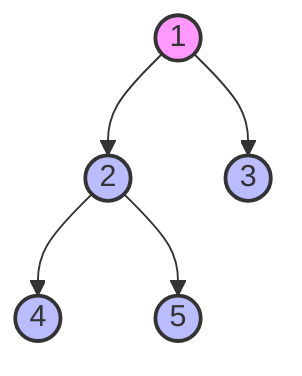
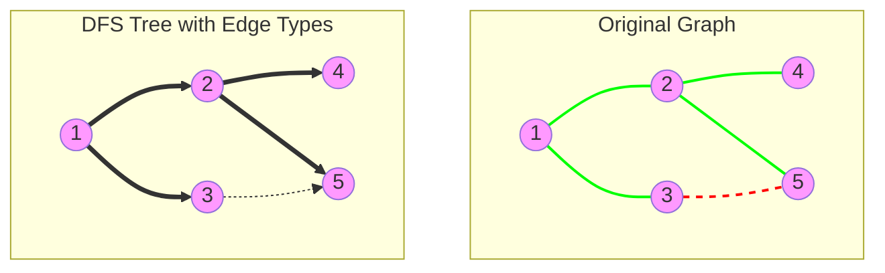
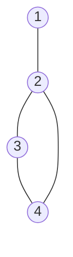
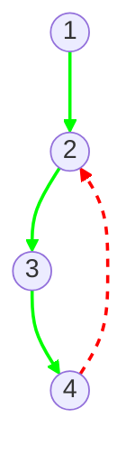

# 🌲 Depth-First Search: The Foundation for Finding Articulation Points

> [!NOTE]
> Depth-First Search (DFS) is the backbone of our articulation points algorithm. Let's understand how it works and why it's perfect for this task.

## What is Depth-First Search? 🤔

Depth-First Search (DFS) is a graph traversal algorithm that explores as far as possible along each branch before backtracking. Think of it as exploring a maze by always choosing a path and following it until you hit a dead end, then backtracking to the last junction and trying a different path.



## DFS Traversal Order 🚶‍♂️

In the graph above, a DFS traversal starting from vertex 1 might visit vertices in this order:
1 → 2 → 4 → 5 → 3

Notice how we fully explore the branch 1 → 2 → 4 → 5 before moving to vertex 3.

## Basic DFS Implementation

```python
def dfs(graph, start, visited=None):
    if visited is None:
        visited = set()
    
    # Mark current vertex as visited
    visited.add(start)
    print(f"Visiting vertex {start}")
    
    # Explore all adjacent vertices
    for neighbor in graph[start]:
        if neighbor not in visited:
            dfs(graph, neighbor, visited)
    
    return visited
```

## DFS Tree and Edge Classification 🌳

When we run DFS on a graph, we create what's called a **DFS tree**. The edges in the original graph can be classified into four types:

1. **Tree Edges**: Edges in the DFS tree (from parent to child)
2. **Back Edges**: Edges connecting a vertex to its ancestor (not parent)
3. **Forward Edges**: Edges connecting a vertex to its descendant (not child)
4. **Cross Edges**: All other edges

> [!NOTE]
> In undirected graphs, we only have tree edges and back edges!



In the diagram above:
- Solid green arrows (==>) represent tree edges
- Dashed red lines (-.>) represent back edges

## Why DFS Reveals Articulation Points: A Simple Example

Consider this graph:



When we run DFS starting from vertex 1, we create this DFS tree:



Notice how vertex 2 has a special property: it's the gateway to the cycle formed by 2-3-4. If we remove vertex 2, we disconnect the graph. DFS helps us discover this by revealing:

1. The parent-child structure (who can reach whom directly)
2. The back edges (alternative paths that bypass certain vertices)

Together, these tell us whether removing a vertex would disconnect the graph.

## Why DFS for Articulation Points? 🎯

DFS is perfect for finding articulation points because:

1. It creates a clear parent-child relationship in the DFS tree
2. Back edges in the DFS tree tell us about alternative paths in the graph
3. We can use these properties to determine if removing a vertex would disconnect the graph

> [!TIP]
> The key insight: A non-root vertex is an articulation point if and only if it has a child that cannot reach any of its ancestors without going through the vertex itself.

## Enhanced DFS for Articulation Points

For finding articulation points, we need to enhance our basic DFS with:

1. **Discovery Time**: When we first visit a vertex
2. **Low Value**: The earliest discovered vertex reachable from the subtree rooted at the current vertex
3. **Parent Tracking**: To identify the parent of each vertex in the DFS tree

## Checkpoint: DFS and Articulation Points So Far

Let's consolidate what we've learned:

1. DFS creates a **tree structure** as it explores the graph
2. This tree has **parent-child** relationships
3. **Back edges** create cycles and represent alternative paths
4. A vertex is an articulation point if removing it breaks these paths

In the next lesson, we'll develop a systematic way to identify these points using the concepts of discovery time and low value. But first, make sure you understand:
- How DFS traverses a graph
- What a DFS tree shows us
- What back edges represent

If these concepts are clear, you're ready to proceed!

## Think About It 🧠

<details>
<summary>Why can't we use BFS (Breadth-First Search) instead of DFS for finding articulation points?</summary>

BFS doesn't naturally create the parent-child relationships and tree structure that we need for the articulation points algorithm. The concept of "low value" is tied to the DFS tree structure and back edges, which BFS doesn't provide in the same way.
</details>

<details>
<summary>What's the significance of back edges in finding articulation points?</summary>

Back edges represent alternative paths in the graph. If a vertex has a back edge to an ancestor, it means there's a way to reach that ancestor without going through the vertex's parent. This is crucial for determining if the parent is an articulation point.
</details>

<details>
<summary>How do tree edges and back edges help us identify articulation points?</summary>

Tree edges form the backbone of our traversal and establish parent-child relationships. Back edges tell us about alternative paths that might exist to reach ancestors. A vertex is an articulation point if removing it would cut off these paths—specifically, if there's a subtree that cannot reach ancestors except through this vertex.
</details>

In the next lesson, we'll dive into the key concepts of discovery time and low value, which are essential for our articulation points algorithm! 