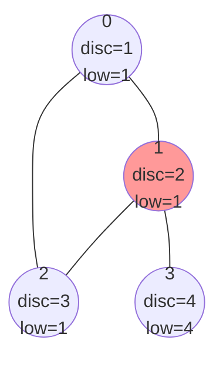

# ⏱️ Discovery Time and Low Values: The Key to Finding Articulation Points

> [!NOTE]
> In this lesson, we'll explore the two critical concepts that make our articulation points algorithm work: discovery time and low values.

## Discovery Time: When We First Visit a Vertex 🕒

**Discovery time** is simply a counter that increases each time we visit a new vertex during our DFS traversal. It tells us the order in which vertices are discovered.

```python
# Initialize
time = 0
disc = [0] * n  # Discovery times for each vertex

# During DFS
def dfs(u):
    nonlocal time
    disc[u] = time
    time += 1
    # ... rest of DFS
```

Think of discovery time as timestamps marking when we first encounter each vertex in our exploration.

## Low Value: Finding Alternative Paths 🔄

The **low value** of a vertex is the minimum of:
1. Its own discovery time
2. The discovery time of any ancestor it can reach through a back edge
3. The low value of any of its children in the DFS tree

```python
# Initialize
low = [0] * n  # Low values for each vertex

# During DFS
def dfs(u):
    # ... discovery time code
    low[u] = disc[u]  # Initially, low value is the discovery time
    
    for v in graph[u]:
        if not visited[v]:
            # Tree edge
            dfs(v)
            low[u] = min(low[u], low[v])
        elif v != parent[u]:
            # Back edge
            low[u] = min(low[u], disc[v])
```

## Visualizing Discovery Time and Low Value 📊

Let's look at an example:



In this graph:
- Vertex 0 is discovered first (disc=1), and its low value is 1 (its own discovery time)
- Vertex 1 is discovered second (disc=2), and its low value is 1 (from the back edge 2→0)
- Vertex 2 is discovered third (disc=3), and its low value is 1 (from the back edge to 0)
- Vertex 3 is discovered fourth (disc=4), and its low value is 4 (its own discovery time, as it has no back edges)

## The Magic: How These Values Help Find Articulation Points ✨

Here's where the magic happens. A non-root vertex `u` is an articulation point if and only if:

```
There exists a child v of u such that low[v] >= disc[u]
```

Why does this work? If `low[v] >= disc[u]`, it means the subtree rooted at `v` cannot reach any ancestor of `u` without going through `u`. In other words, `u` is the only connection between the subtree and the rest of the graph.

For the root of the DFS tree, the rule is different: it's an articulation point if and only if it has more than one child in the DFS tree.

## Step-by-Step Example

Let's trace through our example:

1. Start DFS at vertex 0
   - Mark 0 as visited, set disc[0]=1, low[0]=1
   - Explore neighbor 1

2. Visit vertex 1
   - Mark 1 as visited, set disc[1]=2, low[1]=2
   - Explore neighbor 2

3. Visit vertex 2
   - Mark 2 as visited, set disc[2]=3, low[2]=3
   - Explore neighbor 0 (already visited)
   - It's a back edge, so update low[2] = min(low[2], disc[0]) = min(3, 1) = 1
   - Return to vertex 1

4. Back at vertex 1
   - Update low[1] = min(low[1], low[2]) = min(2, 1) = 1
   - Explore neighbor 3

5. Visit vertex 3
   - Mark 3 as visited, set disc[3]=4, low[3]=4
   - No unvisited neighbors
   - Return to vertex 1

6. Back at vertex 1
   - Update low[1] = min(low[1], low[3]) = min(1, 4) = 1
   - Return to vertex 0

7. Back at vertex 0
   - Update low[0] = min(low[0], low[1]) = min(1, 1) = 1
   - DFS complete

8. Check for articulation points:
   - Vertex 0 is the root with one child, so it's not an articulation point
   - Vertex 1: Child 3 has low[3]=4 which is >= disc[1]=2, so 1 is an articulation point
   - Vertices 2 and 3 have no children in the DFS tree, so they're not articulation points

## Visualizing the Process 🎬

```mermaid
graph TD;
    subgraph "Step 1: Start at 0"
    A1((0<br>disc=1<br>low=1)) --- B1((1));
    B1 --- C1((2));
    C1 --- A1;
    B1 --- D1((3));
    end
    
    subgraph "Step 2: Visit 1"
    A2((0<br>disc=1<br>low=1)) --- B2((1<br>disc=2<br>low=2));
    B2 --- C2((2));
    C2 --- A2;
    B2 --- D2((3));
    end
    
    subgraph "Step 3: Visit 2"
    A3((0<br>disc=1<br>low=1)) --- B3((1<br>disc=2<br>low=2));
    B3 --- C3((2<br>disc=3<br>low=3));
    C3 --- A3;
    B3 --- D3((3));
    end
    
    subgraph "Step 4: Back edge 2→0"
    A4((0<br>disc=1<br>low=1)) --- B4((1<br>disc=2<br>low=2));
    B4 --- C4((2<br>disc=3<br>low=1));
    C4 --- A4;
    B4 --- D4((3));
    end
    
    subgraph "Step 5: Update low[1]"
    A5((0<br>disc=1<br>low=1)) --- B5((1<br>disc=2<br>low=1));
    B5 --- C5((2<br>disc=3<br>low=1));
    C5 --- A5;
    B5 --- D5((3));
    end
    
    subgraph "Final: After visiting 3"
    A6((0<br>disc=1<br>low=1)) --- B6((1<br>disc=2<br>low=1));
    B6 --- C6((2<br>disc=3<br>low=1));
    C6 --- A6;
    B6 --- D6((3<br>disc=4<br>low=4));
    style B6 fill:#ff9999;
    end
```



> [!TIP]
> The key to understanding this algorithm is to visualize how the low values propagate up the DFS tree, carrying information about back edges.

## Think About It 🧠

<details>
<summary>Why do we need to check if a neighbor is the parent in our DFS?</summary>

In an undirected graph, if vertex u has vertex v as a neighbor, then v also has u as a neighbor. When we're at vertex v and checking its neighbors, we'll see u again. We need to ignore this edge back to the parent; otherwise, we'd incorrectly treat it as a back edge to an ancestor.
</details>

<details>
<summary>What's the difference between how we handle the root and non-root vertices?</summary>

The root of the DFS tree is a special case. It doesn't have a parent, so the condition for non-root vertices doesn't apply. Instead, the root is an articulation point if and only if it has more than one child in the DFS tree, because removing it would disconnect those children from each other.
</details>

In the next lesson, we'll put everything together and implement the complete articulation points algorithm! 