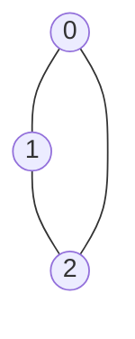

# 💻 Implementing the Articulation Points Algorithm

> [!NOTE]
> Now that we understand the key concepts, let's put everything together and implement the complete articulation points algorithm.

## Building the Algorithm Step by Step

Let's implement our algorithm incrementally:

### Step 1: Basic DFS traversal
```python
def dfs_basic(graph, u, visited):
    visited[u] = True
    for v in graph[u]:
        if not visited[v]:
            dfs_basic(graph, v, visited)
```

### Step 2: Adding discovery times and low values
```python
def dfs_with_times(graph, u, visited, disc, low, time):
    visited[u] = True
    disc[u] = low[u] = time[0]
    time[0] += 1
    
    for v in graph[u]:
        if not visited[v]:
            dfs_with_times(graph, v, visited, disc, low, time)
```

### Step 3: Tracking parent relationships and updating low values
```python
def dfs_with_parent(graph, u, visited, disc, low, parent, time):
    visited[u] = True
    disc[u] = low[u] = time[0]
    time[0] += 1
    
    for v in graph[u]:
        if not visited[v]:
            parent[v] = u
            dfs_with_parent(graph, v, visited, disc, low, parent, time)
            low[u] = min(low[u], low[v])
        elif v != parent[u]:
            low[u] = min(low[u], disc[v])
```

### Step 4: Identifying articulation points
```python
def dfs_art_points(graph, u, visited, disc, low, parent, art_points, time):
    visited[u] = True
    disc[u] = low[u] = time[0]
    time[0] += 1
    children = 0
    
    for v in graph[u]:
        if not visited[v]:
            parent[v] = u
            children += 1
            dfs_art_points(graph, v, visited, disc, low, parent, art_points, time)
            low[u] = min(low[u], low[v])
            
            # Check for articulation point
            if parent[u] == -1 and children > 1:
                art_points.add(u)
            if parent[u] != -1 and low[v] >= disc[u]:
                art_points.add(u)
        elif v != parent[u]:
            low[u] = min(low[u], disc[v])
```

## The Complete Algorithm 🧩

Now, here's the complete algorithm for finding articulation points in an undirected graph:

```python
def articulation_points(graph):
    n = len(graph)
    visited = [False] * n
    disc = [0] * n
    low = [0] * n
    parent = [-1] * n
    art_points = set()
    time = [0]  # Using a list for mutability in Python
    
    def dfs(u):
        # Mark current vertex as visited
        visited[u] = True
        
        # Initialize discovery time and low value
        disc[u] = low[u] = time[0]
        time[0] += 1
        
        # Count children in DFS tree
        children = 0
        
        # Visit all neighbors
        for v in graph[u]:
            # If v is not visited yet, make it a child of u in DFS tree
            if not visited[v]:
                parent[v] = u
                children += 1
                
                # Recursive DFS
                dfs(v)
                
                # Check if subtree rooted at v has a connection to an ancestor of u
                low[u] = min(low[u], low[v])
                
                # u is an articulation point in following cases:
                
                # Case 1: u is root of DFS tree and has two or more children
                if parent[u] == -1 and children > 1:
                    art_points.add(u)
                
                # Case 2: u is not root and low value of one of its children is >= discovery value of u
                if parent[u] != -1 and low[v] >= disc[u]:
                    art_points.add(u)
                    
            # Update low value of u for parent function calls
            # If v is already visited and not the parent of u, 
            # then it's a back edge from u to v
            elif v != parent[u]:
                low[u] = min(low[u], disc[v])
    
    # Call DFS for all unvisited vertices (handles disconnected graphs)
    for i in range(n):
        if not visited[i]:
            dfs(i)
            
    return list(art_points)
```

## Visualizing the Algorithm Execution

Let's see how our implementation would process this simple graph step by step:



Here's a visualization of the key variables at each step:

| Step | Action | visited | disc | low | parent | art_points |
|------|--------|---------|------|-----|--------|------------|
| 1 | Start DFS at 0 | [T,F,F] | [0,0,0] | [0,0,0] | [-1,-1,-1] | {} |
| 2 | Visit 1 | [T,T,F] | [0,1,0] | [0,1,0] | [-1,0,-1] | {} |
| 3 | Visit 2 | [T,T,T] | [0,1,2] | [0,1,2] | [-1,0,1] | {} |
| 4 | Back edge 2→0 | [T,T,T] | [0,1,2] | [0,1,0] | [-1,0,1] | {} |
| 5 | Update low[1] | [T,T,T] | [0,1,2] | [0,0,0] | [-1,0,1] | {} |
| 6 | Check art points | [T,T,T] | [0,1,2] | [0,0,0] | [-1,0,1] | {} |

The algorithm correctly identifies that there are no articulation points in this cycle graph.

## Breaking Down the Implementation 🔍

Let's analyze the key parts of our implementation:

### 1. Initialization

```python
n = len(graph)
visited = [False] * n
disc = [0] * n
low = [0] * n
parent = [-1] * n
art_points = set()
time = [0]  # Using a list for mutability in Python
```

We initialize:
- `visited`: Tracks which vertices we've visited
- `disc`: Stores discovery times
- `low`: Stores low values
- `parent`: Tracks the parent of each vertex in the DFS tree
- `art_points`: Stores the articulation points we find
- `time`: A counter for discovery times

### 2. DFS Function

```python
def dfs(u):
    # Mark current vertex as visited
    visited[u] = True
    
    # Initialize discovery time and low value
    disc[u] = low[u] = time[0]
    time[0] += 1
    
    # Count children in DFS tree
    children = 0
```

We start by marking the current vertex as visited, setting its discovery time and low value, and initializing a counter for its children.

### 3. Processing Neighbors

```python
# Visit all neighbors
for v in graph[u]:
    # If v is not visited yet, make it a child of u in DFS tree
    if not visited[v]:
        parent[v] = u
        children += 1
        
        # Recursive DFS
        dfs(v)
        
        # Check if subtree rooted at v has a connection to an ancestor of u
        low[u] = min(low[u], low[v])
```

For each unvisited neighbor, we:
1. Mark it as a child of the current vertex
2. Increment the children counter
3. Recursively call DFS on it
4. Update the low value of the current vertex based on the low value of its child

### 4. Identifying Articulation Points

```python
# u is an articulation point in following cases:

# Case 1: u is root of DFS tree and has two or more children
if parent[u] == -1 and children > 1:
    art_points.add(u)

# Case 2: u is not root and low value of one of its children is >= discovery value of u
if parent[u] != -1 and low[v] >= disc[u]:
    art_points.add(u)
```

We check two cases:
1. If the current vertex is the root of the DFS tree and has more than one child
2. If the current vertex is not the root and has a child whose low value is greater than or equal to the discovery time of the current vertex

### 5. Handling Back Edges

```python
# Update low value of u for parent function calls
# If v is already visited and not the parent of u, 
# then it's a back edge from u to v
elif v != parent[u]:
    low[u] = min(low[u], disc[v])
```

If we encounter a vertex that's already visited and is not the parent of the current vertex, it's a back edge. We update the low value of the current vertex based on the discovery time of the back edge target.

### 6. Handling Disconnected Graphs

```python
# Call DFS for all unvisited vertices (handles disconnected graphs)
for i in range(n):
    if not visited[i]:
        dfs(i)
```

We call DFS for each unvisited vertex to handle disconnected graphs.

## Time and Space Complexity ⏱️

- **Time Complexity**: O(V + E), where V is the number of vertices and E is the number of edges
  - We visit each vertex once and process each edge once
  
- **Space Complexity**: O(V)
  - We use several arrays of size V to store information about the vertices

## Iterative Implementation Alternative 🔄

While the recursive implementation is cleaner and easier to understand, here's an iterative version for those who prefer it or are concerned about stack overflow for very large graphs:

<details>
<summary>Iterative Implementation</summary>

```python
def articulation_points_iterative(graph):
    n = len(graph)
    visited = [False] * n
    disc = [0] * n
    low = [0] * n
    parent = [-1] * n
    art_points = set()
    time = 0
    
    for start in range(n):
        if visited[start]:
            continue
            
        stack = [(start, 0)]  # (vertex, neighbor_index)
        children = [0] * n
        
        while stack:
            u, idx = stack[-1]
            
            # If this is the first visit to u
            if idx == 0:
                visited[u] = True
                disc[u] = low[u] = time
                time += 1
            
            # If we've processed all neighbors
            if idx == len(graph[u]):
                stack.pop()
                
                # Check if u is an articulation point
                if parent[u] == -1 and children[u] > 1:
                    art_points.add(u)
                    
                continue
                
            # Get the next neighbor
            v = graph[u][idx]
            stack[-1] = (u, idx + 1)  # Move to next neighbor
            
            if not visited[v]:
                parent[v] = u
                children[u] += 1
                stack.append((v, 0))
            elif v != parent[u]:
                low[u] = min(low[u], disc[v])
                
            # After processing a child
            if parent[u] != -1 and idx > 0 and low[graph[u][idx-1]] >= disc[u]:
                art_points.add(u)
                
            # Update low value after processing a child
            if idx > 0 and parent[graph[u][idx-1]] == u:
                low[u] = min(low[u], low[graph[u][idx-1]])
                
    return list(art_points)
```
</details>

## Common Pitfalls to Avoid ⚠️

1. **Forgetting the Root Case**: The root of the DFS tree is a special case and needs to be handled differently.

2. **Parent Check**: Always check if a neighbor is the parent before updating low values for back edges.

3. **Disconnected Graphs**: Make sure to run DFS for all unvisited vertices to handle disconnected graphs.

4. **Duplicate Articulation Points**: Use a set to avoid adding the same articulation point multiple times.

5. **Off-by-One Errors**: Be careful with the initialization and updating of discovery times and low values.

## Think About It 🧠

<details>
<summary>How would you modify the algorithm to find bridges (critical edges) instead of articulation points?</summary>

To find bridges (edges whose removal would disconnect the graph), we would modify the condition for identifying critical components. An edge (u, v) is a bridge if low[v] > disc[u]. This is slightly different from the articulation points condition (low[v] >= disc[u]). The rest of the algorithm remains the same.
</details>

<details>
<summary>Can a graph have articulation points but no bridges?</summary>

Yes! Consider a graph with two cycles connected by a single vertex. That vertex is an articulation point, but there are no bridges because removing any single edge doesn't disconnect the graph.
</details>

<details>
<summary>How would you handle weighted graphs when finding articulation points?</summary>

The articulation points algorithm doesn't consider edge weights, as it's focused on connectivity rather than path lengths. The same algorithm works for weighted graphs without modification, since we're only concerned with the structure of the graph, not the values associated with edges.
</details>

In the next lesson, we'll walk through a complete example to solidify our understanding of the articulation points algorithm! 