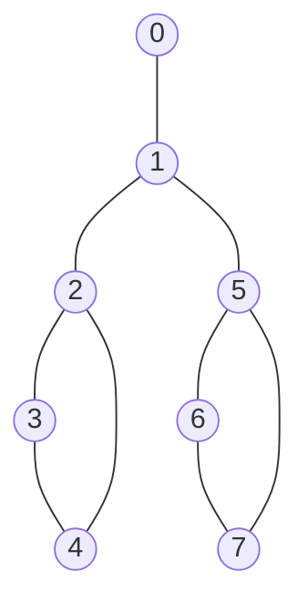
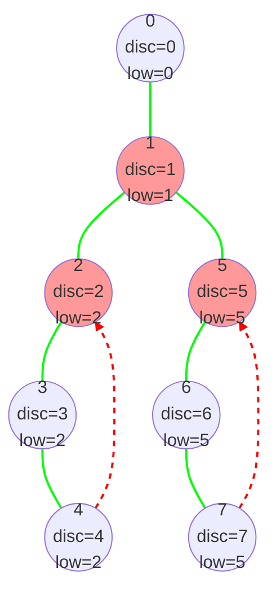

# 🔬 Articulation Points: A Complete Worked Example

> [!NOTE]
> Let's solidify our understanding by walking through a complete example step by step.

## Our Example Graph 📊

We'll work with a slightly more complex graph to illustrate all aspects of the algorithm:



This graph has the following adjacency list representation:

```python
graph = [
    [1],        # Neighbors of vertex 0
    [0, 2, 5],  # Neighbors of vertex 1
    [1, 3, 4],  # Neighbors of vertex 2
    [2, 4],     # Neighbors of vertex 3
    [2, 3],     # Neighbors of vertex 4
    [1, 6, 7],  # Neighbors of vertex 5
    [5, 7],     # Neighbors of vertex 6
    [5, 6]      # Neighbors of vertex 7
]
```

## Step-by-Step Execution 🚶‍♂️

Let's trace through the algorithm step by step, starting from vertex 0:

### Initialization

```
visited = [False, False, False, False, False, False, False, False]
disc = [0, 0, 0, 0, 0, 0, 0, 0]
low = [0, 0, 0, 0, 0, 0, 0, 0]
parent = [-1, -1, -1, -1, -1, -1, -1, -1]
art_points = {}
time = 0
```

### DFS Traversal

#### Step 1: Visit Vertex 0

```
visited[0] = True
disc[0] = low[0] = 0
time = 1
children = 0
```

Explore neighbor 1:
- Not visited, so make it a child of 0
- children = 1
- Call DFS on vertex 1

#### Step 2: Visit Vertex 1

```
visited[1] = True
disc[1] = low[1] = 1
time = 2
children = 0
parent[1] = 0
```

Explore neighbor 0:
- Already visited and is the parent, so skip

Explore neighbor 2:
- Not visited, so make it a child of 1
- children = 1
- Call DFS on vertex 2

#### Step 3: Visit Vertex 2

```
visited[2] = True
disc[2] = low[2] = 2
time = 3
children = 0
parent[2] = 1
```

Explore neighbor 1:
- Already visited and is the parent, so skip

Explore neighbor 3:
- Not visited, so make it a child of 2
- children = 1
- Call DFS on vertex 3

#### Step 4: Visit Vertex 3

```
visited[3] = True
disc[3] = low[3] = 3
time = 4
children = 0
parent[3] = 2
```

Explore neighbor 2:
- Already visited and is the parent, so skip

Explore neighbor 4:
- Not visited, so make it a child of 3
- children = 1
- Call DFS on vertex 4

#### Step 5: Visit Vertex 4

```
visited[4] = True
disc[4] = low[4] = 4
time = 5
children = 0
parent[4] = 3
```

Explore neighbor 2:
- Already visited and not the parent, so it's a back edge
- Update low[4] = min(low[4], disc[2]) = min(4, 2) = 2

Explore neighbor 3:
- Already visited and is the parent, so skip

Return to vertex 3.

#### Step 6: Back to Vertex 3

Update low[3] = min(low[3], low[4]) = min(3, 2) = 2

Return to vertex 2.

#### Step 7: Back to Vertex 2

Update low[2] = min(low[2], low[3]) = min(2, 2) = 2

Explore neighbor 4:
- Already visited, so skip (we've already processed it)

Return to vertex 1.

#### Step 8: Back to Vertex 1

Update low[1] = min(low[1], low[2]) = min(1, 2) = 1

Explore neighbor 5:
- Not visited, so make it a child of 1
- children = 2
- Call DFS on vertex 5

#### Step 9: Visit Vertex 5

```
visited[5] = True
disc[5] = low[5] = 5
time = 6
children = 0
parent[5] = 1
```

Explore neighbor 1:
- Already visited and is the parent, so skip

Explore neighbor 6:
- Not visited, so make it a child of 5
- children = 1
- Call DFS on vertex 6

#### Step 10: Visit Vertex 6

```
visited[6] = True
disc[6] = low[6] = 6
time = 7
children = 0
parent[6] = 5
```

Explore neighbor 5:
- Already visited and is the parent, so skip

Explore neighbor 7:
- Not visited, so make it a child of 6
- children = 1
- Call DFS on vertex 7

#### Step 11: Visit Vertex 7

```
visited[7] = True
disc[7] = low[7] = 7
time = 8
children = 0
parent[7] = 6
```

Explore neighbor 5:
- Already visited and not the parent, so it's a back edge
- Update low[7] = min(low[7], disc[5]) = min(7, 5) = 5

Explore neighbor 6:
- Already visited and is the parent, so skip

Return to vertex 6.

#### Step 12: Back to Vertex 6

Update low[6] = min(low[6], low[7]) = min(6, 5) = 5

Return to vertex 5.

#### Step 13: Back to Vertex 5

Update low[5] = min(low[5], low[6]) = min(5, 5) = 5

Explore neighbor 7:
- Already visited, so skip (we've already processed it)

Return to vertex 1.

#### Step 14: Back to Vertex 1

Update low[1] = min(low[1], low[5]) = min(1, 5) = 1

Return to vertex 0.

#### Step 15: Back to Vertex 0

Update low[0] = min(low[0], low[1]) = min(0, 1) = 0

DFS traversal complete.

### Final Values

```
disc = [0, 1, 2, 3, 4, 5, 6, 7]
low = [0, 1, 2, 2, 2, 5, 5, 5]
parent = [-1, 0, 1, 2, 3, 1, 5, 6]
```

### Identifying Articulation Points

Now let's check each vertex to see if it's an articulation point:

#### Vertex 0 (Root)
- It has only one child (vertex 1), so it's not an articulation point.

#### Vertex 1
- It's not the root.
- For child 2: low[2] = 2 >= disc[1] = 1? Yes, so vertex 1 is an articulation point.
- For child 5: low[5] = 5 >= disc[1] = 1? Yes, so vertex 1 is an articulation point (already added).

#### Vertex 2
- It's not the root.
- For child 3: low[3] = 2 >= disc[2] = 2? Yes, so vertex 2 is an articulation point.

#### Vertex 3
- It's not the root.
- For child 4: low[4] = 2 >= disc[3] = 3? No, so vertex 3 is not an articulation point.

#### Vertex 4
- It has no children in the DFS tree, so it's not an articulation point.

#### Vertex 5
- It's not the root.
- For child 6: low[6] = 5 >= disc[5] = 5? Yes, so vertex 5 is an articulation point.

#### Vertex 6
- It's not the root.
- For child 7: low[7] = 5 >= disc[6] = 6? No, so vertex 6 is not an articulation point.

#### Vertex 7
- It has no children in the DFS tree, so it's not an articulation point.

### Result

The articulation points are: 1, 2, and 5.

## Visual Representation of the Process 🎬



In the diagram:
- Solid green lines represent tree edges
- Dashed red lines represent back edges
- Vertices 1, 2, and 5 (highlighted in red) are articulation points

## Verification ✅

Let's verify our result by checking what happens if we remove each articulation point:

1. **Removing Vertex 1**: This would disconnect vertices 0, 2, 3, 4, 5, 6, and 7 into two components: {0} and {2, 3, 4, 5, 6, 7}.

2. **Removing Vertex 2**: This would disconnect vertices 0, 1, 3, 4, 5, 6, and 7 into two components: {0, 1, 5, 6, 7} and {3, 4}.

3. **Removing Vertex 5**: This would disconnect vertices 0, 1, 2, 3, 4, 6, and 7 into two components: {0, 1, 2, 3, 4} and {6, 7}.

This confirms that our algorithm correctly identified all articulation points.

## Think About It 🧠

<details>
<summary>What would happen if we started the DFS from a different vertex?</summary>

The DFS tree would be different, but we would still identify the same articulation points. The articulation points are a property of the graph structure, not the traversal order. However, the discovery times and low values would be different.
</details>

<details>
<summary>How would the algorithm behave on a complete graph (where every vertex is connected to every other vertex)?</summary>

In a complete graph, there are no articulation points. This is because removing any single vertex still leaves all other vertices connected to each other. The algorithm would correctly return an empty list.
</details>

In the next lesson, we'll explore some real-world applications of articulation points! 