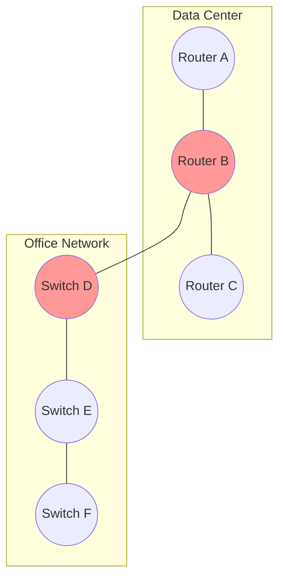
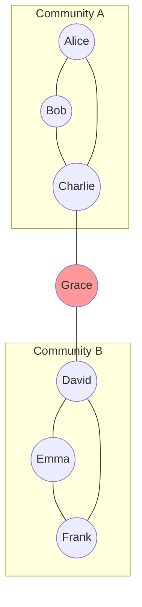
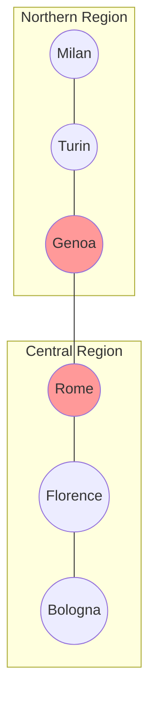
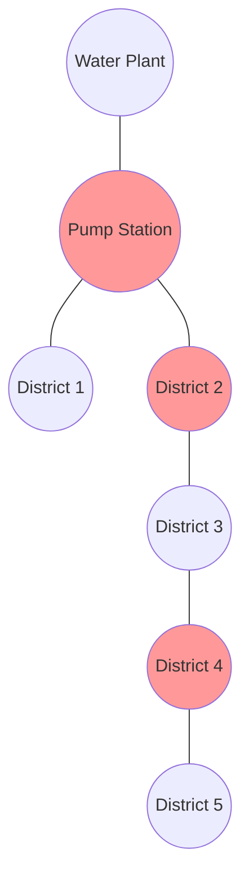

# 🌍 Real-World Applications of Articulation Points

> [!NOTE]
> The articulation points algorithm isn't just a theoretical concept. It has numerous practical applications in various fields. Let's explore some of them!

## Network Reliability Analysis 🖧

One of the most common applications of articulation points is in analyzing the reliability of networks.

### Computer Networks

In computer networks, articulation points represent critical routers or switches whose failure would disconnect parts of the network. Network engineers use this information to:

- Identify single points of failure
- Implement redundancy where needed
- Plan maintenance schedules to minimize disruption
- Design more resilient network topologies

In this simplified network diagram, Routers B and Switch D are articulation points. If either fails, communication between the data center and office network would be disrupted.

### Transportation Networks

In transportation systems, articulation points might represent:

- Critical intersections in road networks
- Key stations in railway systems
- Important airports in flight networks
- Strategic ports in shipping routes

Identifying these points helps transportation planners:
- Prioritize maintenance and security
- Develop contingency plans for disruptions
- Plan infrastructure expansions to reduce vulnerability

## Social Network Analysis 👥

In social networks, articulation points represent individuals who bridge different communities or groups.

In this example, Grace is an articulation point connecting two otherwise separate communities. Sociologists and network analysts use this information to:

- Identify key influencers or bridges between communities
- Understand information flow in social structures
- Analyze the resilience of social networks
- Target interventions or marketing efforts

## Case Study: Italian Power Grid Analysis

In a 2013 study of the Italian power grid, researchers applied the articulation points algorithm to identify critical substations:

The analysis revealed:
- 7% of substations were articulation points
- These critical substations handled 32% of the total power flow
- A targeted reinforcement plan required only €25 million but increased grid resilience by 45%

This real-world application demonstrated how identifying articulation points helped prioritize infrastructure investments efficiently.

## Biological Networks 🧬

Articulation points have important applications in biological networks:

### Protein-Protein Interaction Networks

In protein-protein interaction networks, articulation points may represent:
- Essential proteins whose removal would disrupt cellular functions
- Potential drug targets for therapeutic interventions
- Key proteins in disease pathways

### Metabolic Networks

In metabolic networks, articulation points might be:
- Critical enzymes in metabolic pathways
- Potential bottlenecks in cellular processes
- Important targets for metabolic engineering

## Infrastructure Planning 🏙️

Urban planners and civil engineers use articulation points to:

- Identify critical infrastructure in utility networks (water, electricity, gas)
- Plan emergency response strategies
- Design more resilient urban systems
- Prioritize infrastructure investments

In this water distribution network, the pump station and certain distribution nodes are articulation points. Their failure would cut off water supply to multiple districts.

## Cybersecurity 🔒

In cybersecurity, articulation points help identify:

- Critical servers or systems whose compromise would significantly impact network connectivity
- Strategic points for monitoring network traffic
- Potential targets for security hardening
- Vulnerabilities in network architecture

## Supply Chain Management 📦

Supply chain analysts use articulation points to:

- Identify critical distribution centers
- Assess supply chain vulnerabilities
- Plan for contingencies and disruptions
- Optimize logistics networks

## Telecommunications 📡

In telecommunications networks, articulation points represent:

- Critical cell towers or base stations
- Important switching centers
- Key fiber optic junction points
- Satellite ground stations with unique coverage

Telecommunications companies use this information to:
- Ensure service reliability
- Plan maintenance with minimal disruption
- Implement redundancy where needed
- Optimize network expansion

## Emerging Applications in Data Science and AI

The articulation points concept is finding novel applications in:

### Natural Language Processing
Identifying key connector words in semantic networks that bridge different domains or contexts.

### Recommendation Systems
Finding broker products that connect different user preference clusters, which can be leveraged for cross-selling strategies.

### Federated Learning
Identifying critical nodes in distributed learning networks whose failure would fragment the learning ecosystem.

### Brain Connectomics
Neuroscientists use articulation points to identify critical regions in brain networks that coordinate between different functional modules.

## Case Study: Internet Backbone Resilience 🌐

The internet's global infrastructure relies on a complex network of routers and connections. By analyzing articulation points in this network, researchers and engineers can:

1. Identify critical exchange points that connect different regions
2. Assess the impact of natural disasters or cyber attacks on connectivity
3. Plan the deployment of new submarine cables or fiber routes
4. Develop strategies to maintain connectivity during crises

> [!TIP]
> When applying the articulation points algorithm to real-world networks, consider using weighted graphs to account for factors like capacity, reliability, or importance of connections.

## Think About It 🧠

How might articulation points be used in epidemic modeling?

In epidemic modeling, articulation points could represent individuals or locations that, if isolated, would prevent the spread of disease between different communities. Public health officials might use this information to implement targeted quarantine measures or vaccination strategies to contain outbreaks efficiently.

Can you think of an application of articulation points in software architecture?

In software architecture, articulation points might represent critical services or components whose failure would disconnect parts of the system. Architects could use this information to implement redundancy, circuit breakers, or fallback mechanisms for these critical components to improve system resilience.

How could articulation points be used in social media analysis?

In social media analysis, articulation points could identify users who bridge different communities or interest groups. These users might be influential in spreading information across otherwise disconnected groups. Marketing strategists could target these users for campaigns intended to reach diverse audiences, while disinformation researchers might monitor them to track how misleading content spreads.

In the next lesson, we'll explore some variations and extensions of the articulation points algorithm! 