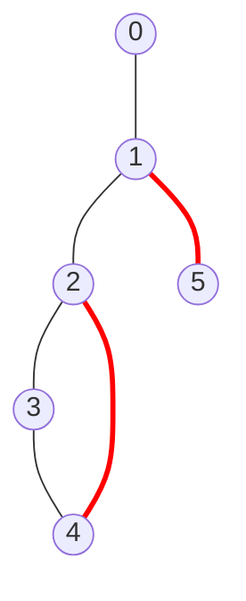
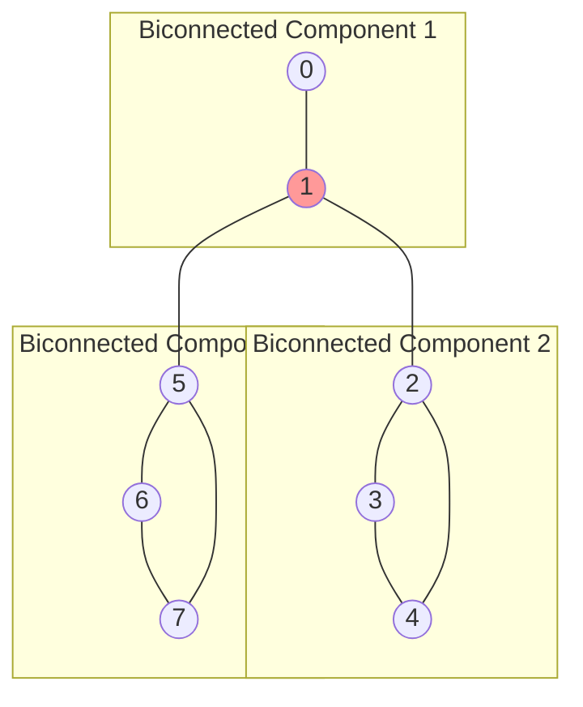
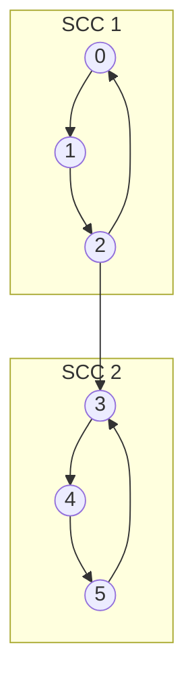

# 🔄 Variations and Extensions of the Articulation Points Algorithm

> [!NOTE]
> The articulation points algorithm is part of a family of related algorithms for analyzing graph connectivity. Let's explore some variations and extensions!

## Bridge Finding Algorithm 🌉

A **bridge** (or cut edge) is an edge whose removal increases the number of connected components in a graph. Bridges are the edge counterpart to articulation points.



In this graph, the edges (1,5) and (2,3) are bridges (highlighted in red).

### Algorithm Modification

The bridge finding algorithm is very similar to the articulation points algorithm. The key difference is in the condition:

```python
# For articulation points (non-root vertex)
if parent[u] != -1 and low[v] >= disc[u]:
    # u is an articulation point
    
# For bridges
if low[v] > disc[u]:  # Note the strict inequality
    # Edge (u,v) is a bridge
```

Notice the strict inequality (`>` instead of `>=`) for bridges. This is because:
- For articulation points, we're checking if the subtree rooted at v can reach u or its ancestors
- For bridges, we're checking if the subtree rooted at v can reach u's ancestors (but not u itself)

### Implementation

```python
def find_bridges(graph):
    n = len(graph)
    visited = [False] * n
    disc = [0] * n
    low = [0] * n
    parent = [-1] * n
    bridges = []
    time = [0]
    
    def dfs(u):
        visited[u] = True
        disc[u] = low[u] = time[0]
        time[0] += 1
        
        for v in graph[u]:
            if not visited[v]:
                parent[v] = u
                dfs(v)
                low[u] = min(low[u], low[v])
                
                # Check if edge (u,v) is a bridge
                if low[v] > disc[u]:
                    bridges.append((u, v))
            elif v != parent[u]:
                low[u] = min(low[u], disc[v])
    
    for i in range(n):
        if not visited[i]:
            dfs(i)
            
    return bridges
```

## Biconnected Components 🔗

A **biconnected component** is a maximal biconnected subgraph. A graph is biconnected if it remains connected after removing any single vertex.

In other words, biconnected components are the "pieces" of the graph separated by articulation points.



In this graph, vertex 1 is an articulation point that separates three biconnected components.

### Finding Biconnected Components

We can find biconnected components using a modified DFS:

1. Use a stack to keep track of edges during DFS
2. When we identify an articulation point, pop edges from the stack until we reach the edge that connects the articulation point to its child
3. These popped edges form a biconnected component

```python
def find_biconnected_components(graph):
    n = len(graph)
    visited = [False] * n
    disc = [0] * n
    low = [0] * n
    parent = [-1] * n
    stack = []  # Stack to store edges
    components = []  # List to store biconnected components
    time = [0]
    
    def dfs(u):
        visited[u] = True
        disc[u] = low[u] = time[0]
        time[0] += 1
        children = 0
        
        for v in graph[u]:
            if not visited[v]:
                parent[v] = u
                children += 1
                stack.append((u, v))  # Add edge to stack
                dfs(v)
                
                low[u] = min(low[u], low[v])
                
                # If u is an articulation point or root
                if (parent[u] == -1 and children > 1) or (parent[u] != -1 and low[v] >= disc[u]):
                    # Start a new biconnected component
                    component = []
                    while stack and stack[-1] != (u, v):
                        component.append(stack.pop())
                    if stack:
                        component.append(stack.pop())
                    components.append(component)
            elif v != parent[u] and disc[v] < disc[u]:
                low[u] = min(low[u], disc[v])
                stack.append((u, v))  # Add back edge to stack
    
    for i in range(n):
        if not visited[i]:
            dfs(i)
            # If stack is not empty, the remaining edges form the last component
            if stack:
                components.append(stack[:])
                stack.clear()
                
    return components
```

## Strongly Connected Components 🔄

For directed graphs, the equivalent concept is **strongly connected components** (SCCs). A strongly connected component is a maximal subgraph where every vertex is reachable from every other vertex.

Tarjan's algorithm (which we use for articulation points) can also find SCCs with slight modifications.



## k-Vertex Connectivity 🔢

The articulation points algorithm identifies vertices whose removal disconnects the graph (1-vertex connectivity). We can extend this to k-vertex connectivity:

- A graph is k-vertex-connected if it remains connected after removing any k-1 vertices
- Finding the minimum set of k vertices whose removal disconnects the graph is a generalization of the articulation points problem

This is a more complex problem and typically requires different algorithms like max-flow min-cut.

## Weighted Articulation Points 🏋️

In real-world applications, not all disconnections are equally important. We might want to find articulation points that, when removed, disconnect components with a significant total weight.

This requires modifying our algorithm to consider weights:

```python
def weighted_articulation_points(graph, weights):
    # Similar to the standard algorithm, but track component weights
    # when identifying articulation points
    # ...
```

## Approximation Algorithms for Large Graphs 📊

For extremely large graphs, running the exact articulation points algorithm might be too expensive. Approximation algorithms can provide good estimates with less computational cost:

1. **Sampling-based approaches**: Run the algorithm on sampled subgraphs
2. **Local algorithms**: Focus on specific regions of the graph
3. **Parallel implementations**: Distribute the computation across multiple processors

## Dynamic Articulation Points 🔄

In many real-world scenarios, graphs change over time (edges and vertices are added or removed). Recomputing articulation points from scratch after each change is inefficient.

Dynamic algorithms maintain and update articulation points incrementally as the graph changes:

```python
def update_articulation_points(graph, art_points, disc, low, edge_added):
    # Update articulation points when a new edge is added
    # ...
```

## Think About It 🧠

<details>
<summary>How would you modify the articulation points algorithm to find the "most critical" articulation point?</summary>

To find the "most critical" articulation point, we could modify the algorithm to calculate the size of each component that would be disconnected if an articulation point is removed. The articulation point that would disconnect the largest component (or create the most imbalanced partition) could be considered the most critical.
</details>

<details>
<summary>Can a graph have bridges but no articulation points?</summary>

No, if a graph has bridges, it must also have articulation points. Specifically, the endpoints of a bridge are articulation points, unless they are leaf nodes (degree 1). This is because removing a bridge endpoint would disconnect at least the vertex at the other end of the bridge.
</details>

In the next lesson, we'll explore some common challenges and optimizations when implementing the articulation points algorithm! 