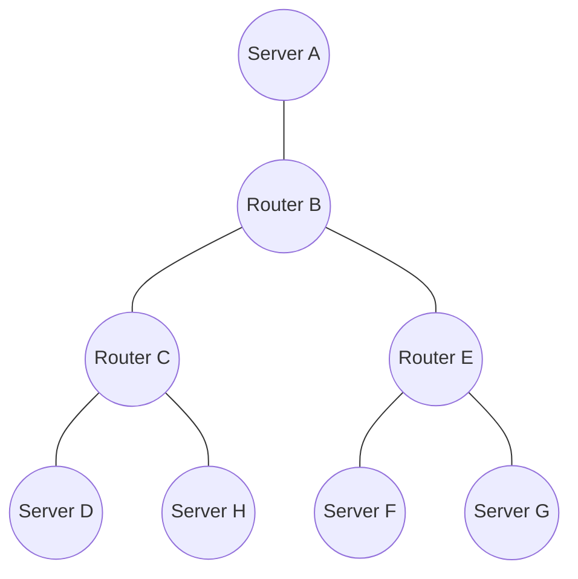

# 🎓 Articulation Points: Conclusion and Practice Exercises

> [!NOTE]
> Congratulations on reaching the end of our articulation points algorithm journey! Let's summarize what we've learned and practice with some exercises.

## What We've Learned 📚

Throughout this series of lessons, we've covered:

1. **The Problem**: Understanding what articulation points are and why they're important
2. **Graph Representation**: How to represent graphs for the algorithm
3. **DFS Basics**: The foundation of our algorithm
4. **Discovery and Low Values**: The key concepts that make the algorithm work
5. **Algorithm Implementation**: The complete algorithm in code
6. **Worked Example**: A step-by-step walkthrough of the algorithm
7. **Real-World Applications**: How articulation points are used in practice
8. **Variations and Extensions**: Related algorithms and concepts
9. **Challenges and Optimizations**: Common issues and how to address them

## Key Takeaways 🔑

- **Articulation points** are vertices in an undirected graph whose removal increases the number of connected components
- The algorithm uses **depth-first search (DFS)** to identify these critical vertices
- Two key concepts drive the algorithm: **discovery time** and **low value**
- The algorithm has **O(V+E) time complexity** and **O(V) space complexity**
- Articulation points have numerous **real-world applications** in network analysis, infrastructure planning, and more

## Practice Exercises 🏋️‍♂️

Let's reinforce your understanding with some practice exercises:

### Exercise 1: Basic Implementation

Implement the articulation points algorithm from scratch. Test it on these graphs:

```
Graph 1:
0 -- 1 -- 2
     |    |
     3 -- 4

Graph 2:
0 -- 1 -- 2 -- 3
     |         |
     5 -- 4 -- 3
```

<details>
<summary>Solution for Graph 1</summary>

The articulation points are: [1]

Explanation: Removing vertex 1 would disconnect the graph into two components: {0} and {2, 3, 4}.
</details>

<details>
<summary>Solution for Graph 2</summary>

The articulation points are: [1, 3]

Explanation: 
- Removing vertex 1 would disconnect vertex 0 from the rest of the graph
- Removing vertex 3 would disconnect the graph into two components: {0, 1, 2} and {4, 5}
</details>

### Exercise 2: Special Cases

Identify the articulation points in these special cases:

```
Complete Graph (K4):
0 -- 1
| \/ |
| /\ |
3 -- 2

Tree:
    0
   / \
  1   2
 / \
3   4

Cycle:
0 -- 1 -- 2 -- 3 -- 0
```

<details>
<summary>Solutions</summary>

Complete Graph (K4): No articulation points

Tree: Vertices 0 and 1 are articulation points

Cycle: No articulation points
</details>

### Exercise 3: Real-World Application

Consider this simplified network:



1. Identify the articulation points in this network
2. What would happen if Router C fails?
3. How would you improve the network's resilience?

<details>
<summary>Solution</summary>

1. Articulation points: B, C, E
2. If Router C fails, Servers D and H would be disconnected from the rest of the network
3. To improve resilience, we could add redundant connections, such as:
   - Connect Server D directly to Router B
   - Connect Server H to Router E
   - Add a direct connection between Routers B and C
</details>

### Exercise 4: Algorithm Variation

Modify the articulation points algorithm to find bridges (critical edges) in a graph. Test it on:

```
Graph:
0 -- 1 -- 2
|    |    |
3 -- 4 -- 5
```

<details>
<summary>Solution</summary>

The bridges are: [(0,3), (2,5)]

Explanation: Removing either of these edges would disconnect the graph.

Key modification to the algorithm:
```python
# For bridges
if low[v] > disc[u]:  # Note the strict inequality
    bridges.append((u, v))
```
</details>

### Exercise 5: Performance Challenge

Consider a large social network with millions of users. You need to identify the most critical users (articulation points) efficiently.

1. How would you optimize the algorithm for this scale?
2. What preprocessing steps might help?
3. Could you use approximation techniques?

<details>
<summary>Solution Ideas</summary>

1. Optimizations:
   - Use an iterative implementation to avoid stack overflow
   - Use compact data structures to save memory
   - Implement parallel processing across multiple machines

2. Preprocessing:
   - Remove vertices with degree 1 (they can't be articulation points)
   - Decompose the graph into connected components and process each separately
   - Identify and handle special cases (complete subgraphs, trees, etc.)

3. Approximation techniques:
   - Sample the graph and run the algorithm on subgraphs
   - Use local algorithms that focus on high-degree vertices
   - Implement incremental updates for dynamic graphs
</details>

## Further Learning Resources 📖

To deepen your understanding of articulation points and related concepts:

### Books
- "Introduction to Algorithms" by Cormen, Leiserson, Rivest, and Stein
- "Algorithm Design" by Kleinberg and Tardos
- "Graph Theory" by Reinhard Diestel

### Online Resources
- [Visualgo - Graph Algorithms](https://visualgo.net/en/dfsbfs)
- [Stanford CS Theory - Graph Algorithms](http://theory.stanford.edu/~tim/w16/l/l2.pdf)
- [GeeksforGeeks - Articulation Points](https://www.geeksforgeeks.org/articulation-points-or-cut-vertices-in-a-graph/)

### Research Papers
- Tarjan, R. E. (1972). "Depth-first search and linear graph algorithms"
- Hopcroft, J., & Tarjan, R. (1973). "Algorithm 447: Efficient algorithms for graph manipulation"

## Final Thoughts 💭

The articulation points algorithm is a beautiful example of how a simple concept (DFS) can be extended to solve complex problems. By understanding the structure of a graph through discovery times and low values, we can identify critical components that might otherwise be hidden.

As you continue your algorithmic journey, remember that many complex problems can be solved by building upon fundamental algorithms and data structures. The principles you've learned here—graph traversal, parent-child relationships, and connectivity analysis—will serve you well in tackling a wide range of computational challenges.

> [!TIP]
> The best way to solidify your understanding is to implement the algorithm yourself and experiment with different graph structures. Try creating your own test cases and visualizing the DFS tree to see how the algorithm works!

Happy coding! 🚀 