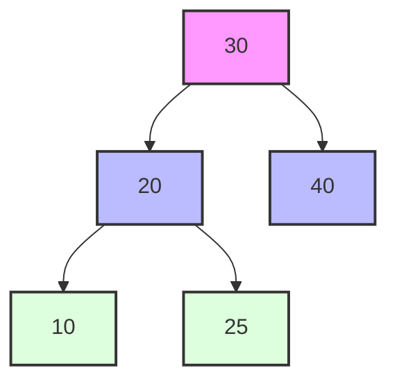

# 🌳 AVL Trees: Self-Balancing Binary Search Trees

> [!NOTE]
> AVL trees are named after their inventors, **A**delson-**V**elsky and **L**andis, who introduced them in 1962.

## The Problem We're Solving 🤔

Imagine you're building a digital library catalog with thousands of books. You need to organize them in a way that makes finding any book extremely fast, regardless of how many books you add or remove over time.

Regular binary search trees can become unbalanced over time, leading to inefficient operations that might take linear time (O(n)) in the worst case. This is where AVL trees come to the rescue!

## Why Balance Matters: A Visual Comparison 📊

Consider searching for a specific book in two different library organizations:

**With an unbalanced binary search tree:**
```
1 → 2 → 3 → ... → 999 → 1000
```
In this degenerate case (essentially a linked list), finding book #1000 requires checking all 1,000 nodes (O(n) time).

**With a balanced AVL tree:**
```
       500
      /   \
    250    750
   /  \    /  \
 125  375 625  875
 / \  ...  ...  / \
...          ... 1000
```
Finding any book requires checking at most 10 nodes (O(log n) time), a 100x improvement!

## What is an AVL Tree? 🌲

An AVL tree is a **self-balancing binary search tree** where the height difference between the left and right subtrees of any node (called the balance factor) is at most 1.

> [!TIP]
> Think of an AVL tree as a binary search tree that automatically reorganizes itself to maintain balance, ensuring optimal performance.

### Key Properties:

- **Binary Search Tree Property**: For any node, all values in its left subtree are less than the node's value, and all values in its right subtree are greater.
- **Balance Property**: The height difference between left and right subtrees of any node is at most 1.
- **Self-Balancing**: After insertions or deletions, the tree automatically rebalances itself using rotation operations.

## Why Do We Need AVL Trees? 🎯

Regular binary search trees can degenerate into a linked list in the worst case, making operations slow (O(n) time complexity). AVL trees guarantee O(log n) time complexity for search, insert, and delete operations by maintaining balance.

<details>
<summary>Real-world Applications</summary>

AVL trees are used in:
- **Database indexing systems**: For efficient range queries and sorted data access
- **Memory management systems**: To track memory blocks by address
- **Network routing algorithms**: For IP lookup tables requiring fast searches
- **File systems**: For organizing directory structures and rapid file lookup
- **Geographic information systems**: For spatial indexing of map data
- **Game development**: For fast collision detection between objects

</details>

## Visual Example



This is a balanced AVL tree. Notice how the height difference between subtrees at any node is at most 1.

## Interactive Thought Experiment 🧠

Before proceeding, take a moment to consider:

If we insert the values 50, 40, 30, 20, 10 in sequence into:
1. A regular binary search tree
2. An AVL tree

How would the final structures differ? Sketch both trees on paper and consider the efficiency of searching for the value 10 in each structure.

## What We'll Learn 📚

In this step-by-step guide, we'll explore:
1. How to build an AVL tree from scratch
2. How to maintain balance using rotations
3. How to perform search, insert, and delete operations efficiently
4. When and why to use AVL trees in real-world applications

> [!TIP]
> As you go through this guide, try to visualize the tree structure and how it changes with each operation. Drawing the trees on paper can be incredibly helpful!

## Let's Get Started! 🚀

Are you ready to dive into the world of self-balancing trees? In the next section, we'll explore the fundamental concepts of AVL trees and how they maintain balance.

**Question to ponder**: Why do you think maintaining balance in a tree is so important for performance? How much faster is O(log n) compared to O(n) for large datasets? 