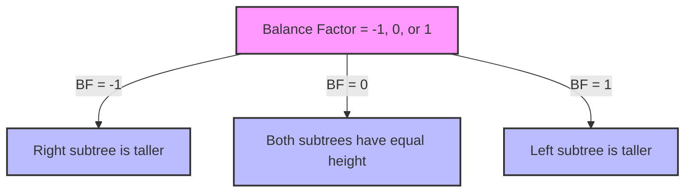

# 🧱 The Building Blocks of AVL Trees

Before we dive into the implementation details, let's understand the fundamental concepts that make AVL trees work.

## Building on Your BST Knowledge 🔄

AVL trees are an extension of Binary Search Trees (BSTs). If you're familiar with BSTs, you already know:
- Each node has at most 2 children (left and right)
- Left child contains a value less than the parent
- Right child contains a value greater than the parent
- Search, insertion, and deletion work by comparing values and traversing left or right

AVL trees add just one critical feature: **self-balancing** through height tracking and rotations.

## Tree Node Structure 📊

Every node in an AVL tree contains:

```javascript
class AVLNode {
  constructor(value) {
    this.value = value;    // The data stored in the node
    this.left = null;      // Pointer to left child
    this.right = null;     // Pointer to right child
    this.height = 1;       // Height of the node (crucial for balancing)
  }
}
```

> [!NOTE]
> The height property is what distinguishes AVL tree nodes from regular binary search tree nodes. This extra information helps us maintain balance.

## Height Calculation: The Building Analogy 📏

Think of the height of a node like "floors" in a building:

- A leaf node is on the "ground floor" (height = 1)
- A null child doesn't exist (height = 0)
- The height of any node is 1 + the height of its tallest child (like adding another floor)

```
       Node A (height 3)
      /        \
 Node B (h2)   Node C (h1)
    / \           
Node D  Node E    
 (h1)   (h1)      
```

In this example:
- Nodes D and E are leaf nodes (height 1)
- Node B's height is 1 + max(D.height, E.height) = 1 + 1 = 2
- Node C is a leaf node (height 1)
- Node A's height is 1 + max(B.height, C.height) = 1 + 2 = 3

The height calculation function:

```javascript
getHeight(node) {
  return node ? node.height : 0;
}
```

> [!TIP]
> Always update the height of a node after any operation that might change the structure of its subtrees!

## Balance Factor ⚖️

The **balance factor** is the key to understanding AVL trees. It is calculated as:

```
Balance Factor = Height of Left Subtree - Height of Right Subtree
```

For an AVL tree to remain balanced, the balance factor of every node must be -1, 0, or 1.



### Examples:

<details open>
<summary>Balanced Node (Balance Factor = 0)</summary>

```
    10
   /  \
  5    15
```

Here, both left and right subtrees have the same height (1), so the balance factor is 0.

</details>

<details>
<summary>Left-Heavy Node (Balance Factor = 1)</summary>

```
    10
   /  \
  5    null
```

Here, the left subtree has height 1, and the right subtree has height 0, so the balance factor is 1.

</details>

<details>
<summary>Right-Heavy Node (Balance Factor = -1)</summary>

```
    10
   /  \
null   15
```

Here, the left subtree has height 0, and the right subtree has height 1, so the balance factor is -1.

</details>

<details>
<summary>Unbalanced Node (Balance Factor = 2)</summary>

```
     10
    /
   5
  /
 3
```

Here, the left subtree has height 2, and the right subtree has height 0, so the balance factor is 2. This node needs rebalancing!

</details>

## Tree Operations Overview 🔄

AVL trees support three main operations:

1. **Search**: Find a node with a specific value (same as in a regular BST)
2. **Insert**: Add a new node while maintaining balance
3. **Delete**: Remove a node while maintaining balance

The search operation is identical to a regular binary search tree. The insert and delete operations, however, include an additional step to rebalance the tree if necessary.

## The AVL Tree Balancing Process 🔧

Here's how balancing works at a high level:

1. Perform a standard BST operation (insert or delete)
2. Update the height of each affected node going up the tree
3. Check the balance factor of each affected node
4. If any node has a balance factor outside the range [-1, 1], perform appropriate rotations to rebalance

When an insertion or deletion causes a node to have a balance factor outside the range [-1, 1], we need to rebalance the tree using **rotations**.

There are four types of rotations:

1. **Left Rotation**: Used when a node is right-heavy (balance factor < -1)
2. **Right Rotation**: Used when a node is left-heavy (balance factor > 1)
3. **Left-Right Rotation**: A combination of left and right rotations
4. **Right-Left Rotation**: A combination of right and left rotations

We'll explore each of these rotations in detail in the next section.

> [!WARNING]
> Rotations can be tricky to understand at first. Take your time to visualize each step of the rotation process.

## Quick Knowledge Check 🤔

Before moving on, consider these questions:

1. Why do we need to store the height of each node instead of calculating it on demand?
2. What would happen if we allowed balance factors to be in the range [-2, 2] instead of [-1, 1]?
3. If a node has a balance factor of 2, what does that tell us about its left and right subtrees?
4. How does the height of an AVL tree with n nodes compare to an unbalanced binary search tree with n nodes?

<details>
<summary>Check your answers</summary>

1. Storing the height is more efficient than recalculating it, as height calculation would require traversing all descendants repeatedly.
2. The tree would be less strictly balanced, potentially allowing longer paths which would reduce search efficiency.
3. It means the left subtree is two levels taller than the right subtree, indicating an imbalance that needs correction.
4. An AVL tree has a height of O(log n), while an unbalanced BST could degenerate to O(n) height in the worst case.

</details>

In the next section, we'll dive into the rotation operations that keep our AVL tree balanced. 