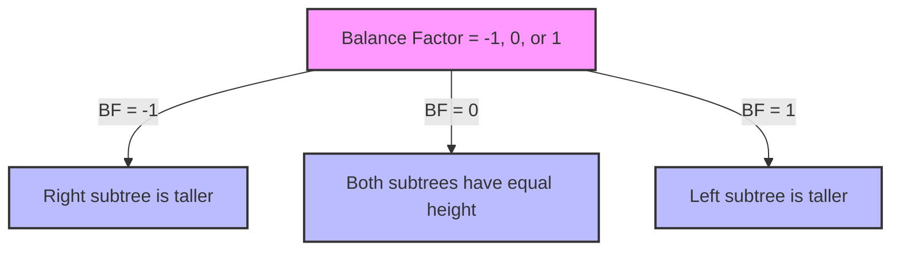

# 🧱 The Building Blocks of AVL Trees

Before we dive into the implementation details, let's understand the fundamental concepts that make AVL trees work.

## Tree Node Structure 📊

Every node in an AVL tree contains:

```javascript
class AVLNode {
  constructor(value) {
    this.value = value;    // The data stored in the node
    this.left = null;      // Pointer to left child
    this.right = null;     // Pointer to right child
    this.height = 1;       // Height of the node (crucial for balancing)
  }
}
```

> [!NOTE]
> The height property is what distinguishes AVL tree nodes from regular binary search tree nodes. This extra information helps us maintain balance.

## Balance Factor ⚖️

The **balance factor** is the key to understanding AVL trees. It is calculated as:

```
Balance Factor = Height of Left Subtree - Height of Right Subtree
```

For an AVL tree to remain balanced, the balance factor of every node must be -1, 0, or 1.



### Examples:

<details open>
<summary>Balanced Node (Balance Factor = 0)</summary>

```
    10
   /  \
  5    15
```

Here, both left and right subtrees have the same height (1), so the balance factor is 0.

</details>

<details>
<summary>Left-Heavy Node (Balance Factor = 1)</summary>

```
    10
   /  \
  5    null
```

Here, the left subtree has height 1, and the right subtree has height 0, so the balance factor is 1.

</details>

<details>
<summary>Right-Heavy Node (Balance Factor = -1)</summary>

```
    10
   /  \
null   15
```

Here, the left subtree has height 0, and the right subtree has height 1, so the balance factor is -1.

</details>

## Height Calculation 📏

The height of a node is the length of the longest path from it to a leaf node. In our implementation:

- A leaf node has a height of 1
- The height of a null node is considered 0
- The height of a node is 1 + the maximum height of its children

```javascript
getHeight(node) {
  return node ? node.height : 0;
}
```

> [!TIP]
> Always update the height of a node after any operation that might change the structure of its subtrees!

## Tree Operations Overview 🔄

AVL trees support three main operations:

1. **Search**: Find a node with a specific value (same as in a regular BST)
2. **Insert**: Add a new node while maintaining balance
3. **Delete**: Remove a node while maintaining balance

The search operation is identical to a regular binary search tree. The insert and delete operations, however, include an additional step to rebalance the tree if necessary.

## Balancing Mechanism 🔧

When an insertion or deletion causes a node to have a balance factor outside the range [-1, 1], we need to rebalance the tree using **rotations**.

There are four types of rotations:

1. **Left Rotation**: Used when a node is right-heavy
2. **Right Rotation**: Used when a node is left-heavy
3. **Left-Right Rotation**: A combination of left and right rotations
4. **Right-Left Rotation**: A combination of right and left rotations

We'll explore each of these rotations in detail in the next section.

> [!WARNING]
> Rotations can be tricky to understand at first. Take your time to visualize each step of the rotation process.

## Think About It 🤔

Before moving on, consider these questions:

1. Why do we need to store the height of each node instead of calculating it on demand?
2. What would happen if we allowed balance factors to be in the range [-2, 2] instead of [-1, 1]?

In the next section, we'll dive into the rotation operations that keep our AVL tree balanced. 