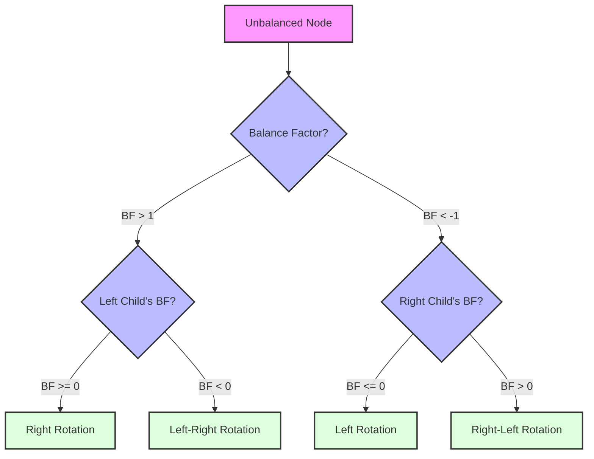

# 🔄 Rotations: The Magic Behind AVL Trees

Rotations are the key operations that keep an AVL tree balanced. When an insertion or deletion causes a node to become unbalanced (balance factor outside the range [-1, 1]), we perform one or more rotations to restore balance.

## Types of Rotations 🔄

There are four types of rotations in AVL trees:

1. **Left Rotation (LL)**: Used when a node is right-heavy and its right child is balanced or right-heavy
2. **Right Rotation (RR)**: Used when a node is left-heavy and its left child is balanced or left-heavy
3. **Left-Right Rotation (LR)**: Used when a node is left-heavy and its left child is right-heavy
4. **Right-Left Rotation (RL)**: Used when a node is right-heavy and its right child is left-heavy

Let's explore each of these rotations in detail.

## Left Rotation (LL) 👈

A left rotation is performed when a node has a balance factor of -2 and its right child has a balance factor of -1 or 0.

### Before Left Rotation:
```
    A
   / \
  B   C
     / \
    D   E
```

### After Left Rotation:
```
      C
     / \
    A   E
   / \
  B   D
```

### Code Implementation:
```javascript
leftRotate(x) {
  const y = x.right;
  const T2 = y.left;
  
  // Perform rotation
  y.left = x;
  x.right = T2;
  
  // Update heights
  x.height = Math.max(this.getHeight(x.left), this.getHeight(x.right)) + 1;
  y.height = Math.max(this.getHeight(y.left), this.getHeight(y.right)) + 1;
  
  // Return new root
  return y;
}
```

> [!TIP]
> In a left rotation, the right child becomes the new root, and the original root becomes the left child of the new root.

## Right Rotation (RR) 👉

A right rotation is performed when a node has a balance factor of 2 and its left child has a balance factor of 1 or 0.

### Before Right Rotation:
```
    A
   / \
  B   C
 / \
D   E
```

### After Right Rotation:
```
      B
     / \
    D   A
       / \
      E   C
```

### Code Implementation:
```javascript
rightRotate(y) {
  const x = y.left;
  const T2 = x.right;
  
  // Perform rotation
  x.right = y;
  y.left = T2;
  
  // Update heights
  y.height = Math.max(this.getHeight(y.left), this.getHeight(y.right)) + 1;
  x.height = Math.max(this.getHeight(x.left), this.getHeight(x.right)) + 1;
  
  // Return new root
  return x;
}
```

> [!TIP]
> In a right rotation, the left child becomes the new root, and the original root becomes the right child of the new root.

## Left-Right Rotation (LR) 🔄

A left-right rotation is a combination of a left rotation followed by a right rotation. It's performed when a node has a balance factor of 2 and its left child has a balance factor of -1.

### Before Left-Right Rotation:
```
      A
     / \
    B   C
   / \
  D   E
     / \
    F   G
```

### After Left Rotation on B:
```
      A
     / \
    E   C
   / \
  B   G
 / \
D   F
```

### After Right Rotation on A:
```
        E
       / \
      B   A
     / \ / \
    D  F G  C
```

### Code Implementation:
```javascript
// Left-Right Rotation
if (balance > 1 && value > node.left.value) {
  node.left = this.leftRotate(node.left);
  return this.rightRotate(node);
}
```

## Right-Left Rotation (RL) 🔄

A right-left rotation is a combination of a right rotation followed by a left rotation. It's performed when a node has a balance factor of -2 and its right child has a balance factor of 1.

### Before Right-Left Rotation:
```
    A
   / \
  B   C
     / \
    D   E
   / \
  F   G
```

### After Right Rotation on C:
```
    A
   / \
  B   D
     / \
    F   C
       / \
      G   E
```

### After Left Rotation on A:
```
      D
     / \
    A   C
   / \ / \
  B  F G  E
```

### Code Implementation:
```javascript
// Right-Left Rotation
if (balance < -1 && value < node.right.value) {
  node.right = this.rightRotate(node.right);
  return this.leftRotate(node);
}
```

## Choosing the Right Rotation 🤔

The choice of rotation depends on the balance factors of the unbalanced node and its children:



> [!WARNING]
> It's crucial to update the heights of all affected nodes after performing rotations. Failure to do so will lead to incorrect balance factors and potentially more imbalances.

## Practice Exercise 💪

Try to trace through the following insertions into an initially empty AVL tree, identifying when rotations are needed and which type:

1. Insert 10
2. Insert 20
3. Insert 30
4. Insert 40
5. Insert 50
6. Insert 25

<details>
<summary>Solution</summary>

1. Insert 10: Tree is balanced
```
10
```

2. Insert 20: Tree is balanced
```
10
 \
  20
```

3. Insert 30: Tree becomes unbalanced (balance factor of 10 is -2), perform left rotation
```
Before rotation:
10
 \
  20
   \
    30

After left rotation:
  20
 /  \
10   30
```

4. Insert 40: Tree is balanced
```
  20
 /  \
10   30
      \
       40
```

5. Insert 50: Tree becomes unbalanced (balance factor of 30 is -2), perform left rotation on 30, then tree is balanced
```
Before rotation:
  20
 /  \
10   30
      \
       40
        \
         50

After left rotation on 30:
    20
   /  \
  10   40
      /  \
     30   50
```

6. Insert 25: Tree is balanced
```
    20
   /  \
  10   40
      /  \
     30   50
    /
   25
```

</details>

In the next section, we'll explore how to implement the insertion operation in an AVL tree, which uses these rotations to maintain balance. 