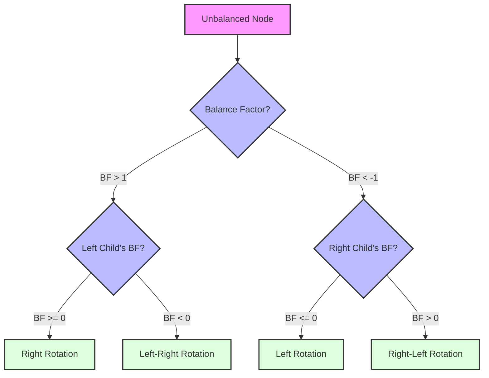

# 🔄 Rotations: The Magic Behind AVL Trees

Rotations are the key operations that keep an AVL tree balanced. When an insertion or deletion causes a node to become unbalanced (balance factor outside the range [-1, 1]), we perform one or more rotations to restore balance.

## Thinking About Rotations 🧠

Before diving into the technical details, let's build an intuition for rotations:

Imagine your tree is like a mobile hanging from the ceiling. When one side becomes too heavy (imbalanced), you need to redistribute the weight to maintain balance. Rotations are simply a way of rearranging nodes to ensure no part of the tree becomes too deep.


## Types of Rotations 🔄

There are four types of rotations in AVL trees:

1. **Left Rotation (LL)**: Used when a node is right-heavy and its right child is balanced or right-heavy
2. **Right Rotation (RR)**: Used when a node is left-heavy and its left child is balanced or left-heavy
3. **Left-Right Rotation (LR)**: Used when a node is left-heavy and its left child is right-heavy
4. **Right-Left Rotation (RL)**: Used when a node is right-heavy and its right child is left-heavy

Let's explore each of these rotations in detail.

## Left Rotation (LL) 👈

A left rotation is performed when a node has a balance factor of -2 and its right child has a balance factor of -1 or 0.

### Mental Model:
"Lift the heavy right child up to become the new root, and shift the old root to the left."

### Before Left Rotation:
```
    A
   / \
  B   C
     / \
    D   E
```

### After Left Rotation:
```
      C
     / \
    A   E
   / \
  B   D
```

### Step-by-Step Process:
1. Node C becomes the new root
2. Node A becomes C's left child
3. C's original left child (D) becomes A's right child
4. A's left child (B) remains unchanged
5. C's right child (E) remains unchanged
6. Update the heights of A and then C

### Code Implementation:
```javascript
leftRotate(x) {
  // Step 1: Identify the new root
  const y = x.right;
  
  // Step 2: Identify the "moving subtree"
  const T2 = y.left;
  
  // Step 3: Perform rotation - make y the new root
  y.left = x;
  x.right = T2;
  
  // Step 4: Update heights
  x.height = Math.max(this.getHeight(x.left), this.getHeight(x.right)) + 1;
  y.height = Math.max(this.getHeight(y.left), this.getHeight(y.right)) + 1;
  
  // Step 5: Return new root
  return y;
}
```

> [!TIP]
> In a left rotation, the right child becomes the new root, and the original root becomes the left child of the new root.

## Right Rotation (RR) 👉

A right rotation is performed when a node has a balance factor of 2 and its left child has a balance factor of 1 or 0.

### Mental Model:
"Lift the heavy left child up to become the new root, and shift the old root to the right."

### Before Right Rotation:
```
    A
   / \
  B   C
 / \
D   E
```

### After Right Rotation:
```
      B
     / \
    D   A
       / \
      E   C
```

### Step-by-Step Process:
1. Node B becomes the new root
2. Node A becomes B's right child
3. B's original right child (E) becomes A's left child
4. B's left child (D) remains unchanged
5. A's right child (C) remains unchanged
6. Update the heights of A and then B

### Code Implementation:
```javascript
rightRotate(y) {
  // Step 1: Identify the new root
  const x = y.left;
  
  // Step 2: Identify the "moving subtree"
  const T2 = x.right;
  
  // Step 3: Perform rotation - make x the new root
  x.right = y;
  y.left = T2;
  
  // Step 4: Update heights
  y.height = Math.max(this.getHeight(y.left), this.getHeight(y.right)) + 1;
  x.height = Math.max(this.getHeight(x.left), this.getHeight(x.right)) + 1;
  
  // Step 5: Return new root
  return x;
}
```

> [!TIP]
> In a right rotation, the left child becomes the new root, and the original root becomes the right child of the new root.

## Left-Right Rotation (LR) 🔄

A left-right rotation is a combination of a left rotation followed by a right rotation. It's performed when a node has a balance factor of 2 and its left child has a balance factor of -1.

### Mental Model:
"First rotate the left subtree left to create a left-left case, then rotate the whole tree right."

### Before Left-Right Rotation:
```
      A
     / \
    B   C
   / \
  D   E
     / \
    F   G
```

### After Left Rotation on B:
```
      A
     / \
    E   C
   / \
  B   G
 / \
D   F
```

### After Right Rotation on A:
```
        E
       / \
      B   A
     / \ / \
    D  F G  C
```

### Code Implementation:
```javascript
// Left-Right Rotation
if (balance > 1 && this.getBalance(node.left) < 0) {
  // First, left rotate the left child
  node.left = this.leftRotate(node.left);
  // Then, right rotate the node
  return this.rightRotate(node);
}
```

## Right-Left Rotation (RL) 🔄

A right-left rotation is a combination of a right rotation followed by a left rotation. It's performed when a node has a balance factor of -2 and its right child has a balance factor of 1.

### Mental Model:
"First rotate the right subtree right to create a right-right case, then rotate the whole tree left."

### Before Right-Left Rotation:
```
    A
   / \
  B   C
     / \
    D   E
   / \
  F   G
```

### After Right Rotation on C:
```
    A
   / \
  B   D
     / \
    F   C
       / \
      G   E
```

### After Left Rotation on A:
```
      D
     / \
    A   C
   / \ / \
  B  F G  E
```

### Code Implementation:
```javascript
// Right-Left Rotation
if (balance < -1 && this.getBalance(node.right) > 0) {
  // First, right rotate the right child
  node.right = this.rightRotate(node.right);
  // Then, left rotate the node
  return this.leftRotate(node);
}
```

## Animated Visualization

To better understand rotations, visualize them as a series of steps:


Studying this animation can help you see exactly how nodes move during each type of rotation.

## Choosing the Right Rotation 🤔

The choice of rotation depends on the balance factors of the unbalanced node and its children:



> [!WARNING]
> It's crucial to update the heights of all affected nodes after performing rotations. Failure to do so will lead to incorrect balance factors and potentially more imbalances.

## Common Rotation Mistakes ⚠️

1. **Forgetting to update heights**: Always update heights after rotations, starting from the lowest modified nodes.
2. **Returning the wrong node**: Remember to return the new root of the subtree after rotation.
3. **Incorrect pointers**: Carefully manage the reassignment of child pointers during rotation.
4. **Wrong rotation choice**: Double-check the balance factors to ensure you're using the correct rotation type.

## Practice Exercise 💪

Try to trace through the following insertions into an initially empty AVL tree, identifying when rotations are needed and which type:

1. Insert 10
2. Insert 20
3. Insert 30
4. Insert 40
5. Insert 50
6. Insert 25

<details>
<summary>Solution</summary>

1. Insert 10: Tree is balanced
```
10
```

2. Insert 20: Tree is balanced
```
10
 \
  20
```

3. Insert 30: Tree becomes unbalanced (balance factor of 10 is -2), perform left rotation
```
Before rotation:
10
 \
  20
   \
    30

After left rotation:
  20
 /  \
10   30
```

4. Insert 40: Tree is balanced
```
  20
 /  \
10   30
      \
       40
```

5. Insert 50: Tree becomes unbalanced (balance factor of 30 is -2), perform left rotation on 30, then tree is balanced
```
Before rotation:
  20
 /  \
10   30
      \
       40
        \
         50

After left rotation on 30:
    20
   /  \
  10   40
      /  \
     30   50
```

6. Insert 25: Tree is balanced
```
    20
   /  \
  10   40
      /  \
     30   50
    /
   25
```

</details>

## Interactive Check: Test Your Understanding

Before moving on, make sure you can answer these questions:

1. What rotation would you perform if a node has a balance factor of 2 and its left child has a balance factor of 1?
2. What happens to the "moving subtree" (y.left in a left rotation) during a rotation?
3. Why do we need double rotations (LR and RL) in some cases?
4. How many nodes change their parent during a single rotation?

In the next section, we'll explore how to implement the insertion operation in an AVL tree, which uses these rotations to maintain balance. 