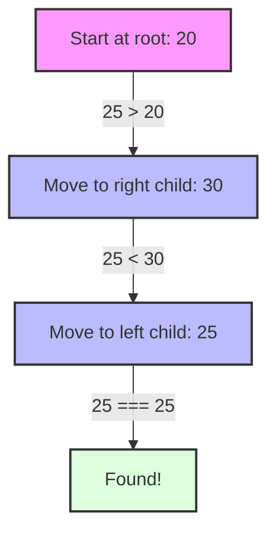

# 🔍 Search in AVL Trees

Searching in an AVL tree is identical to searching in a regular binary search tree. The self-balancing property of AVL trees ensures that the search operation is always efficient, with a guaranteed time complexity of O(log n).

## The Dictionary Analogy 📚

Searching in an AVL tree is like finding a word in a dictionary using a divide-and-conquer approach:

1. Open the dictionary roughly in the middle
2. Is your word before or after this page?
   - If before, look in the first half
   - If after, look in the second half
3. Repeat until you find your word

This binary search approach is extremely efficient. For a dictionary with 1,000,000 words, you'll find any word in at most 20 steps!

## The Search Process 🕵️

The search process in an AVL tree is straightforward:

1. Start at the root of the tree.
2. Compare the target value with the current node's value:
   - If they are equal, we've found the node we're looking for.
   - If the target value is less than the current node's value, search in the left subtree.
   - If the target value is greater than the current node's value, search in the right subtree.
3. If we reach a null node, the target value is not in the tree.

## Visualizing the Search Process

```
Step 1: Start at root (50)
                50
              /    \
            30      70
           /  \    /  \
         20   40  60   80

Step 2: Search for 60 (60 > 50, go right)
                50
              /    \
            30     [70]
           /  \    /  \
         20   40  60   80

Step 3: Search for 60 (60 < 70, go left)
                50
              /    \
            30      70
           /  \    /  \
         20   40 [60]  80

Step 4: Found 60!
```

## Implementation 💻

Here's a simple recursive implementation of the search operation:

```javascript
search(value) {
  return this.searchNode(this.root, value);
}

searchNode(node, value) {
  // Base case: If the node is null or the value is found
  if (!node) return null;
  if (node.value === value) return node;
  
  // Recursive case: Search in the left or right subtree
  if (value < node.value) {
    return this.searchNode(node.left, value);
  } else {
    return this.searchNode(node.right, value);
  }
}
```

And here's an iterative implementation, which avoids the overhead of recursive function calls:

```javascript
search(value) {
  let current = this.root;
  
  while (current) {
    if (value === current.value) {
      return current;
    } else if (value < current.value) {
      current = current.left;
    } else {
      current = current.right;
    }
  }
  
  return null; // Value not found
}
```

> [!TIP]
> The iterative implementation is generally more efficient in terms of space complexity, as it doesn't use the call stack for recursion.

## Visual Example: Searching for 25 in an AVL Tree 🖼️

Consider the following AVL tree:

```
     20
    /  \
   10   30
  / \   / \
 5  15 25  40
```

Let's trace through the search for the value 25:

1. Start at the root (20).
2. 25 > 20, so we move to the right child (30).
3. 25 < 30, so we move to the left child (25).
4. 25 === 25, so we've found the node we're looking for.



## Search Performance Visualization 📊

Let's visualize why AVL trees provide such efficient search operations:

### Binary Search Performance (Node Comparisons)
```
Number of nodes | Max comparisons needed
-------------------------------------
10             | 4
100            | 7
1,000          | 10
10,000         | 14
100,000        | 17
1,000,000      | 20
```

In a balanced tree like an AVL tree, the number of comparisons grows very slowly as the number of nodes increases!

## Search Time Complexity ⏱️

- **Time Complexity**: O(log n) - In the worst case, we need to traverse the height of the tree, which is guaranteed to be logarithmic in an AVL tree.
- **Space Complexity**: 
  - O(log n) for the recursive implementation (due to the call stack).
  - O(1) for the iterative implementation.

## The Advantage of AVL Trees for Search 🚀

The key advantage of AVL trees for search operations is their guaranteed logarithmic height. In a regular binary search tree, the height can degenerate to O(n) in the worst case, making search operations inefficient.

Consider these two trees with the same elements:

**Unbalanced BST (worst case):**
```
10
 \
  20
   \
    30
     \
      40
       \
        50
```

**AVL Tree:**
```
    30
   /  \
  20   40
 /      \
10       50
```

In the unbalanced BST, searching for 50 requires traversing all 5 nodes, while in the AVL tree, it only requires traversing 3 nodes.

> [!NOTE]
> This difference becomes even more significant as the number of elements increases. For a tree with 1,000,000 elements, an unbalanced BST might require up to 1,000,000 comparisons in the worst case, while an AVL tree would require at most 20 comparisons.

## Handling Search Edge Cases 🧪

### Empty Tree

If the tree is empty, the search operation will return null:

```javascript
// Search in an empty tree
if (!this.root) return null;
```

### Not Found

If the value is not found in the tree, the search operation will also return null:

```javascript
// Value not found
return null;
```

### Duplicate Values

If the tree allows duplicate values (stored in the right subtree, for example), the search operation will find the first occurrence of the value.

## Practice Exercise 💪

Consider the following AVL tree:

```
       50
      /  \
     30   70
    / \   / \
   20 40 60  80
  /       \
 10       65
```

Trace through the search process for the following values, noting each comparison made:
1. 40
2. 65
3. 90

<details>
<summary>Solution</summary>

1. Searching for 40:
   - Start at the root (50).
   - 40 < 50, so move to the left child (30).
   - 40 > 30, so move to the right child (40).
   - 40 === 40, so we've found the node.
   - Total comparisons: 3

2. Searching for 65:
   - Start at the root (50).
   - 65 > 50, so move to the right child (70).
   - 65 < 70, so move to the left child (60).
   - 65 > 60, so move to the right child (65).
   - 65 === 65, so we've found the node.
   - Total comparisons: 4

3. Searching for 90:
   - Start at the root (50).
   - 90 > 50, so move to the right child (70).
   - 90 > 70, so move to the right child (80).
   - 90 > 80, but there's no right child, so 90 is not in the tree.
   - Total comparisons: 3

</details>

## Interactive Search Challenge 🎮

Try to predict the path and number of comparisons needed to find these values in the tree below:

```
           100
         /     \
       50      150
      /  \     /  \
    25    75  125  175
   / \   /    /    / \
  15 30 60   110  160 200
```

1. Search for 75: ______
2. Search for 160: ______
3. Search for 110: ______
4. Search for 120: ______

<details>
<summary>Check your answers</summary>

1. Search for 75:
   - Path: 100 → 50 → 75 (3 comparisons)

2. Search for 160:
   - Path: 100 → 150 → 175 → 160 (4 comparisons)

3. Search for 110:
   - Path: 100 → 150 → 125 → 110 (4 comparisons)

4. Search for 120:
   - Path: 100 → 150 → 125 → 110 → null (Not found, 4 comparisons)

</details>

## Variations and Optimizations 🔧

While the basic search operation is straightforward, there are several variations and optimizations that can be useful in different scenarios:

<details>
<summary>Finding the Minimum Value</summary>

To find the minimum value in an AVL tree, we simply follow the left child pointers until we reach a node with no left child:

```javascript
findMin() {
  if (!this.root) return null;
  
  let current = this.root;
  while (current.left) {
    current = current.left;
  }
  
  return current;
}
```

</details>

<details>
<summary>Finding the Maximum Value</summary>

Similarly, to find the maximum value, we follow the right child pointers:

```javascript
findMax() {
  if (!this.root) return null;
  
  let current = this.root;
  while (current.right) {
    current = current.right;
  }
  
  return current;
}
```

</details>

<details>
<summary>Finding the Successor</summary>

The successor of a node is the node with the smallest value greater than the given node's value. It's useful for in-order traversal and deletion operations:

```javascript
findSuccessor(node) {
  if (!node) return null;
  
  // If the node has a right subtree, the successor is the minimum value in that subtree
  if (node.right) {
    let current = node.right;
    while (current.left) {
      current = current.left;
    }
    return current;
  }
  
  // If the node doesn't have a right subtree, we need to find the lowest ancestor
  // whose left child is also an ancestor of the node
  let successor = null;
  let current = this.root;
  
  while (current) {
    if (node.value < current.value) {
      successor = current;
      current = current.left;
    } else if (node.value > current.value) {
      current = current.right;
    } else {
      break;
    }
  }
  
  return successor;
}
```

</details>

## Knowledge Check ✅

Before moving on, make sure you understand:

1. Why is searching in an AVL tree more efficient than in an unbalanced BST?
2. What is the maximum number of comparisons needed to find a value in an AVL tree with 1 million nodes?
3. When would you use the recursive search implementation versus the iterative one?
4. How would you modify the search function to find all occurrences of a value if duplicates are allowed?

In the next section, we'll explore the deletion operation in AVL trees, which is more complex than insertion and search as it requires additional steps to maintain balance. 