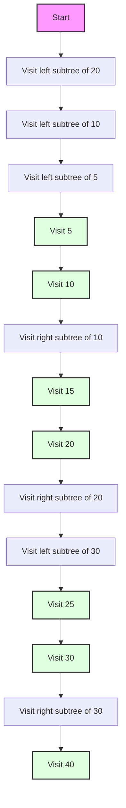

# 🚶 Traversal in AVL Trees

Traversal operations allow us to visit all nodes in a tree in a specific order. These operations are identical for AVL trees and regular binary search trees, as they don't affect the structure of the tree.

## Real-World Traversal Analogies 🌍

Understanding tree traversals becomes easier when we relate them to familiar real-world scenarios:

- **In-order Traversal**: Like reading a book from left to right, where each page is in numerical order.
- **Pre-order Traversal**: Like exploring a file system where you visit a folder first, then its contents.
- **Post-order Traversal**: Like cleaning a building from bottom to top, finishing each floor before moving up.
- **Level-order Traversal**: Like visiting floors of a building one level at a time, from top to bottom.

## Types of Traversals 🔄

There are four main types of tree traversals:

1. **In-order Traversal**: Visit left subtree, then root, then right subtree (LNR)
2. **Pre-order Traversal**: Visit root, then left subtree, then right subtree (NLR)
3. **Post-order Traversal**: Visit left subtree, then right subtree, then root (LRN)
4. **Level-order Traversal**: Visit nodes level by level, from left to right

Let's explore each of these traversals in detail.

## In-order Traversal 📊

In-order traversal visits the nodes in ascending order of their values in a binary search tree. It follows the pattern: left subtree, root, right subtree (LNR).

### Practical Applications:
- **Sorted Reporting**: Generate reports with data in ascending order
- **Validating BST Property**: Checking if a tree is a valid binary search tree
- **Finding the kth Smallest Element**: By tracking the count of visited nodes

### Implementation:

```javascript
inOrderTraversal(callback) {
  this.inOrderTraversalHelper(this.root, callback);
}

inOrderTraversalHelper(node, callback) {
  if (node) {
    // First, visit the left subtree
    this.inOrderTraversalHelper(node.left, callback);
    
    // Then, visit the current node
    callback(node.value);
    
    // Finally, visit the right subtree
    this.inOrderTraversalHelper(node.right, callback);
  }
}
```

### Visual Example:

For the following AVL tree:

```
     20
    /  \
   10   30
  / \   / \
 5  15 25  40
```

The in-order traversal would visit nodes in this order: 5, 10, 15, 20, 25, 30, 40.



> [!TIP]
> In-order traversal of a binary search tree (including AVL trees) always visits nodes in ascending order of their values. This is useful for tasks like printing all elements in sorted order.

## Pre-order Traversal 📊

Pre-order traversal visits the root before its children. It follows the pattern: root, left subtree, right subtree (NLR).

### Practical Applications:
- **Creating a Copy of a Tree**: The pre-order sequence can be used to reconstruct the tree
- **Serializing a Tree Structure**: Converting a tree to a format that can be saved or transmitted
- **Prefix Expression Evaluation**: Evaluating mathematical expressions in prefix notation

### Implementation:

```javascript
preOrderTraversal(callback) {
  this.preOrderTraversalHelper(this.root, callback);
}

preOrderTraversalHelper(node, callback) {
  if (node) {
    // First, visit the current node
    callback(node.value);
    
    // Then, visit the left subtree
    this.preOrderTraversalHelper(node.left, callback);
    
    // Finally, visit the right subtree
    this.preOrderTraversalHelper(node.right, callback);
  }
}
```

### Visual Example:

For the same AVL tree:

```
     20
    /  \
   10   30
  / \   / \
 5  15 25  40
```

The pre-order traversal would visit nodes in this order: 20, 10, 5, 15, 30, 25, 40.

```
Step 1: Visit 20               Step 2: Visit 10              Step 3: Visit 5
     [20]                          20                           20
    /  \                         /  \                         /  \
   10   30                     [10]  30                      10   30
  / \   / \                    / \   / \                   / \   / \
 5  15 25  40                 5  15 25  40               [5] 15 25  40

...and so on
```

> [!TIP]
> Pre-order traversal is useful for creating a copy of the tree or for generating a prefix expression from an expression tree.

## Post-order Traversal 📊

Post-order traversal visits the root after its children. It follows the pattern: left subtree, right subtree, root (LRN).

### Practical Applications:
- **Resource Cleanup**: Deleting a tree or releasing resources (children before parents)
- **Computing Directory Sizes**: Calculate sizes of nested directories (children first)
- **Postfix Expression Evaluation**: Evaluating mathematical expressions in postfix notation

### Implementation:

```javascript
postOrderTraversal(callback) {
  this.postOrderTraversalHelper(this.root, callback);
}

postOrderTraversalHelper(node, callback) {
  if (node) {
    // First, visit the left subtree
    this.postOrderTraversalHelper(node.left, callback);
    
    // Then, visit the right subtree
    this.postOrderTraversalHelper(node.right, callback);
    
    // Finally, visit the current node
    callback(node.value);
  }
}
```

### Visual Example:

For the same AVL tree:

```
     20
    /  \
   10   30
  / \   / \
 5  15 25  40
```

The post-order traversal would visit nodes in this order: 5, 15, 10, 25, 40, 30, 20.

```
Final Steps:                                           
     20                          20                         [20]
    /  \                        /  \                        /  \
   10   30                     10  [30]                    10   30
  / \   / \                   / \   / \                   / \   / \
 5  15 25 [40]               5  15[25] 40                5  15 25  40
```

> [!TIP]
> Post-order traversal is useful for deleting the tree (as we delete children before parents) or for calculating space used by each directory in a file system.

## Level-order Traversal 📊

Level-order traversal visits nodes level by level, from left to right. It uses a queue to keep track of nodes to visit.

### Practical Applications:
- **Breadth-First Search**: Finding the shortest path in a graph
- **Level Averaging**: Finding average values at each level of a tree
- **Connecting Nodes at the Same Level**: Creating connections between nodes at the same depth

### Implementation:

```javascript
levelOrderTraversal(callback) {
  if (!this.root) return;
  
  const queue = [this.root];
  
  while (queue.length > 0) {
    const node = queue.shift();
    
    // Visit the current node
    callback(node.value);
    
    // Add children to the queue
    if (node.left) queue.push(node.left);
    if (node.right) queue.push(node.right);
  }
}
```

### Visual Example:

For the same AVL tree:

```
     20
    /  \
   10   30
  / \   / \
 5  15 25  40
```

The level-order traversal would visit nodes in this order: 20, 10, 30, 5, 15, 25, 40.

```mermaid
graph TD;
    A[Queue: [20]] --> B[Visit 20, Queue: [10, 30]]
    B --> C[Visit 10, Queue: [30, 5, 15]]
    C --> D[Visit 30, Queue: [5, 15, 25, 40]]
    D --> E[Visit 5, Queue: [15, 25, 40]]
    E --> F[Visit 15, Queue: [25, 40]]
    F --> G[Visit 25, Queue: [40]]
    G --> H[Visit 40, Queue: []]
    style A fill:#f9f,stroke:#333,stroke-width:2px
    style B fill:#bbf,stroke:#333,stroke-width:2px
    style C fill:#bbf,stroke:#333,stroke-width:2px
    style D fill:#bbf,stroke:#333,stroke-width:2px
    style E fill:#dfd,stroke:#333,stroke-width:2px
    style F fill:#dfd,stroke:#333,stroke-width:2px
    style G fill:#dfd,stroke:#333,stroke-width:2px
    style H fill:#dfd,stroke:#333,stroke-width:2px
```

> [!TIP]
> Level-order traversal is useful for tasks like printing the tree level by level or for breadth-first search algorithms.

## All Traversals Compared: Visual Side-by-Side

Let's see all four traversals on the same tree for comparison:

```
                   50
                  /  \
                30    70
               / \    / \
             20  40  60  80
            /
           10

In-order:     10, 20, 30, 40, 50, 60, 70, 80  (sorted order)
Pre-order:    50, 30, 20, 10, 40, 70, 60, 80  (root first)
Post-order:   10, 20, 40, 30, 60, 80, 70, 50  (leaves first)
Level-order:  50, 30, 70, 20, 40, 60, 80, 10  (breadth-first)
```

## Iterative Implementations 🔄

While recursive implementations are elegant, they can lead to stack overflow for very deep trees. Here are iterative implementations for the traversals:

<details>
<summary>Iterative In-order Traversal</summary>

```javascript
inOrderTraversalIterative(callback) {
  if (!this.root) return;
  
  const stack = [];
  let current = this.root;
  
  while (current || stack.length > 0) {
    // Reach the leftmost node
    while (current) {
      stack.push(current);
      current = current.left;
    }
    
    // Current is now null, pop from stack
    current = stack.pop();
    
    // Visit the node
    callback(current.value);
    
    // Move to the right subtree
    current = current.right;
  }
}
```

</details>

<details>
<summary>Iterative Pre-order Traversal</summary>

```javascript
preOrderTraversalIterative(callback) {
  if (!this.root) return;
  
  const stack = [this.root];
  
  while (stack.length > 0) {
    // Pop from stack and visit
    const node = stack.pop();
    callback(node.value);
    
    // Push right child first (so that left child is processed first)
    if (node.right) stack.push(node.right);
    if (node.left) stack.push(node.left);
  }
}
```

</details>

<details>
<summary>Iterative Post-order Traversal</summary>

```javascript
postOrderTraversalIterative(callback) {
  if (!this.root) return;
  
  const stack1 = [this.root];
  const stack2 = [];
  
  // First, we push nodes in stack2 in the order: root, right, left
  while (stack1.length > 0) {
    const node = stack1.pop();
    stack2.push(node);
    
    if (node.left) stack1.push(node.left);
    if (node.right) stack1.push(node.right);
  }
  
  // Then, we pop from stack2 to get the post-order traversal
  while (stack2.length > 0) {
    const node = stack2.pop();
    callback(node.value);
  }
}
```

</details>

## Practical Applications of Traversals 🚀

Each traversal type has specific real-world applications that leverage its unique ordering properties:

### In-order Traversal Applications
- **Database Report Generation**: When you need to generate reports with data in ascending order
- **BST Validation**: To verify if a tree satisfies the BST property
- **Range Queries**: Finding all elements between two values efficiently

### Pre-order Traversal Applications
- **Directory Structure Copying**: When copying a file system directory structure (create parent directories first)
- **Expression Tree Evaluation**: For evaluating expressions in prefix notation (operators before operands)
- **Document Object Model (DOM) Processing**: HTML/XML parsers often process documents in pre-order

### Post-order Traversal Applications
- **Resource Cleanup**: When shutting down a system and releasing resources (children before parents)
- **Expression Evaluation**: For evaluating expressions in postfix notation (operands before operators)
- **File System Size Calculation**: To calculate space used by nested directories (child sizes calculated first)

### Level-order Traversal Applications
- **Organizational Chart Processing**: Processing company hierarchies level by level
- **Game AI Decision Trees**: For evaluating game states at increasing depths
- **Network Broadcasting**: For sending information to nodes based on their distance from the source

## Practice Exercise 💪

Consider the following AVL tree:

```
       50
      /  \
     30   70
    / \   / \
   20 40 60  80
  /       \
 10       65
```

Trace through each of the four traversals and list the order in which nodes are visited.

<details>
<summary>Solution</summary>

1. In-order Traversal: 10, 20, 30, 40, 50, 60, 65, 70, 80
2. Pre-order Traversal: 50, 30, 20, 10, 40, 70, 60, 65, 80
3. Post-order Traversal: 10, 20, 40, 30, 65, 60, 80, 70, 50
4. Level-order Traversal: 50, 30, 70, 20, 40, 60, 80, 10, 65

</details>

## Knowledge Check ✅

Before moving on, test your understanding with these questions:

1. If you need to print all elements in a BST in sorted order, which traversal would you use?
2. Which traversal would be most efficient for deleting an entire tree?
3. If you need to create an exact copy of a tree structure, which traversal is most suitable?
4. What data structure is used to implement an iterative level-order traversal?
5. Why might you prefer an iterative traversal implementation over a recursive one?

<details>
<summary>Check your answers</summary>

1. In-order traversal (visits nodes in ascending order in a BST)
2. Post-order traversal (ensures children are deleted before parents)
3. Pre-order traversal (visits nodes in an order that allows reconstruction)
4. Queue (to process nodes in first-in, first-out order)
5. To avoid stack overflow for very deep trees and to reduce memory usage

</details>

In the next section, we'll explore the time and space complexity of AVL tree operations and compare AVL trees with other balanced tree data structures. 