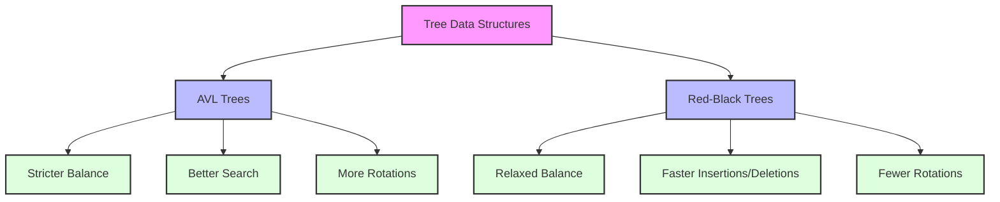

# ⚖️ Complexity and Comparison of AVL Trees

In this section, we'll analyze the time and space complexity of AVL tree operations and compare AVL trees with other balanced tree data structures.

## Time Complexity Analysis 📊

Let's analyze the time complexity of the main operations in an AVL tree:

| Operation | Average Case | Worst Case |
|-----------|--------------|------------|
| Search    | O(log n)     | O(log n)   |
| Insert    | O(log n)     | O(log n)   |
| Delete    | O(log n)     | O(log n)   |
| Traversal | O(n)         | O(n)       |

### Search Operation

The search operation in an AVL tree has a time complexity of O(log n) in both the average and worst cases. This is because:

1. The height of an AVL tree is guaranteed to be O(log n) due to the balance property.
2. In the worst case, we need to traverse from the root to a leaf node, which takes O(log n) time.

### Insert Operation

The insert operation also has a time complexity of O(log n) in both the average and worst cases:

1. Finding the insertion point takes O(log n) time.
2. Updating heights and checking balance factors on the path from the insertion point to the root takes O(log n) time.
3. Performing rotations (if needed) takes O(1) time at each node, and there are at most O(log n) nodes on the path.

### Delete Operation

The delete operation has a time complexity of O(log n) in both the average and worst cases:

1. Finding the node to delete takes O(log n) time.
2. Deleting the node and finding its successor (if needed) takes O(log n) time.
3. Updating heights and rebalancing on the path from the deletion point to the root takes O(log n) time.

### Traversal Operations

All traversal operations (in-order, pre-order, post-order, and level-order) have a time complexity of O(n), as they visit each node exactly once.

## Space Complexity Analysis 📊

The space complexity of an AVL tree depends on the operation:

| Operation | Space Complexity |
|-----------|------------------|
| Storage   | O(n)             |
| Search    | O(1) iterative, O(log n) recursive |
| Insert    | O(log n)         |
| Delete    | O(log n)         |
| Traversal | O(log n) to O(n) |

### Storage

An AVL tree with n nodes requires O(n) space to store the nodes and their associated data.

### Search Operation

- The iterative implementation of search uses O(1) extra space.
- The recursive implementation uses O(log n) space due to the call stack.

### Insert and Delete Operations

Both insert and delete operations use O(log n) space due to the recursive call stack.

### Traversal Operations

- Recursive traversals use O(log n) space due to the call stack.
- Iterative in-order and pre-order traversals use O(log n) space for the stack.
- Iterative post-order traversal uses O(n) space in the worst case.
- Level-order traversal uses O(n) space in the worst case for the queue.

## Comparison with Other Data Structures 🔍

Let's compare AVL trees with other balanced tree data structures:

### AVL Trees vs. Red-Black Trees

| Aspect | AVL Trees | Red-Black Trees |
|--------|-----------|-----------------|
| Balance Condition | Height difference ≤ 1 | No red node has a red parent |
| Height | At most 1.44 * log(n) | At most 2 * log(n) |
| Search Performance | Slightly better | Slightly worse |
| Insert/Delete Performance | Slightly worse (more rotations) | Slightly better (fewer rotations) |
| Memory Usage | Slightly more (height info) | Slightly less (color bit) |

> [!TIP]
> Choose AVL trees when search operations are more frequent than insertions and deletions. Choose Red-Black trees when insertions and deletions are more frequent than searches.

### AVL Trees vs. B-Trees

| Aspect | AVL Trees | B-Trees |
|--------|-----------|---------|
| Node Structure | Binary (2 children) | Multiple children |
| Optimized For | In-memory operations | Disk-based operations |
| Height | O(log n) | O(log_m n) where m is the order |
| Branching Factor | 2 | m (typically large) |
| Memory Usage | More nodes, less data per node | Fewer nodes, more data per node |

> [!NOTE]
> B-Trees are commonly used in databases and file systems because they minimize disk I/O operations by storing multiple keys in a single node.

### AVL Trees vs. Hash Tables

| Aspect | AVL Trees | Hash Tables |
|--------|-----------|-------------|
| Operations | O(log n) search, insert, delete | O(1) average case search, insert, delete |
| Ordered Data | Yes | No |
| Space Efficiency | More efficient | Less efficient (due to empty slots) |
| Worst Case | O(log n) | O(n) (with poor hash function) |
| Range Queries | Efficient | Inefficient |

> [!TIP]
> Use AVL trees when you need ordered data or efficient range queries. Use hash tables when you need fast lookups and don't care about the order of elements.

## When to Use AVL Trees 🎯

AVL trees are ideal in scenarios such as:

1. **Applications requiring frequent lookups**: AVL trees guarantee O(log n) search time.

2. **Ordered data requirements**: When you need to maintain data in sorted order and perform operations like finding the minimum/maximum element, successor/predecessor, or range queries.

3. **Guaranteed worst-case performance**: Unlike some other data structures, AVL trees provide consistent performance guarantees.

4. **Memory-constrained environments**: AVL trees are more memory-efficient than some alternatives like B-trees for in-memory operations.

## When Not to Use AVL Trees ⚠️

AVL trees might not be the best choice in these scenarios:

1. **Frequent insertions and deletions**: Red-Black trees might be more efficient due to fewer rotations.

2. **Unordered data with simple lookups**: Hash tables provide O(1) average-case lookups.

3. **Disk-based storage**: B-trees or B+ trees are more suitable for minimizing disk I/O.

4. **Very large datasets that don't fit in memory**: External data structures or database systems might be more appropriate.

## Real-World Applications 🌍

AVL trees are used in many real-world applications:

1. **Database indexing**: For creating efficient indexes on columns that require range queries.

2. **In-memory caches**: For maintaining sorted data with fast lookups.

3. **File systems**: For organizing directory structures and file metadata.

4. **Network routing tables**: For efficient IP lookup and routing decisions.

5. **Computational geometry**: For spatial data structures like segment trees.

## Practice Exercise 💪

Consider the following scenarios and determine whether an AVL tree would be an appropriate data structure:

1. A dictionary application that needs to support prefix searches (finding all words that start with a given prefix).
2. A social media application that needs to store user IDs and quickly check if a user exists.
3. A stock market application that needs to find the highest and lowest stock prices in a given time range.
4. A database system that stores records on disk and needs to minimize disk I/O operations.

Solution

1. **Dictionary with prefix searches**: An AVL tree would be appropriate, as it maintains sorted order and allows for efficient range queries. However, a Trie data structure might be even better for prefix searches.

2. **Social media user ID lookup**: A hash table would be more efficient than an AVL tree for simple existence checks, as it provides O(1) average-case lookups.

3. **Stock market range queries**: An AVL tree would be appropriate, as it efficiently supports finding minimum and maximum values in a range.

4. **Disk-based database**: A B-tree or B+ tree would be more appropriate than an AVL tree, as they are specifically designed to minimize disk I/O by having a higher branching factor and storing more keys per node.

In the next section, we'll conclude our exploration of AVL trees with a summary of key concepts and some advanced topics for further study. 