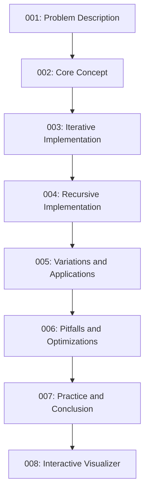

# 🗺️ Your Learning Journey: Binary Search Algorithm

Welcome to this comprehensive course on the Binary Search algorithm! This learning path will take you from understanding the basic concept to implementing advanced variations and solving complex problems.

## Prerequisites

Before starting this course, you should have:
- Basic knowledge of arrays and loops
- Familiarity with at least one programming language
- Understanding of basic algorithmic concepts like time complexity

## Learning Path Overview

## What You'll Learn

1. **Problem Description**: Understand the binary search problem and its importance
2. **Core Concept**: Master the divide-and-conquer strategy that powers binary search
3. **Iterative Implementation**: Build your first binary search algorithm
4. **Recursive Implementation**: Explore alternative implementation approaches
5. **Variations and Applications**: Learn common variations and real-world uses
6. **Pitfalls and Optimizations**: Avoid common mistakes and optimize performance
7. **Practice and Conclusion**: Solve problems and consolidate your knowledge
8. **Interactive Visualizer**: Visualize the algorithm in action

## Learning Outcomes

By the end of this course, you will be able to:
- Implement binary search algorithms from scratch
- Apply binary search to solve complex problems
- Optimize search operations in your applications
- Identify when binary search is the right algorithm to use
- Extend binary search concepts to other algorithms

Let's begin our journey with understanding the problem that binary search solves! 