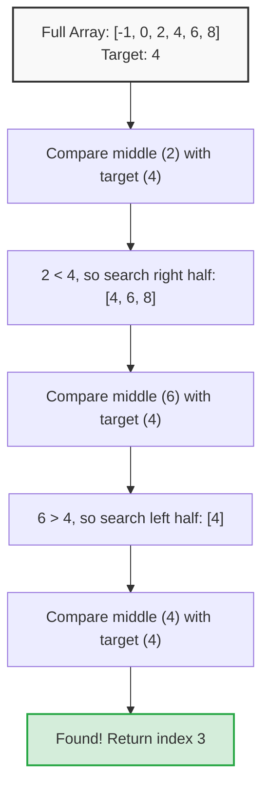
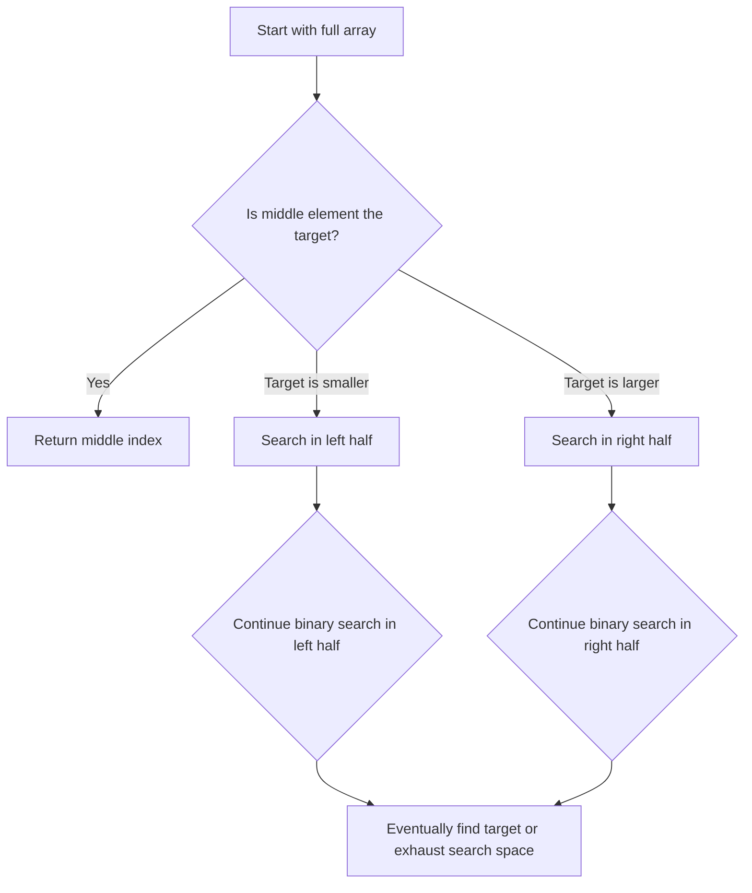

# 🎯 The Core Concept: Divide and Conquer

## Learning Objectives
By the end of this lesson, you will be able to:
- Explain the divide-and-conquer strategy underpinning binary search
- Visualize how binary search divides the search space in half
- Understand why binary search achieves logarithmic time complexity
- Trace through a complete binary search example

Binary search is a perfect example of the **divide and conquer** strategy in computer science. Let's understand what makes it so powerful.

## The Key Insight

> [!TIP]
> Binary search works by repeatedly dividing the search space in half until the target is found or determined not to exist.

Imagine you're playing a number guessing game:
- I'm thinking of a number between 1 and 100
- After each guess, I'll tell you if your guess is too high, too low, or correct

What's the most efficient strategy? 

If you guess 50 first:
- If that's correct, you win!
- If it's too high, you know the answer is between 1-49
- If it's too low, you know the answer is between 51-100

With just one guess, you've eliminated half of all possibilities! This is exactly how binary search works.

## Visualizing the Halving Process

Let's see how binary search narrows down the search space when looking for 4 in [-1, 0, 2, 4, 6, 8]:

Notice how each comparison eliminates half of the remaining elements, quickly narrowing down to the target.

## The Binary Search Process

## Step-by-Step Breakdown

1. **Initialize** two pointers: `left` at the beginning of the array and `right` at the end
2. **Find the middle** element between `left` and `right`
3. **Compare** the middle element with the target:
   - If they match, we've found our target! Return the middle index
   - If the target is smaller, set `right` to `middle - 1` (search left half)
   - If the target is larger, set `left` to `middle + 1` (search right half)
4. **Repeat** steps 2-3 until either:
   - We find the target (success!)
   - The search space is empty (`left > right`) meaning the target isn't in the array

## Visual Example

Let's search for `4` in the array `[-1, 0, 2, 4, 6, 8]`:

| Step | Left | Right | Middle | Middle Value | Comparison | Action | Remaining Elements |
|------|------|-------|--------|--------------|------------|--------|-------------------|
| 1    | 0    | 5     | 2      | 2            | 4 > 2      | Search right half | [-1, 0, 2, ~~4, 6, 8~~] |
| 2    | 3    | 5     | 4      | 6            | 4 < 6      | Search left half | [~~-1, 0, 2~~, 4, ~~6, 8~~] |
| 3    | 3    | 3     | 3      | 4            | 4 = 4      | Found at index 3! | [~~-1, 0, 2~~, 4, ~~6, 8~~] |

## The Mathematics Behind Binary Search Efficiency

Binary search achieves logarithmic time complexity because it follows a pattern of repeatedly dividing the problem size:

1. Initial array size: n elements
2. After 1st comparison: n/2 elements remain
3. After 2nd comparison: n/4 elements remain
4. After 3rd comparison: n/8 elements remain

This pattern continues until we either find the target or exhaust the search space. 

Mathematically, the question becomes: "How many times can we divide n by 2 until we reach 1?" This is exactly what the logarithm base 2 (log₂) calculates.

For an array of size n, the maximum number of comparisons needed is:
- ⌊log₂(n)⌋ + 1

This is why searching in a sorted array of 1 billion elements requires at most 30 comparisons with binary search!

## Why It's So Efficient

Every time we make a comparison, we eliminate half of the remaining elements. This gives binary search its logarithmic time complexity:

- With 8 elements, we need at most 3 comparisons
- With 1,024 elements, we need at most 10 comparisons
- With 1,048,576 elements, we need at most 20 comparisons

The pattern is clear: for n elements, we need at most log₂(n) comparisons.

> [!WARNING]
> Remember that binary search only works on sorted arrays! If your array isn't sorted, you'll need to sort it first (which typically takes O(n log n) time) or use a different search algorithm.

## Think About It

What happens if we have duplicate elements in our array?

Binary search still works with duplicates, but it will find one of the occurrences of the target, not necessarily the first or last one. If you need to find the first or last occurrence, you would need a modified version of binary search.

If we double the size of our array, how many more comparisons would binary search need in the worst case?

Just one more comparison! This is the power of logarithmic growth. If we go from n elements to 2n elements, log₂(2n) = log₂(n) + log₂(2) = log₂(n) + 1.

In the next lesson, we'll implement binary search using an iterative approach and analyze the code step by step. 