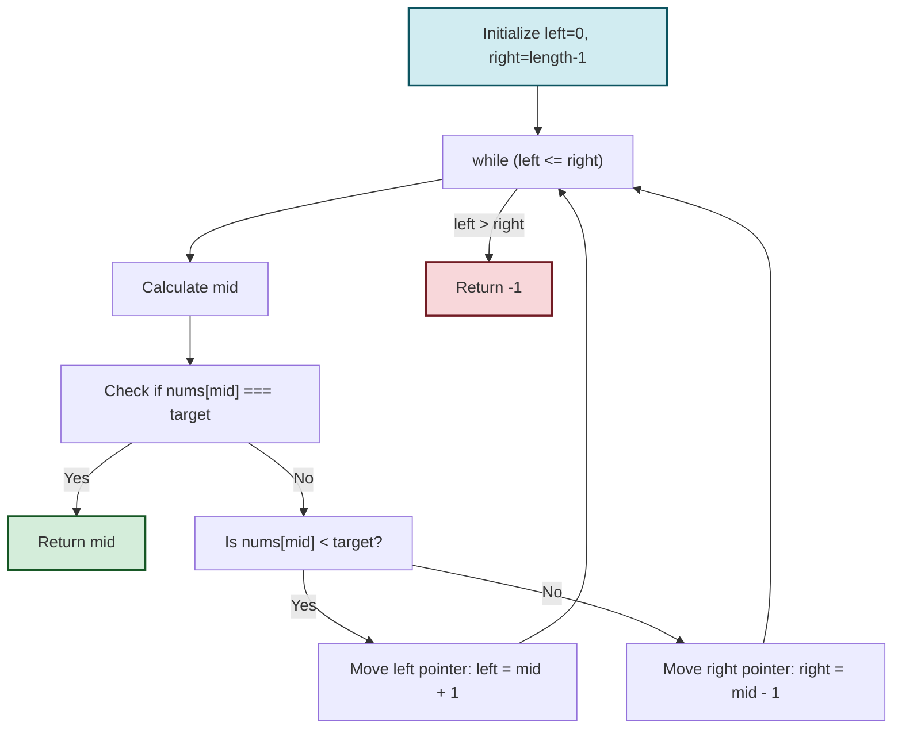

# 🔄 Implementing Binary Search: The Iterative Approach

## Learning Objectives
By the end of this lesson, you will be able to:
- Implement binary search using an iterative approach
- Analyze the time and space complexity of binary search
- Explain each component of the implementation
- Identify and avoid common pitfalls in binary search code
- Trace through the algorithm's execution step by step

Now that we understand the core concept, let's implement binary search using an iterative approach. This is the most common and memory-efficient way to implement the algorithm.

## The Code

```javascript
function binarySearch(nums, target) {
  // Handle edge case of empty array
  if (nums.length === 0) return -1;
  
  let left = 0;
  let right = nums.length - 1;

  while (left <= right) {
    const mid = left + Math.floor((right - left) / 2);

    if (nums[mid] === target) {
      return mid;
    }

    if (nums[mid] < target) {
      left = mid + 1;
    } else {
      right = mid - 1;
    }
  }

  return -1;
}
```

## Code-to-Algorithm Mapping

Here's how each part of our code implements the algorithm steps:



## Breaking Down the Implementation

### 1. Edge Cases

```javascript
if (nums.length === 0) return -1;
```

We start by handling the empty array edge case. If the array is empty, the target cannot be found, so we immediately return -1.

### 2. Initialize the Search Range

```javascript
let left = 0;
let right = nums.length - 1;
```

We start by defining our search space:
- `left` points to the first element (index 0)
- `right` points to the last element (index `nums.length - 1`)

### 3. The Main Loop

```javascript
while (left <= right) {
  // ...
}
```

We continue searching as long as our search space contains at least one element (`left <= right`). When `left` becomes greater than `right`, it means we've exhausted our search space without finding the target.

### 4. Finding the Middle Element

```javascript
const mid = left + Math.floor((right - left) / 2);
```

> [!TIP]
> We use `left + Math.floor((right - left) / 2)` instead of the simpler `Math.floor((left + right) / 2)` to avoid potential integer overflow in languages where this might be an issue.

### 5. Comparing and Adjusting

```javascript
if (nums[mid] === target) {
  return mid;
}

if (nums[mid] < target) {
  left = mid + 1;
} else {
  right = mid - 1;
}
```

This is the heart of the algorithm:
- If we found the target, return its index
- If the middle value is less than the target, the target must be in the right half
- If the middle value is greater than the target, the target must be in the left half

### 6. Not Found Case

```javascript
return -1;
```

If we exit the loop without finding the target, it doesn't exist in the array, so we return -1.

## Edge Cases to Consider

Binary search implementations need to handle these edge cases correctly:

1. **Empty arrays**: Our check at the beginning handles this case.
2. **Single-element arrays**: The algorithm works correctly with the `left <= right` condition.
3. **Target smaller than all elements**: Will correctly return -1.
4. **Target larger than all elements**: Will correctly return -1.
5. **Very large arrays**: Our middle calculation method prevents integer overflow.

Let's verify our implementation works for these edge cases:

| Edge Case | Array | Target | Expected Result | Explanation |
|-----------|-------|--------|----------------|------------|
| Empty array | [] | 5 | -1 | First check returns -1 |
| Single element (match) | [5] | 5 | 0 | Loop runs once, finds target at index 0 |
| Single element (no match) | [5] | 7 | -1 | Loop runs once, updates left=1, right=0, then exits |
| Target smaller than all | [5, 10, 15] | 2 | -1 | Narrows to left=0, right=-1, returns -1 |
| Target larger than all | [5, 10, 15] | 20 | -1 | Narrows to left=3, right=2, returns -1 |

## Tracing Through an Example

Let's trace through our code with the example from before: searching for `4` in `[-1, 0, 2, 4, 6, 8]`.

| Iteration | left | right | mid | nums[mid] | Comparison | Action |
|-----------|------|-------|-----|-----------|------------|--------|
| Initial   | 0    | 5     | -   | -         | -          | -      |
| 1         | 0    | 5     | 2   | 2         | 4 > 2      | left = mid + 1 = 3 |
| 2         | 3    | 5     | 4   | 6         | 4 < 6      | right = mid - 1 = 3 |
| 3         | 3    | 3     | 3   | 4         | 4 = 4      | Return mid = 3 |

## Time and Space Complexity

- **Time Complexity**: O(log n)
  - Each iteration eliminates half of the remaining elements
  - For an array of size n, we need at most log₂(n) iterations

- **Space Complexity**: O(1)
  - We only use a constant amount of extra space (the variables `left`, `right`, and `mid`)
  - This is one advantage of the iterative approach over the recursive approach

## Common Pitfalls to Avoid

> [!WARNING]
> 1. **Off-by-one errors**: Make sure your loop condition is `left <= right` (not `<`), so you don't miss the case where the target is the only element left.
> 2. **Infinite loops**: Ensure you're properly updating `left` and `right` to narrow the search space.
> 3. **Integer overflow**: Use `left + Math.floor((right - left) / 2)` instead of `Math.floor((left + right) / 2)` for calculating the middle.
> 4. **Not handling edge cases**: Check for empty arrays and other edge cases.
> 5. **Assuming array is sorted**: Binary search requires a sorted array to work correctly.

## Try It Yourself

<details>
<summary>What would happen if we changed the loop condition from `left <= right` to `left < right`?</summary>

If we used `left < right`, the algorithm would stop when there's only one element left (when `left` equals `right`). This would cause the algorithm to miss the target if it happens to be the last element in our search space.
</details>

<details>
<summary>How would you modify this implementation to return the insertion position (where the target should be inserted) if it's not found?</summary>

```javascript
function searchInsert(nums, target) {
  let left = 0;
  let right = nums.length - 1;
  
  while (left <= right) {
    const mid = left + Math.floor((right - left) / 2);
    
    if (nums[mid] === target) {
      return mid;
    }
    
    if (nums[mid] < target) {
      left = mid + 1;
    } else {
      right = mid - 1;
    }
  }
  
  // If we exit the loop, 'left' is the position where target should be inserted
  return left;
}
```
</details>

In the next lesson, we'll explore an alternative implementation using recursion and compare it with the iterative approach. 