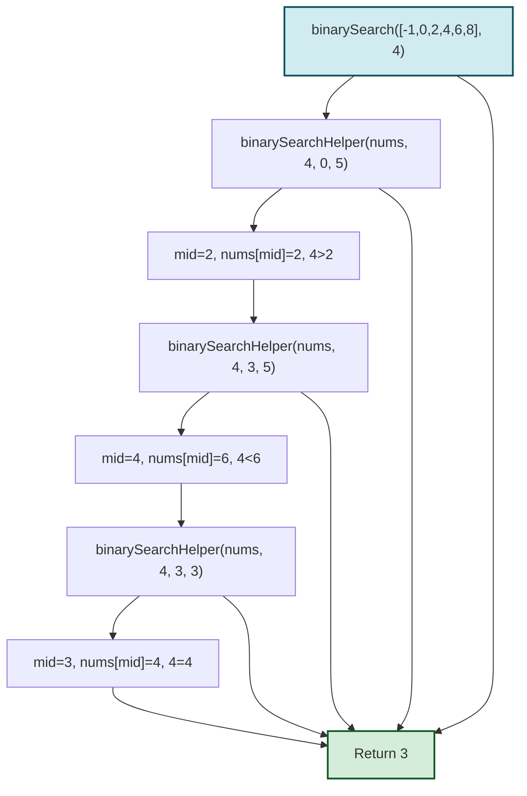
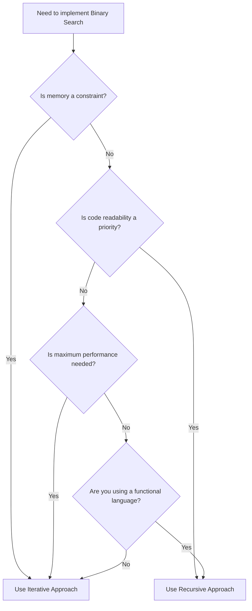

# 🔁 Implementing Binary Search: The Recursive Approach

## Learning Objectives
By the end of this lesson, you will be able to:
- Implement binary search using a recursive approach
- Understand how the call stack operates in recursive binary search
- Compare the tradeoffs between iterative and recursive implementations
- Analyze the space complexity implications of recursion
- Determine when to use recursive vs. iterative implementations

In this lesson, we'll explore an alternative implementation of binary search using recursion. While the iterative approach is more common in practice, understanding the recursive approach can deepen your understanding of the algorithm and recursion in general.

## The Code

```javascript
function binarySearch(nums, target) {
  return binarySearchHelper(nums, target, 0, nums.length - 1);
}

function binarySearchHelper(nums, target, left, right) {
  // Base case: if the search space is empty
  if (left > right) {
    return -1;
  }

  const mid = left + Math.floor((right - left) / 2);

  // Found the target
  if (nums[mid] === target) {
    return mid;
  }

  // Target is in the right half
  if (nums[mid] < target) {
    return binarySearchHelper(nums, target, mid + 1, right);
  }

  // Target is in the left half
  return binarySearchHelper(nums, target, left, mid - 1);
}
```

## Breaking Down the Recursive Implementation

### 1. The Main Function

```javascript
function binarySearch(nums, target) {
  return binarySearchHelper(nums, target, 0, nums.length - 1);
}
```

We start with a simple wrapper function that initializes the recursive search with the full array bounds.

### 2. The Recursive Helper Function

```javascript
function binarySearchHelper(nums, target, left, right) {
  // ...
}
```

This function does the actual work and takes four parameters:
- `nums`: The array to search in
- `target`: The value we're looking for
- `left`: The left boundary of the current search space
- `right`: The right boundary of the current search space

### 3. The Base Case

```javascript
if (left > right) {
  return -1;
}
```

This is our stopping condition. If `left` becomes greater than `right`, it means we've exhausted our search space without finding the target, so we return -1.

### 4. Finding the Middle and Comparing

```javascript
const mid = left + Math.floor((right - left) / 2);

if (nums[mid] === target) {
  return mid;
}
```

Just like in the iterative approach, we find the middle element and check if it's our target.

### 5. The Recursive Calls

```javascript
if (nums[mid] < target) {
  return binarySearchHelper(nums, target, mid + 1, right);
}

return binarySearchHelper(nums, target, left, mid - 1);
```

Instead of updating variables in a loop, we make recursive calls with updated boundaries:
- If the target is in the right half, we recursively search that half
- Otherwise, we recursively search the left half

## Visualizing the Recursive Call Stack

Let's visualize how the recursive calls build up and unwind for our example: searching for `4` in `[-1, 0, 2, 4, 6, 8]`:



The diagram shows:
1. Initial call that sets up the helper with full array bounds
2. First recursive call with right half (indices 3-5)
3. Second recursive call with just index 3
4. Target found, result bubbles back up through the call stack

## Call Stack Memory Usage

Each function call adds a new frame to the call stack with:
- References to `nums` and `target` (shared across calls)
- Values for `left` and `right` (unique to each call)
- The return address (where to continue after the call completes)
- Local variables like `mid`

Let's examine the call stack at its deepest point in our example:

| Stack Frame | Parameters | Local Variables | Memory Used (approx.) |
|-------------|------------|-----------------|----------------------|
| Frame 3 | nums, target, left=3, right=3 | mid=3 | 28 bytes |
| Frame 2 | nums, target, left=3, right=5 | mid=4 | 28 bytes |
| Frame 1 | nums, target, left=0, right=5 | mid=2 | 28 bytes |
| **Total** | | | **~84 bytes** |

## Tracing Through an Example

Let's trace through our recursive code with the same example: searching for `4` in `[-1, 0, 2, 4, 6, 8]`.

| Call | left | right | mid | nums[mid] | Comparison | Action |
|------|------|-------|-----|-----------|------------|--------|
| 1    | 0    | 5     | 2   | 2         | 4 > 2      | Recurse with (3, 5) |
| 2    | 3    | 5     | 4   | 6         | 4 < 6      | Recurse with (3, 3) |
| 3    | 3    | 3     | 3   | 4         | 4 = 4      | Return 3 |

## Deep Dive: Space Complexity Analysis

Let's analyze the memory usage difference between iterative and recursive approaches:

**Iterative Approach:**
- Variables `left`, `right`, and `mid`: 3 variables × 4 bytes (typical integer size) = 12 bytes
- Total: O(1) space - constant regardless of input size

**Recursive Approach:**
- Each recursive call creates a new stack frame containing:
  - Function parameters (nums, target, left, right): ~16 bytes
  - Return address: 8 bytes
  - Local variables: 4 bytes
- With log₂(n) recursive calls for an array of size n:
  - Total space: ~28 bytes × log₂(n) = O(log n)

For an array of 1,000,000 elements, the recursive approach might use:
~28 bytes × log₂(1,000,000) ≈ 28 bytes × 20 ≈ 560 bytes

This is still very small, but significantly more than the constant space of the iterative approach, and could matter for extremely large arrays or constrained environments.

## Comparing Iterative and Recursive Approaches

### Iterative Advantages
- ✅ **Memory Efficiency**: Uses constant O(1) space
- ✅ **Performance**: Slightly faster due to no function call overhead
- ✅ **Stack Safety**: No risk of stack overflow for very large arrays

### Recursive Advantages
- ✅ **Readability**: Some find it more elegant and easier to understand
- ✅ **Problem Structure**: Naturally matches the divide-and-conquer nature of the algorithm
- ✅ **Functional Style**: Fits well with functional programming paradigms

### Time and Space Complexity

- **Time Complexity**: O(log n) - same as the iterative version
- **Space Complexity**: O(log n) - due to the recursive call stack
  
> [!NOTE]
> The recursive approach uses more memory because each recursive call adds a new frame to the call stack, storing the function's state (parameters and local variables).

## Decision Guide: When to Use Each Approach

Use this flowchart to decide which implementation to choose:



- **Use iterative** when:
  - Memory efficiency is important
  - You're working with very large arrays
  - You're implementing in a language with limited stack size

- **Use recursive** when:
  - Code readability is a priority
  - You're working with moderate-sized arrays
  - You're in a functional programming context

## Try It Yourself

<details>
<summary>How would you modify the recursive implementation to count the number of comparisons made?</summary>

```javascript
function binarySearch(nums, target) {
  let comparisons = 0;
  
  function binarySearchHelper(left, right) {
    if (left > right) {
      return -1;
    }
    
    const mid = left + Math.floor((right - left) / 2);
    comparisons++;
    
    if (nums[mid] === target) {
      return mid;
    }
    
    if (nums[mid] < target) {
      return binarySearchHelper(mid + 1, right);
    }
    
    return binarySearchHelper(left, mid - 1);
  }
  
  const result = binarySearchHelper(0, nums.length - 1);
  console.log(`Found in ${comparisons} comparisons`);
  return result;
}
```
</details>

<details>
<summary>How would you modify the recursive implementation to handle the case of finding the first occurrence of a target value in an array with duplicates?</summary>

```javascript
function findFirstOccurrence(nums, target) {
  let result = -1;
  
  function helper(left, right) {
    if (left > right) {
      return;
    }
    
    const mid = left + Math.floor((right - left) / 2);
    
    // If we found target, save the index and continue searching to the left
    if (nums[mid] === target) {
      result = mid;
      helper(left, mid - 1);
    }
    // If target is greater than mid value, search right
    else if (nums[mid] < target) {
      helper(mid + 1, right);
    }
    // If target is less than mid value, search left
    else {
      helper(left, mid - 1);
    }
  }
  
  helper(0, nums.length - 1);
  return result;
}
```
</details>

In the next lesson, we'll explore some common variations and applications of binary search in real-world scenarios. 