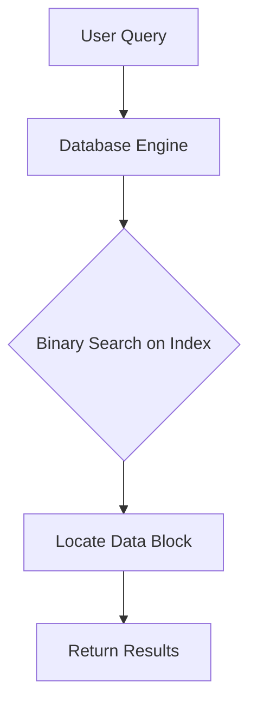
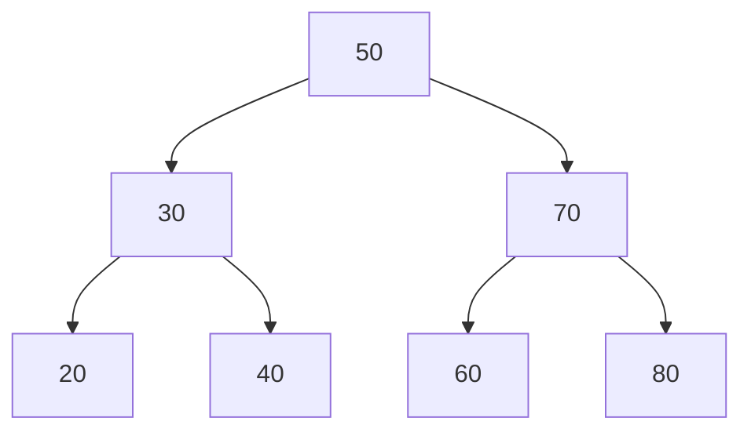

# 🔍 Beyond the Basics: Variations and Applications

## Learning Objectives
By the end of this lesson, you will be able to:
- Implement common variations of binary search for specific use cases
- Compare the performance characteristics of different binary search variants
- Apply binary search principles to real-world problems
- Understand how binary search concepts extend beyond simple arrays
- Recognize binary search patterns in complex algorithms and data structures

Binary search is more versatile than it might initially appear. In this lesson, we'll explore some common variations of the algorithm and see how it's applied in real-world scenarios.

## Common Variations of Binary Search

### 1. Finding the First Occurrence

What if our array contains duplicates and we want to find the first occurrence of the target?

```javascript
function findFirstOccurrence(nums, target) {
  let left = 0;
  let right = nums.length - 1;
  let result = -1;

  while (left <= right) {
    const mid = left + Math.floor((right - left) / 2);

    if (nums[mid] === target) {
      result = mid;  // Save this as a potential result
      right = mid - 1;  // But continue searching in the left half
    } else if (nums[mid] < target) {
      left = mid + 1;
    } else {
      right = mid - 1;
    }
  }

  return result;
}
```

> [!TIP]
> The key difference is that when we find a match, we don't immediately return. Instead, we save the index and continue searching in the left half.

### 2. Finding the Last Occurrence

Similarly, we can find the last occurrence:

```javascript
function findLastOccurrence(nums, target) {
  let left = 0;
  let right = nums.length - 1;
  let result = -1;

  while (left <= right) {
    const mid = left + Math.floor((right - left) / 2);

    if (nums[mid] === target) {
      result = mid;  // Save this as a potential result
      left = mid + 1;  // But continue searching in the right half
    } else if (nums[mid] < target) {
      left = mid + 1;
    } else {
      right = mid - 1;
    }
  }

  return result;
}
```

### 3. Finding the Insertion Position

What if we want to find where a target should be inserted to maintain the sorted order?

```javascript
function searchInsertPosition(nums, target) {
  let left = 0;
  let right = nums.length - 1;

  while (left <= right) {
    const mid = left + Math.floor((right - left) / 2);

    if (nums[mid] === target) {
      return mid;
    }

    if (nums[mid] < target) {
      left = mid + 1;
    } else {
      right = mid - 1;
    }
  }

  return left;  // This is where the target should be inserted
}
```

> [!NOTE]
> When the target isn't found, `left` will be the position where the target should be inserted to maintain the sorted order.

### 4. Binary Search on Rotated Sorted Arrays

What if our array is sorted but has been rotated around a pivot point?

```javascript
function searchInRotatedArray(nums, target) {
  let left = 0;
  let right = nums.length - 1;

  while (left <= right) {
    const mid = left + Math.floor((right - left) / 2);

    if (nums[mid] === target) {
      return mid;
    }

    // Check if the left half is sorted
    if (nums[left] <= nums[mid]) {
      // Check if target is in the left half
      if (nums[left] <= target && target < nums[mid]) {
        right = mid - 1;
      } else {
        left = mid + 1;
      }
    } 
    // Right half is sorted
    else {
      // Check if target is in the right half
      if (nums[mid] < target && target <= nums[right]) {
        left = mid + 1;
      } else {
        right = mid - 1;
      }
    }
  }

  return -1;
}
```

## Performance Analysis of Binary Search Variations

Let's compare the efficiency of different binary search variations:

| Variation | Time Complexity | Space Complexity | Ideal Use Case |
|-----------|----------------|------------------|---------------|
| Standard Binary Search | O(log n) | O(1) | Finding a unique element |
| First Occurrence | O(log n) | O(1) | Finding the lower bound in duplicates |
| Last Occurrence | O(log n) | O(1) | Finding the upper bound in duplicates |
| Insertion Position | O(log n) | O(1) | Maintaining sorted order while inserting |
| Rotated Array Search | O(log n) | O(1) | Searching in partially sorted data |
| Exponential Search | O(log n) | O(1) | Unbounded arrays or lists |

Despite similar asymptotic complexity, these variations can show performance differences in practice:

1. **Standard vs. First/Last Occurrence**: First/Last occurrence searches always traverse to one end even after finding a match, making them slightly slower in the best case but still O(log n).

2. **Standard vs. Rotated Array**: The rotated array variation requires additional comparisons to determine which subarray is sorted, adding a constant factor overhead.

3. **Count occurrences**: Combining first and last occurrence to count total occurrences still maintains O(log n) time complexity: `count = lastIndex - firstIndex + 1`.

## Real-World Applications

Binary search isn't just a theoretical concept—it's used in many practical applications:

### 1. Database Systems



Databases use binary search on indices to quickly locate records. When you search for a specific customer in a database with millions of records, binary search makes it possible to find them almost instantly.

### Implementing Database Index Searching

Here's a simplified example of how database systems might use binary search for B-tree indexing:

```javascript
class DatabaseIndex {
  constructor(keys, pointers) {
    this.keys = keys;       // Sorted keys
    this.pointers = pointers; // Pointers to actual data
  }
  
  findRecord(targetKey) {
    const index = this.binarySearch(this.keys, targetKey);
    if (index === -1) return null;
    
    return this.fetchRecord(this.pointers[index]);
  }
  
  binarySearch(keys, target) {
    // Binary search implementation
    let left = 0;
    let right = keys.length - 1;
    
    while (left <= right) {
      const mid = left + Math.floor((right - left) / 2);
      
      if (keys[mid] === target) {
        return mid;
      }
      
      if (keys[mid] < target) {
        left = mid + 1;
      } else {
        right = mid - 1;
      }
    }
    
    return -1;
  }
  
  fetchRecord(pointer) {
    // Fetch the actual record from disk/memory
    // ...
    return { id: pointer, data: "Record data" };
  }
}

// Usage example
const dbIndex = new DatabaseIndex(
  [101, 103, 105, 107, 109], // keys
  [0x1234, 0x2345, 0x3456, 0x4567, 0x5678] // pointers
);

const record = dbIndex.findRecord(105);
console.log(record); // { id: 0x3456, data: "Record data" }
```

### 2. Version Control Bisecting

Git's `bisect` command uses a binary search approach to find which commit introduced a bug:

```bash
git bisect start
git bisect bad   # Current version is bad
git bisect good v1.0  # v1.0 was known to be good
# Git will now use binary search to help find the first bad commit
```

Here's a simplified implementation of how Git bisect works:

```javascript
function gitBisect(commits, testFunction) {
  let left = 0;
  let right = commits.length - 1;
  let firstBadCommit = -1;
  
  while (left <= right) {
    const mid = left + Math.floor((right - left) / 2);
    console.log(`Testing commit: ${commits[mid].hash}`);
    
    const isBad = testFunction(commits[mid]);
    
    if (isBad) {
      // This commit is bad, but might not be the first bad one
      firstBadCommit = mid;
      right = mid - 1; // Look for an earlier bad commit
    } else {
      // This commit is good, so the bug was introduced later
      left = mid + 1;
    }
  }
  
  return firstBadCommit >= 0 ? commits[firstBadCommit] : null;
}

// Example usage
const commits = [
  { hash: "a1b2c3", message: "Initial commit" },
  { hash: "d4e5f6", message: "Add feature X" },
  { hash: "g7h8i9", message: "Fix bug in Y" },
  { hash: "j0k1l2", message: "Refactor Z" },
  { hash: "m3n4o5", message: "Implement A" }
];

// Test function - returns true if the commit is "bad"
function testCommit(commit) {
  // In reality, this would build the code and run tests
  return commit.hash >= "g7h8i9"; // Let's say the bug was introduced in g7h8i9
}

const firstBadCommit = gitBisect(commits, testCommit);
console.log(`First bad commit: ${firstBadCommit.hash} - ${firstBadCommit.message}`);
```

### 3. Machine Learning

In machine learning, binary search is used in various algorithms:
- Finding optimal hyperparameters
- Decision tree construction
- Nearest neighbor search optimization

Example of hyperparameter tuning using binary search:

```javascript
function findOptimalLearningRate(model, minRate, maxRate, tolerance = 0.0001) {
  let left = minRate;
  let right = maxRate;
  let bestScore = -Infinity;
  let bestRate = 0;
  
  while (right - left > tolerance) {
    const mid = (left + right) / 2;
    
    // Train model with this learning rate
    model.setLearningRate(mid);
    model.train();
    const score = model.evaluate();
    
    if (score > bestScore) {
      bestScore = score;
      bestRate = mid;
    }
    
    // Try a slightly higher learning rate to determine direction
    model.setLearningRate(mid + tolerance);
    model.train();
    const higherScore = model.evaluate();
    
    if (higherScore > score) {
      // Better performance with higher rate, search right half
      left = mid;
    } else {
      // Better performance with lower rate, search left half
      right = mid;
    }
  }
  
  return bestRate;
}
```

### 4. System Design

Binary search principles are used in distributed systems:
- Load balancers use binary search to find optimal server allocation
- Consistent hashing algorithms for distributed caching

## Beyond Arrays: Binary Search Trees

The binary search concept extends to tree data structures:



Binary Search Trees (BSTs) organize data so that for each node:
- All values in the left subtree are less than the node's value
- All values in the right subtree are greater than the node's value

This structure allows for O(log n) search, insert, and delete operations.

```javascript
class TreeNode {
  constructor(value) {
    this.value = value;
    this.left = null;
    this.right = null;
  }
}

class BinarySearchTree {
  constructor() {
    this.root = null;
  }
  
  // Insert a value into the BST
  insert(value) {
    const newNode = new TreeNode(value);
    
    if (this.root === null) {
      this.root = newNode;
      return this;
    }
    
    let current = this.root;
    
    while (true) {
      if (value === current.value) return undefined;
      
      if (value < current.value) {
        if (current.left === null) {
          current.left = newNode;
          return this;
        }
        current = current.left;
      } else {
        if (current.right === null) {
          current.right = newNode;
          return this;
        }
        current = current.right;
      }
    }
  }
  
  // Search for a value in the BST
  search(value) {
    if (this.root === null) return false;
    
    let current = this.root;
    
    while (current) {
      if (value === current.value) return true;
      
      if (value < current.value) {
        current = current.left;
      } else {
        current = current.right;
      }
    }
    
    return false;
  }
}

// Example usage
const bst = new BinarySearchTree();
bst.insert(50);
bst.insert(30);
bst.insert(70);
bst.insert(20);
bst.insert(40);
bst.insert(60);
bst.insert(80);

console.log(bst.search(40)); // true
console.log(bst.search(55)); // false
```

## Think About It

<details>
<summary>How would you use binary search to find the square root of a number (without using the built-in square root function)?</summary>

```javascript
function findSquareRoot(x, precision = 0.0001) {
  if (x < 0) return NaN;
  if (x === 0 || x === 1) return x;
  
  let left = 0;
  let right = x;
  
  while (right - left > precision) {
    const mid = (left + right) / 2;
    const square = mid * mid;
    
    if (Math.abs(square - x) < precision) {
      return mid;
    }
    
    if (square < x) {
      left = mid;
    } else {
      right = mid;
    }
  }
  
  return (left + right) / 2;
}
```

This uses binary search to efficiently narrow down the possible values for the square root.
</details>

<details>
<summary>How would you use binary search to find the peak element in an array? (A peak element is an element that is strictly greater than its neighbors.)</summary>

```javascript
function findPeakElement(nums) {
  let left = 0;
  let right = nums.length - 1;
  
  while (left < right) {
    const mid = left + Math.floor((right - left) / 2);
    
    if (nums[mid] > nums[mid + 1]) {
      // We are on the descending part of the array
      // Peak is in the left half (including mid)
      right = mid;
    } else {
      // We are on the ascending part of the array
      // Peak is in the right half
      left = mid + 1;
    }
  }
  
  // When left === right, we've found the peak
  return left;
}

// Example usage
console.log(findPeakElement([1, 2, 3, 1])); // 2 (element with value 3)
console.log(findPeakElement([1, 2, 1, 3, 5, 6, 4])); // 5 (element with value 6)
```
</details>

In the next lesson, we'll discuss common pitfalls and optimization techniques for binary search. 