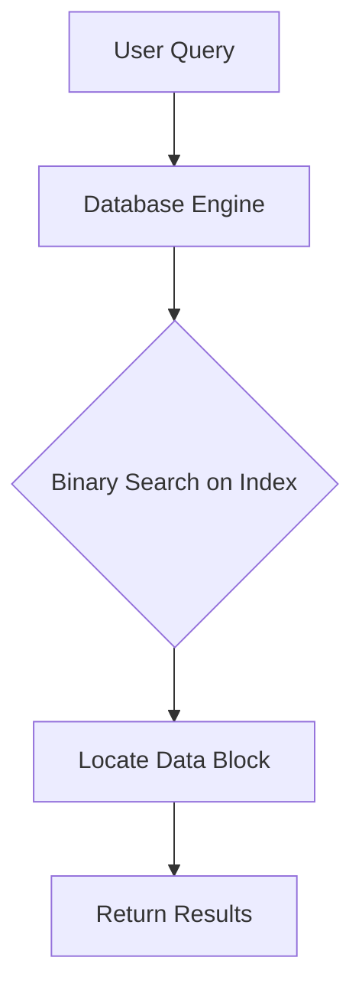
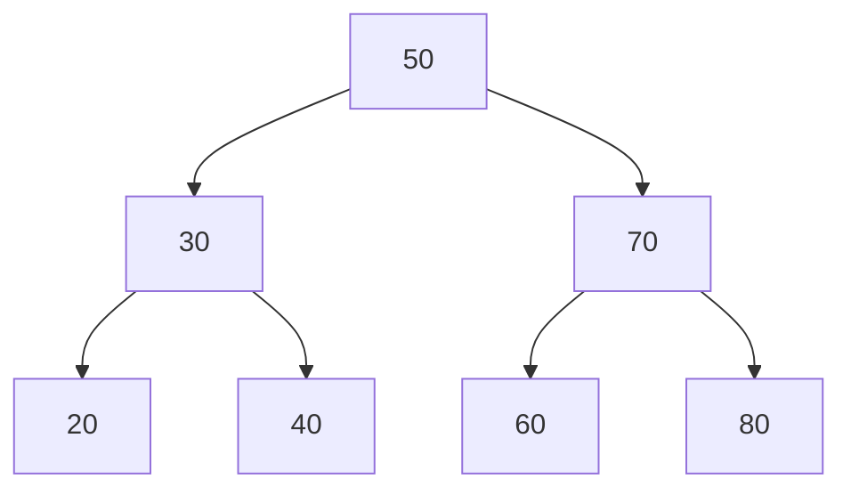

# 🔍 Beyond the Basics: Variations and Applications

Binary search is more versatile than it might initially appear. In this lesson, we'll explore some common variations of the algorithm and see how it's applied in real-world scenarios.

## Common Variations of Binary Search

### 1. Finding the First Occurrence

What if our array contains duplicates and we want to find the first occurrence of the target?

```javascript
function findFirstOccurrence(nums, target) {
  let left = 0;
  let right = nums.length - 1;
  let result = -1;

  while (left <= right) {
    const mid = left + Math.floor((right - left) / 2);

    if (nums[mid] === target) {
      result = mid;  // Save this as a potential result
      right = mid - 1;  // But continue searching in the left half
    } else if (nums[mid] < target) {
      left = mid + 1;
    } else {
      right = mid - 1;
    }
  }

  return result;
}
```

> [!TIP]
> The key difference is that when we find a match, we don't immediately return. Instead, we save the index and continue searching in the left half.

### 2. Finding the Last Occurrence

Similarly, we can find the last occurrence:

```javascript
function findLastOccurrence(nums, target) {
  let left = 0;
  let right = nums.length - 1;
  let result = -1;

  while (left <= right) {
    const mid = left + Math.floor((right - left) / 2);

    if (nums[mid] === target) {
      result = mid;  // Save this as a potential result
      left = mid + 1;  // But continue searching in the right half
    } else if (nums[mid] < target) {
      left = mid + 1;
    } else {
      right = mid - 1;
    }
  }

  return result;
}
```

### 3. Finding the Insertion Position

What if we want to find where a target should be inserted to maintain the sorted order?

```javascript
function searchInsertPosition(nums, target) {
  let left = 0;
  let right = nums.length - 1;

  while (left <= right) {
    const mid = left + Math.floor((right - left) / 2);

    if (nums[mid] === target) {
      return mid;
    }

    if (nums[mid] < target) {
      left = mid + 1;
    } else {
      right = mid - 1;
    }
  }

  return left;  // This is where the target should be inserted
}
```

> [!NOTE]
> When the target isn't found, `left` will be the position where the target should be inserted to maintain the sorted order.

### 4. Binary Search on Rotated Sorted Arrays

What if our array is sorted but has been rotated around a pivot point?

```javascript
function searchInRotatedArray(nums, target) {
  let left = 0;
  let right = nums.length - 1;

  while (left <= right) {
    const mid = left + Math.floor((right - left) / 2);

    if (nums[mid] === target) {
      return mid;
    }

    // Check if the left half is sorted
    if (nums[left] <= nums[mid]) {
      // Check if target is in the left half
      if (nums[left] <= target && target < nums[mid]) {
        right = mid - 1;
      } else {
        left = mid + 1;
      }
    } 
    // Right half is sorted
    else {
      // Check if target is in the right half
      if (nums[mid] < target && target <= nums[right]) {
        left = mid + 1;
      } else {
        right = mid - 1;
      }
    }
  }

  return -1;
}
```

## Real-World Applications

Binary search isn't just a theoretical concept—it's used in many practical applications:

### 1. Database Systems



Databases use binary search on indices to quickly locate records. When you search for a specific customer in a database with millions of records, binary search makes it possible to find them almost instantly.

### 2. Version Control Bisecting

Git's `bisect` command uses a binary search approach to find which commit introduced a bug:

```bash
git bisect start
git bisect bad   # Current version is bad
git bisect good v1.0  # v1.0 was known to be good
# Git will now use binary search to help find the first bad commit
```

### 3. Machine Learning

In machine learning, binary search is used in various algorithms:
- Finding optimal hyperparameters
- Decision tree construction
- Nearest neighbor search optimization

### 4. System Design

Binary search principles are used in distributed systems:
- Load balancers use binary search to find optimal server allocation
- Consistent hashing algorithms for distributed caching

## Beyond Arrays: Binary Search Trees

The binary search concept extends to tree data structures:



Binary Search Trees (BSTs) organize data so that for each node:
- All values in the left subtree are less than the node's value
- All values in the right subtree are greater than the node's value

This structure allows for O(log n) search, insert, and delete operations.

## Think About It

<details>
<summary>How would you use binary search to find the square root of a number (without using the built-in square root function)?</summary>

```javascript
function findSquareRoot(x, precision = 0.0001) {
  if (x < 0) return NaN;
  if (x === 0 || x === 1) return x;
  
  let left = 0;
  let right = x;
  
  while (right - left > precision) {
    const mid = (left + right) / 2;
    const square = mid * mid;
    
    if (Math.abs(square - x) < precision) {
      return mid;
    }
    
    if (square < x) {
      left = mid;
    } else {
      right = mid;
    }
  }
  
  return (left + right) / 2;
}
```

This uses binary search to efficiently narrow down the possible values for the square root.
</details>

In the next lesson, we'll discuss common pitfalls and optimization techniques for binary search. 