# 🌳 Binary Tree Breadth-First Search (BFS)

> [!NOTE]
> In this lesson, we'll understand what Binary Tree BFS is and why it's important.

## Prerequisites 📚

Before diving into BFS, you should be familiar with:
- Basic tree data structures, particularly binary trees
- Queue data structure and its operations (enqueue, dequeue)
- Basic algorithm concepts (time and space complexity)

## What is Breadth-First Search? 🤔

Breadth-First Search (BFS) is a tree/graph traversal algorithm that explores nodes **level-by-level**, starting from the root node and moving downward. Unlike depth-first search which explores as far as possible along each branch before backtracking, BFS traverses the tree horizontally, visiting all nodes at the current depth before moving to nodes at the next depth level.

Think of it like exploring a family tree generation by generation, rather than following one family line all the way down.

```mermaid
graph TD;
    A[Root Level] --> B[Level 1];
    A --> C[Level 1];
    B --> D[Level 2];
    B --> E[Level 2];
    C --> F[Level 2];
    C --> G[Level 2];
    
    classDef visited fill:#9f9,stroke:#333,stroke-width:2px;
    class A visited;
    
    subgraph "BFS Order: A → B → C → D → E → F → G"
        direction LR;
    end
```



## The Challenge 🎯

Given a binary tree, implement a function to traverse it in level order using the Breadth-First Search algorithm. The function should return an array containing the values of all nodes in the order they were visited.

### Example 1

```
Input: 
    1
   / \
  2   3
 / \   \
4   5   6

Output: [1, 2, 3, 4, 5, 6]
```

_Explanation: The nodes are visited level by level from top to bottom and left to right._

### Example 2

```
Input: 
    1
     \
      2
     /
    3

Output: [1, 2, 3]
```

_Explanation: Each level is traversed from left to right before moving to the next level._

## Visualizing BFS in Action 🎬

Let's see how BFS traverses the first example tree step by step:

```mermaid
graph TD;
    1((1)) --> 2((2))
    1 --> 3((3))
    2 --> 4((4))
    2 --> 5((5))
    3 -->|""|x((""))
    3 --> 6((6))
    
    classDef current fill:#f96,stroke:#333,stroke-width:4px;
    classDef visited fill:#9f9,stroke:#333,stroke-width:2px;
    classDef queued fill:#bbf,stroke:#333,stroke-width:2px;
    classDef empty fill:#fff,stroke:#fff,stroke-width:0px;
    
    class 1 current;
    class x empty;
```

Step 1: We start at the root node (1) and add it to our queue.
- Queue: [1]
- Result: []

```mermaid
graph TD;
    1((1)) --> 2((2))
    1 --> 3((3))
    2 --> 4((4))
    2 --> 5((5))
    3 -->|""|x((""))
    3 --> 6((6))
    
    classDef current fill:#f96,stroke:#333,stroke-width:4px;
    classDef visited fill:#9f9,stroke:#333,stroke-width:2px;
    classDef queued fill:#bbf,stroke:#333,stroke-width:2px;
    classDef empty fill:#fff,stroke:#fff,stroke-width:0px;
    
    class 1 visited;
    class 2 queued;
    class 3 queued;
    class x empty;
```

Step 2: We process 1, add it to our result, and enqueue its children (2, 3).
- Queue: [2, 3]
- Result: [1]

## Why is BFS Important? 💡

BFS is a fundamental algorithm with many real-world applications:

- 🔍 Finding the shortest path in unweighted graphs
- 🌐 Web crawling to discover pages level by level
- 🧩 Solving puzzles where the shortest solution is desired
- 🔄 Level-order processing in hierarchical structures
- 🤝 Social network analysis (finding friends within a certain number of connections)

> [!TIP]
> BFS is particularly useful when you need to find the shortest path between two points in an unweighted graph or when you need to process nodes level by level.

## Interactive Learning Check ✅

<details>
<summary>What data structure is essential for implementing BFS?</summary>

**Queue** - A queue follows the First-In-First-Out (FIFO) principle, which ensures that nodes are processed in the order they are discovered, level by level.
</details>

<details>
<summary>Why might BFS be preferred over DFS in some situations?</summary>

BFS is preferred when:
- You need to find the shortest path in an unweighted graph
- You need to process nodes level by level
- The solution is likely to be closer to the starting point
- You need to find all nodes at a certain distance from the start
</details>

## What's Coming Next? 🚀

In the upcoming lessons, we'll break down the BFS algorithm step by step, understand its implementation, analyze its efficiency, and explore its applications. By the end, you'll have a deep understanding of how BFS works and when to use it.

<details>
<summary>🤔 Think About This</summary>

Before moving on, consider these questions:
- How would you manually perform a BFS on a simple binary tree?
- What data structure might be useful for implementing BFS?
- How is BFS different from depth-first search (DFS)?

We'll address these questions in the upcoming lessons!
</details> 