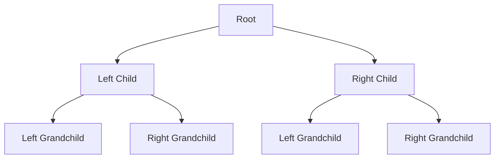
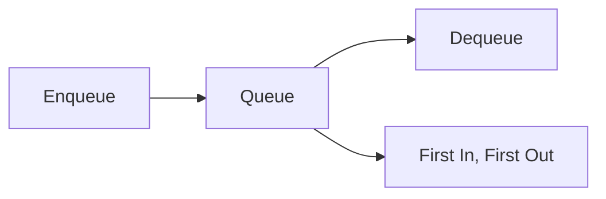

# 🧩 Key Concepts and Data Structures for BFS

> [!NOTE]
> Before diving into the algorithm, let's understand the fundamental concepts and data structures that make BFS work.

## Binary Trees: A Quick Refresher 🌲

A binary tree is a hierarchical data structure where each node has at most two children, referred to as the left child and the right child.



Each node in a binary tree typically contains:
- A value (or data)
- A reference to the left child
- A reference to the right child

In code, we represent a binary tree node like this:

```javascript
function TreeNode(val, left = null, right = null) {
  this.val = val;
  this.left = left;
  this.right = right;
}
```

## The Queue: BFS's Essential Tool 📋

The key to implementing BFS is using a **queue** data structure. A queue follows the First-In-First-Out (FIFO) principle:

- Elements are added to the back (enqueue)
- Elements are removed from the front (dequeue)

This FIFO behavior is perfect for BFS because it ensures we process nodes in the order we discover them, level by level.



In JavaScript, we can implement a queue using an array with `push()` to enqueue and `shift()` to dequeue:

```javascript
const queue = [];
queue.push(item);  // Enqueue
const item = queue.shift();  // Dequeue
```

## Level-Order Traversal: The Heart of BFS 🔄

BFS performs a level-order traversal, which means:

1. Start at the root (level 0)
2. Visit all nodes at the current level
3. Move to the next level
4. Repeat until all levels are visited

> [!TIP]
> Think of BFS as exploring a tree in "waves" that move outward from the root, like ripples in a pond.

## Visualizing BFS in Action 👁️

Let's visualize how BFS traverses this binary tree:

```
    1
   / \
  2   3
 / \   \
4   5   6
```

1. Start with the root node (1) in the queue
2. Process 1, enqueue its children (2, 3)
3. Process 2, enqueue its children (4, 5)
4. Process 3, enqueue its child (6)
5. Process 4, 5, and 6 (no children to enqueue)

The resulting BFS traversal order is: [1, 2, 3, 4, 5, 6]

<details>
<summary>💡 Step-by-Step Animation</summary>

Here's how the queue evolves during BFS:

Initial state: Queue = [1]

1. Dequeue 1, process it → Output: [1]
   Enqueue 1's children → Queue = [2, 3]

2. Dequeue 2, process it → Output: [1, 2]
   Enqueue 2's children → Queue = [3, 4, 5]

3. Dequeue 3, process it → Output: [1, 2, 3]
   Enqueue 3's children → Queue = [4, 5, 6]

4. Dequeue 4, process it → Output: [1, 2, 3, 4]
   No children to enqueue → Queue = [5, 6]

5. Dequeue 5, process it → Output: [1, 2, 3, 4, 5]
   No children to enqueue → Queue = [6]

6. Dequeue 6, process it → Output: [1, 2, 3, 4, 5, 6]
   No children to enqueue → Queue = []

Queue is empty, BFS is complete!
</details>

## Why Use a Queue for BFS? 🤔

The queue ensures we visit nodes in the correct order for BFS:

- It maintains the order of discovery
- It automatically handles the level-by-level progression
- It provides a clean way to track which nodes we need to visit next

> [!WARNING]
> Using a stack instead of a queue would result in depth-first search (DFS), not breadth-first search!

## Think About This 🧠

<details>
<summary>What would happen if we used a different data structure instead of a queue?</summary>

- Using a **stack** (Last-In-First-Out) would give us depth-first search (DFS)
- Using a **priority queue** would give us a best-first search, which could be useful for certain pathfinding algorithms
- Using a **random access** approach would result in an unpredictable traversal order
</details>

In the next lesson, we'll implement the BFS algorithm step by step! 