# 🧩 Key Concepts and Data Structures for BFS

> [!NOTE]
> Before diving into the algorithm, let's understand the fundamental concepts and data structures that make BFS work.

## Binary Trees: A Quick Refresher 🌲

A binary tree is a hierarchical data structure where each node has at most two children, referred to as the left child and the right child.


Each node in a binary tree typically contains:
- A value (or data)
- A reference to the left child
- A reference to the right child

In code, we represent a binary tree node like this:

```javascript
function TreeNode(val, left = null, right = null) {
  this.val = val;
  this.left = left;
  this.right = right;
}
```

<details>
<summary>Other Language Implementations</summary>

#### Python
```python
class TreeNode:
    def __init__(self, val=0, left=None, right=None):
        self.val = val
        self.left = left
        self.right = right
```

#### TypeScript
```typescript
class TreeNode {
    val: number;
    left: TreeNode | null;
    right: TreeNode | null;
    
    constructor(val: number = 0, left: TreeNode | null = null, right: TreeNode | null = null) {
        this.val = val;
        this.left = left;
        this.right = right;
    }
}
```

#### Java
```java
public class TreeNode {
    int val;
    TreeNode left;
    TreeNode right;
    
    TreeNode() {}
    
    TreeNode(int val) { 
        this.val = val; 
    }
    
    TreeNode(int val, TreeNode left, TreeNode right) {
        this.val = val;
        this.left = left;
        this.right = right;
    }
}
```
</details>

## The Queue: BFS's Essential Tool 📋

The key to implementing BFS is using a **queue** data structure. A queue follows the First-In-First-Out (FIFO) principle:

- Elements are added to the back (enqueue)
- Elements are removed from the front (dequeue)

This FIFO behavior is perfect for BFS because it ensures we process nodes in the order we discover them, level by level.


### Queue Visualization

```mermaid
sequenceDiagram
    participant Back
    participant Queue
    participant Front
    
    Note over Queue: Empty Queue: []
    Back->>Queue: Enqueue(A)
    Note over Queue: Queue: [A]
    Back->>Queue: Enqueue(B)
    Note over Queue: Queue: [A, B]
    Queue->>Front: Dequeue() → A
    Note over Queue: Queue: [B]
    Back->>Queue: Enqueue(C)
    Note over Queue: Queue: [B, C]
    Queue->>Front: Dequeue() → B
    Note over Queue: Queue: [C]
```



### Queue Implementations in Different Languages

<details>
<summary>JavaScript/TypeScript</summary>

```javascript
// Using an array as a queue
const queue = [];
queue.push(item);  // Enqueue
const item = queue.shift();  // Dequeue

// More efficient queue implementation
class Queue {
  constructor() {
    this.items = {};
    this.frontIndex = 0;
    this.backIndex = 0;
  }
  
  enqueue(item) {
    this.items[this.backIndex] = item;
    this.backIndex++;
  }
  
  dequeue() {
    if (this.isEmpty()) return null;
    
    const item = this.items[this.frontIndex];
    delete this.items[this.frontIndex];
    this.frontIndex++;
    return item;
  }
  
  isEmpty() {
    return this.frontIndex === this.backIndex;
  }
  
  size() {
    return this.backIndex - this.frontIndex;
  }
}
```
</details>

<details>
<summary>Python</summary>

```python
# Using collections.deque (preferred)
from collections import deque
queue = deque()
queue.append(item)  # Enqueue
item = queue.popleft()  # Dequeue

# Using a list (less efficient for large queues)
queue = []
queue.append(item)  # Enqueue
item = queue.pop(0)  # Dequeue (inefficient for large lists)
```
</details>

<details>
<summary>Java</summary>

```java
// Using LinkedList
import java.util.LinkedList;
import java.util.Queue;

Queue<Integer> queue = new LinkedList<>();
queue.add(item);  // Enqueue
int item = queue.poll();  // Dequeue

// Using ArrayDeque (more efficient)
import java.util.ArrayDeque;
import java.util.Queue;

Queue<Integer> queue = new ArrayDeque<>();
queue.add(item);  // Enqueue
int item = queue.poll();  // Dequeue
```
</details>

## Level-Order Traversal: The Heart of BFS 🔄

BFS performs a level-order traversal, which means:

1. Start at the root (level 0)
2. Visit all nodes at the current level
3. Move to the next level
4. Repeat until all levels are visited

> [!TIP]
> Think of BFS as exploring a tree in "waves" that move outward from the root, like ripples in a pond.

## Visualizing BFS in Action 👁️

Let's visualize how BFS traverses this binary tree:

```
    1
   / \
  2   3
 / \   \
4   5   6
```

1. Start with the root node (1) in the queue
2. Process 1, enqueue its children (2, 3)
3. Process 2, enqueue its children (4, 5)
4. Process 3, enqueue its child (6)
5. Process 4, 5, and 6 (no children to enqueue)

The resulting BFS traversal order is: [1, 2, 3, 4, 5, 6]

## Queue Evolution During BFS 📊

Here's a visual representation of how the queue and result array evolve during BFS:


<details>
<summary>💡 Step-by-Step Animation</summary>

Here's how the queue evolves during BFS:

Initial state: Queue = [1]

1. Dequeue 1, process it → Output: [1]
   Enqueue 1's children → Queue = [2, 3]

2. Dequeue 2, process it → Output: [1, 2]
   Enqueue 2's children → Queue = [3, 4, 5]

3. Dequeue 3, process it → Output: [1, 2, 3]
   Enqueue 3's children → Queue = [4, 5, 6]

4. Dequeue 4, process it → Output: [1, 2, 3, 4]
   No children to enqueue → Queue = [5, 6]

5. Dequeue 5, process it → Output: [1, 2, 3, 4, 5]
   No children to enqueue → Queue = [6]

6. Dequeue 6, process it → Output: [1, 2, 3, 4, 5, 6]
   No children to enqueue → Queue = []

Queue is empty, BFS is complete!
</details>

## Why Use a Queue for BFS? 🤔

The queue ensures we visit nodes in the correct order for BFS:

- It maintains the order of discovery
- It automatically handles the level-by-level progression
- It provides a clean way to track which nodes we need to visit next

> [!WARNING]
> Using a stack instead of a queue would result in depth-first search (DFS), not breadth-first search!

## Knowledge Check ✅

<details>
<summary>What would happen if we used a stack instead of a queue for tree traversal?</summary>

If we used a stack (Last-In-First-Out) instead of a queue, we would be implementing **Depth-First Search (DFS)** instead of BFS.

In DFS, we would explore as far as possible along each branch before backtracking, resulting in a very different traversal order. For our example tree:
- BFS order: [1, 2, 3, 4, 5, 6]
- DFS order (preorder): [1, 2, 4, 5, 3, 6]
</details>

<details>
<summary>Why is a queue particularly good for level-order traversal?</summary>

A queue processes elements in the order they were added (FIFO), which naturally matches the level-by-level traversal pattern:

1. We process the root node first
2. Then we add its children to the queue
3. When we finish with one level, the next level's nodes are already lined up in the queue in left-to-right order
4. This ensures we complete each level before moving to the next

This FIFO property is crucial for ensuring that nodes are processed level by level, rather than branch by branch.
</details>

## Think About This 🧠

<details>
<summary>What would happen if we used a different data structure instead of a queue?</summary>

- Using a **stack** (Last-In-First-Out) would give us depth-first search (DFS)
- Using a **priority queue** would give us a best-first search, which could be useful for certain pathfinding algorithms
- Using a **random access** approach would result in an unpredictable traversal order
</details>

In the next lesson, we'll implement the BFS algorithm step by step! 