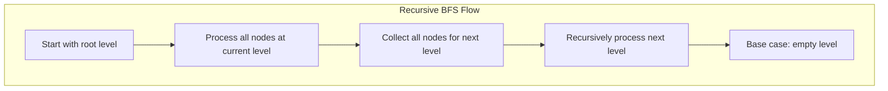
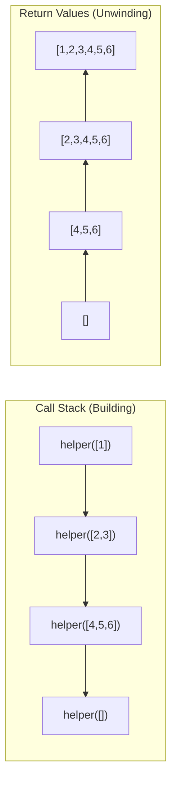

# 🔁 Recursive Implementation of BFS

> [!NOTE]
> In this lesson, we'll explore an alternative recursive approach to implementing BFS.

## The Recursive Approach 🧩

While BFS is typically implemented iteratively with a queue, it can also be implemented recursively. The recursive approach is less common but provides an interesting alternative perspective on the algorithm.

> [!TIP]
> Understanding both iterative and recursive implementations deepens your grasp of the algorithm and expands your problem-solving toolkit.

## The Key Insight 💡

The key insight for a recursive BFS implementation is to:

1. Process all nodes at the current level
2. Collect all nodes for the next level
3. Recursively process the next level

Instead of using a queue to manage the traversal, we'll use recursion to process each level one at a time.



## Step-by-Step Implementation 📝

Let's break down the recursive implementation:

### Step 1: Handle Edge Cases ⚠️

First, we handle the empty tree case:

```javascript
function bfs(root) {
  if (!root) return [];
  
  // Rest of the implementation...
}
```

### Step 2: Create a Helper Function 🔧

We'll create a helper function that processes one level at a time:

```javascript
function bfs(root) {
  if (!root) return [];

  function helper(level) {
    // Implementation details...
  }
  
  return helper([root]);
}
```

### Step 3: Implement the Recursive Logic 🧠

The helper function will:
1. Process all nodes at the current level
2. Collect nodes for the next level
3. Recursively call itself with the next level

```javascript
function bfs(root) {
  if (!root) return [];

  function helper(level) {
    if (level.length === 0) return [];
    
    const nextLevel = [];
    const values = [];
    
    level.forEach((node) => {
      values.push(node.val);
      if (node.left) nextLevel.push(node.left);
      if (node.right) nextLevel.push(node.right);
    });
    
    return values.concat(helper(nextLevel));
  }
  
  return helper([root]);
}
```

## The Complete Implementation 🏆

Here's the complete recursive implementation of BFS:

```javascript
/**
 * Represents a node in a binary tree.
 * @constructor
 * @param {number} val - The node's value.
 * @param {TreeNode|null} [left=null] - Left child.
 * @param {TreeNode|null} [right=null] - Right child.
 */
function TreeNode(val, left = null, right = null) {
  this.val = val;
  this.left = left;
  this.right = right;
}

/**
 * Recursively performs a breadth-first search (BFS) on a binary tree.
 *
 * @param {TreeNode|null} root - The root of the binary tree.
 * @returns {number[]} An array of values in level order.
 */
function bfs(root) {
  if (!root) return [];  // Handle empty tree case

  function helper(level) {
    // Base case: if no nodes at this level, return empty array
    if (level.length === 0) return [];
    
    const nextLevel = [];  // Collect nodes for the next level
    const values = [];     // Store values from current level
    
    // Process all nodes at the current level
    level.forEach((node) => {
      values.push(node.val);  // Add current node's value
      
      // Collect children for the next level
      if (node.left) nextLevel.push(node.left);
      if (node.right) nextLevel.push(node.right);
    });
    
    // Combine current level values with all subsequent levels
    return values.concat(helper(nextLevel));
  }

  return helper([root]);  // Start with the root level
}
```

## Visualizing Recursive BFS 🔄

Unlike typical recursion which goes deep before backtracking, recursive BFS processes entire levels:

```mermaid
graph TB
    subgraph "Initial Call: helper([1])"
        A1[Process level [1]]
        A2[Collect children: [2,3]]
        A3[Return [1] + helper([2,3])]
    end
    
    subgraph "First Recursive Call: helper([2,3])"
        B1[Process level [2,3]]
        B2[Collect children: [4,5,6]]
        B3[Return [2,3] + helper([4,5,6])]
    end
    
    subgraph "Second Recursive Call: helper([4,5,6])"
        C1[Process level [4,5,6]]
        C2[Collect children: []]
        C3[Return [4,5,6] + helper([])]
    end
    
    subgraph "Final Recursive Call: helper([])"
        D1[Return []]
    end
    
    A3 --> B1
    B3 --> C1
    C3 --> D1
```

Each recursive call processes an entire level before making the next call.

## Implementations in Other Languages 🌍

<details>
<summary>Python Implementation</summary>

```python
class TreeNode:
    def __init__(self, val=0, left=None, right=None):
        self.val = val
        self.left = left
        self.right = right

def bfs(root):
    if not root:
        return []
    
    def helper(level):
        if not level:
            return []
        
        next_level = []
        values = []
        
        for node in level:
            values.append(node.val)
            if node.left:
                next_level.append(node.left)
            if node.right:
                next_level.append(node.right)
        
        return values + helper(next_level)
    
    return helper([root])
```
</details>

<details>
<summary>Java Implementation</summary>

```java
import java.util.ArrayList;
import java.util.List;

public class RecursiveBFS {
    public static class TreeNode {
        int val;
        TreeNode left;
        TreeNode right;
        
        TreeNode() {}
        TreeNode(int val) { this.val = val; }
        TreeNode(int val, TreeNode left, TreeNode right) {
            this.val = val;
            this.left = left;
            this.right = right;
        }
    }
    
    public static List<Integer> bfs(TreeNode root) {
        if (root == null) return new ArrayList<>();
        
        return helper(List.of(root));
    }
    
    private static List<Integer> helper(List<TreeNode> level) {
        if (level.isEmpty()) return new ArrayList<>();
        
        List<TreeNode> nextLevel = new ArrayList<>();
        List<Integer> values = new ArrayList<>();
        
        for (TreeNode node : level) {
            values.add(node.val);
            if (node.left != null) nextLevel.add(node.left);
            if (node.right != null) nextLevel.add(node.right);
        }
        
        List<Integer> result = new ArrayList<>(values);
        result.addAll(helper(nextLevel));
        return result;
    }
}
```
</details>

## Tracing Through an Example 🔍

Let's trace through the recursive algorithm with this example tree:

```mermaid
graph TD;
    1((1)) --> 2((2))
    1 --> 3((3))
    2 --> 4((4))
    2 --> 5((5))
    3 -->|""|x((""))
    3 --> 6((6))
    
    classDef empty fill:#fff,stroke:#fff,stroke-width:0px;
    class x empty;
```

<details>
<summary>Step-by-Step Execution</summary>

1. Call `bfs(root)` → `helper([1])`
   - Process level `[1]`: `values = [1]`
   - Collect children: `nextLevel = [2, 3]`
   - Return `[1].concat(helper([2, 3]))`

2. Process level `[2, 3]`:
   - `values = [2, 3]`
   - Collect children: `nextLevel = [4, 5, 6]`
   - Return `[2, 3].concat(helper([4, 5, 6]))`

3. Process level `[4, 5, 6]`:
   - `values = [4, 5, 6]`
   - Collect children: `nextLevel = []`
   - Return `[4, 5, 6].concat(helper([]))`

4. Process level `[]`:
   - Base case reached: return `[]`

5. Unwinding the recursion:
   - `[4, 5, 6].concat([]) = [4, 5, 6]`
   - `[2, 3].concat([4, 5, 6]) = [2, 3, 4, 5, 6]`
   - `[1].concat([2, 3, 4, 5, 6]) = [1, 2, 3, 4, 5, 6]`

6. Final result: `[1, 2, 3, 4, 5, 6]`
</details>

## Recursion Call Stack Visualization 📚

Here's how the recursion call stack builds up and then unwinds:



## Handling Potential Stack Overflow ⚠️

The recursive approach can cause stack overflow errors for very deep or wide trees. Here are some strategies to mitigate this risk:

1. **Limit recursion depth**: Add a depth parameter and return early if it exceeds a threshold
   ```javascript
   function helper(level, maxDepth = 1000) {
     if (level.length === 0 || maxDepth <= 0) return [];
     // ...rest of implementation
     return values.concat(helper(nextLevel, maxDepth - 1));
   }
   ```

2. **Process in batches**: For very wide trees, process the level in smaller chunks
   ```javascript
   function helper(level) {
     if (level.length === 0) return [];
     
     // Process in batches of 1000 nodes at a time
     if (level.length > 1000) {
       const batch = level.slice(0, 1000);
       const remaining = level.slice(1000);
       return helper(batch).concat(helper(remaining));
     }
     
     // Regular implementation for smaller levels
     // ...
   }
   ```

3. **Fall back to iterative**: Detect large trees and use the iterative approach instead
   ```javascript
   function bfs(root) {
     // If tree is very large, use iterative approach
     if (estimateTreeSize(root) > 10000) {
       return iterativeBfs(root);
     }
     // Otherwise use recursive approach
     // ...
   }
   ```

## Comparing Iterative vs. Recursive Approaches 🔄

Let's compare the two approaches:

| Aspect | Iterative | Recursive |
|--------|-----------|-----------|
| **Readability** | More intuitive for BFS | Less common for BFS |
| **Memory Usage** | Uses a queue | Uses call stack |
| **Performance** | Generally faster | Potential stack overflow for deep trees |
| **Implementation** | Straightforward | More complex |
| **Level Awareness** | Requires extra logic | Naturally level-aware |
| **Error Handling** | Easier to manage | Stack overflow risk |

> [!WARNING]
> The recursive approach may cause stack overflow errors for very deep trees due to the call stack limitations.

## Time and Space Complexity ⏱️

- **Time Complexity**: O(n) where n is the number of nodes in the tree
  - Each node is processed exactly once

- **Space Complexity**: O(n) in the worst case
  - The recursive call stack can grow to a height proportional to the number of levels
  - The arrays used to store levels and values also contribute to space usage
  - In the worst case, a completely unbalanced tree could lead to O(n) recursion depth

## Knowledge Check ✅

<details>
<summary>How does the recursive BFS approach differ from a typical recursive DFS approach?</summary>

In a typical recursive DFS approach, each recursive call processes a single node and then immediately makes recursive calls for its children, going deep into one branch before backtracking.

In recursive BFS, each recursive call processes an entire level of nodes and collects all their children before making a single recursive call to process the next level. This ensures level-by-level traversal despite using recursion.
</details>

<details>
<summary>What's the base case in the recursive BFS implementation?</summary>

The base case is when we encounter an empty level (i.e., `level.length === 0`). At this point, we return an empty array, which signals the end of the recursion.

This happens when we've processed all levels of the tree and there are no more nodes to visit.
</details>

## Think About This 🧠

<details>
<summary>When might you prefer the recursive implementation over the iterative one?</summary>

You might prefer the recursive implementation when:

1. You want to clearly separate the logic for processing each level
2. You need to perform complex operations at each level that are easier to express recursively
3. You're working with a language that optimizes tail recursion
4. The tree is not very deep, so stack overflow is not a concern
5. You want to make the level-by-level nature of BFS more explicit in your code
</details>

In the next lesson, we'll explore practical applications and variations of the BFS algorithm! 