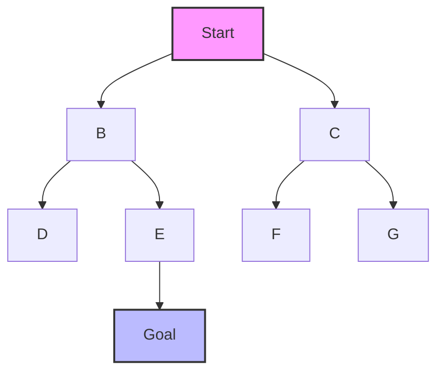

# 🌟 Applications and Variations of BFS

> [!NOTE]
> In this lesson, we'll explore practical applications of BFS and some common variations of the algorithm.

## Real-World Applications of BFS 🌍

BFS is not just a theoretical algorithm—it has numerous practical applications in various domains:

### 1. Shortest Path Finding 🗺️

BFS finds the shortest path in unweighted graphs, making it useful for:

- **GPS Navigation Systems**: Finding the shortest route between two points
- **Network Routing**: Determining the shortest path for data packets
- **Game Development**: Pathfinding for characters in grid-based games



### 2. Web Crawling 🕸️

Search engines use BFS to discover and index web pages:

- Start at a seed URL
- Visit all linked pages (one level away)
- Then visit pages linked from those pages (next level)
- Continue this process to explore the web

### 3. Social Network Analysis 👥

BFS helps analyze relationships in social networks:

- Finding all friends within a certain number of connections
- Calculating degrees of separation between users
- Identifying potential friend recommendations

### 4. Puzzle Solving 🧩

BFS is excellent for solving puzzles where you need to find the minimum number of moves:

- Rubik's Cube
- Sliding puzzle games
- Word ladder puzzles (changing one word to another by altering one letter at a time)

### 5. Level-Order Operations 📊

In tree data structures, BFS enables:

- Level-order traversal for UI rendering of hierarchical structures
- Finding the minimum depth of a tree
- Serializing and deserializing tree structures

## Common Variations of BFS 🔄

The basic BFS algorithm can be modified to solve different problems:

### 1. Level-Aware BFS 📏

This variation keeps track of the level of each node:

```javascript
function levelOrderTraversal(root) {
  if (!root) return [];
  
  const queue = [root];
  const result = [];
  
  while (queue.length) {
    const levelSize = queue.length;
    const currentLevel = [];
    
    for (let i = 0; i < levelSize; i++) {
      const node = queue.shift();
      currentLevel.push(node.val);
      
      if (node.left) queue.push(node.left);
      if (node.right) queue.push(node.right);
    }
    
    result.push(currentLevel);
  }
  
  return result;
}
```

This returns: `[[1], [2, 3], [4, 5, 6]]` for our example tree.

### 2. Bidirectional BFS 🔄

For finding the shortest path between two nodes, bidirectional BFS runs two simultaneous BFS searches:
- One from the start node
- One from the end node
- When the two searches meet, we've found the shortest path

This can be significantly faster than standard BFS for large graphs.

### 3. BFS with Path Tracking 🛣️

This variation keeps track of the path taken to reach each node:

```javascript
function bfsWithPath(root, target) {
  if (!root) return null;
  
  const queue = [{ node: root, path: [root.val] }];
  
  while (queue.length) {
    const { node, path } = queue.shift();
    
    if (node.val === target) return path;
    
    if (node.left) queue.push({ node: node.left, path: [...path, node.left.val] });
    if (node.right) queue.push({ node: node.right, path: [...path, node.right.val] });
  }
  
  return null; // Target not found
}
```

### 4. Multi-Source BFS 🌐

This starts BFS from multiple source nodes simultaneously:

```javascript
function multiSourceBFS(graph, sources) {
  const queue = [...sources];
  const visited = new Set(sources);
  
  while (queue.length) {
    const node = queue.shift();
    
    for (const neighbor of graph[node]) {
      if (!visited.has(neighbor)) {
        visited.add(neighbor);
        queue.push(neighbor);
      }
    }
  }
  
  return visited;
}
```

This is useful for problems like finding all nodes reachable from any of several starting points.

## BFS vs. Other Algorithms 🥊

Let's compare BFS with other related algorithms:

| Algorithm | When to Use | Advantages | Disadvantages |
|-----------|-------------|------------|--------------|
| **BFS** | Finding shortest paths in unweighted graphs | Guarantees shortest path, level-order traversal | High memory usage for wide graphs |
| **DFS** | Exploring all possibilities, maze generation | Low memory usage, good for deep graphs | Doesn't guarantee shortest path |
| **Dijkstra's** | Finding shortest paths in weighted graphs | Works with positive weights | More complex than BFS |
| **A*** | Finding paths with heuristics | Often faster than Dijkstra's | Requires a good heuristic function |

> [!TIP]
> Choose the right algorithm based on your specific problem. BFS is ideal for unweighted shortest path problems and level-order traversals.

## Optimizing BFS for Performance ⚡

Here are some tips to optimize BFS implementations:

1. **Use an efficient queue implementation**: In languages where array operations like `shift()` are expensive, consider using a linked list or a dedicated queue data structure.

2. **Mark nodes as visited**: For graph BFS, always mark nodes as visited to avoid processing them multiple times.

3. **Early termination**: If you're searching for a specific node, return as soon as you find it rather than completing the entire traversal.

4. **Memory management**: For very large trees/graphs, consider implementing a streaming or chunked approach to manage memory usage.

## Think About This 🧠

<details>
<summary>How would you modify BFS to find the maximum width of a binary tree?</summary>

You could use a level-aware BFS and keep track of the maximum number of nodes at any level:

```javascript
function maxWidth(root) {
  if (!root) return 0;
  
  const queue = [root];
  let maxWidth = 0;
  
  while (queue.length) {
    const levelSize = queue.length;
    maxWidth = Math.max(maxWidth, levelSize);
    
    for (let i = 0; i < levelSize; i++) {
      const node = queue.shift();
      
      if (node.left) queue.push(node.left);
      if (node.right) queue.push(node.right);
    }
  }
  
  return maxWidth;
}
```

This function returns the maximum number of nodes at any level in the tree.
</details>

In the next lesson, we'll tackle common interview questions and challenges related to BFS! 