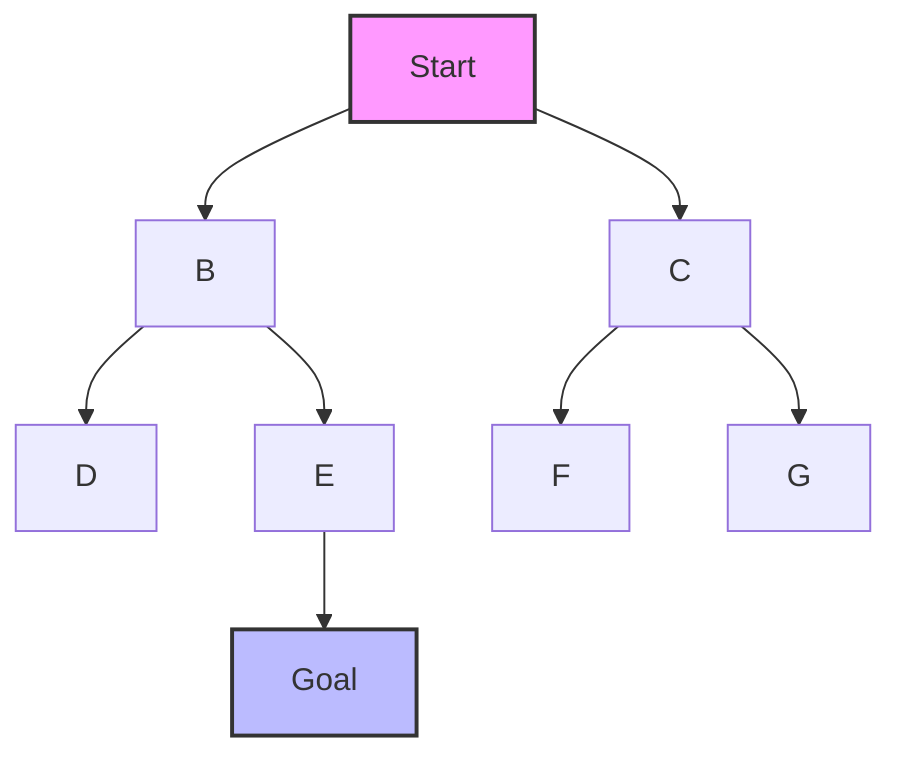
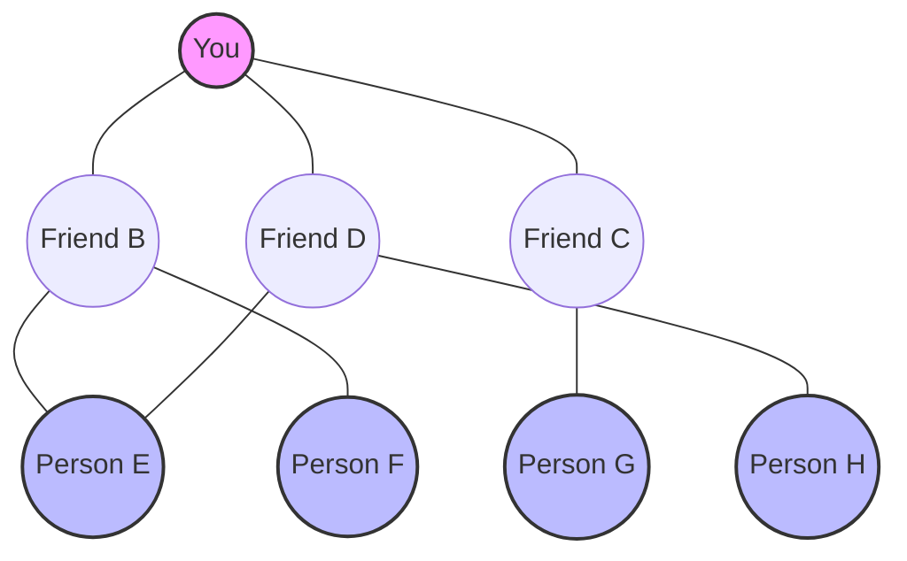
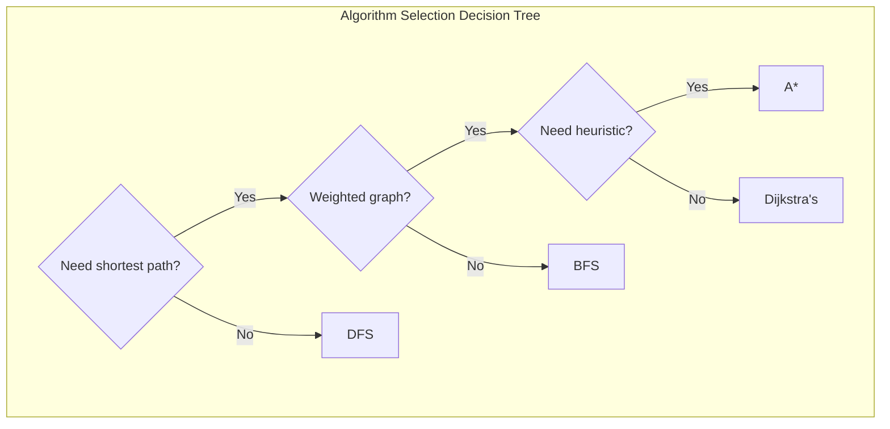

# 🌟 Applications and Variations of BFS

> [!NOTE]
> In this lesson, we'll explore practical applications of BFS and some common variations of the algorithm.

## Real-World Applications of BFS 🌍

BFS is not just a theoretical algorithm—it has numerous practical applications in various domains:

### 1. Shortest Path Finding 🗺️

BFS finds the shortest path in unweighted graphs, making it useful for:

- **GPS Navigation Systems**: Finding the shortest route between two points
- **Network Routing**: Determining the shortest path for data packets
- **Game Development**: Pathfinding for characters in grid-based games



#### Case Study: Maze Solving 🧩

Let's see how BFS can be used to solve a simple maze:

```
S # # # #
. # . . .
# . # # .
# . . . .
# # # # G
```

Where:
- `S` is the start
- `G` is the goal
- `#` are walls
- `.` are open paths

```javascript
function solveMaze(maze) {
  const rows = maze.length;
  const cols = maze[0].length;
  
  // Find start and goal positions
  let start, goal;
  for (let r = 0; r < rows; r++) {
    for (let c = 0; c < cols; c++) {
      if (maze[r][c] === 'S') start = [r, c];
      if (maze[r][c] === 'G') goal = [r, c];
    }
  }
  
  // BFS to find shortest path
  const queue = [[...start, []]]; // [row, col, path]
  const visited = new Set(`${start[0]},${start[1]}`);
  const directions = [[-1, 0], [1, 0], [0, -1], [0, 1]]; // up, down, left, right
  
  while (queue.length) {
    const [row, col, path] = queue.shift();
    
    // Check if we reached the goal
    if (row === goal[0] && col === goal[1]) {
      return [...path, [row, col]]; // Return the path to goal
    }
    
    // Try all four directions
    for (const [dr, dc] of directions) {
      const newRow = row + dr;
      const newCol = col + dc;
      const key = `${newRow},${newCol}`;
      
      // Check if the new position is valid
      if (
        newRow >= 0 && newRow < rows &&
        newCol >= 0 && newCol < cols &&
        !visited.has(key) &&
        maze[newRow][newCol] !== '#'
      ) {
        visited.add(key);
        queue.push([newRow, newCol, [...path, [row, col]]]);
      }
    }
  }
  
  return null; // No path found
}
```

### 2. Web Crawling 🕸️

Search engines use BFS to discover and index web pages:

- Start at a seed URL
- Visit all linked pages (one level away)
- Then visit pages linked from those pages (next level)
- Continue this process to explore the web

#### Case Study: Simple Web Crawler

```python
import requests
from bs4 import BeautifulSoup
from collections import deque
from urllib.parse import urljoin

def web_crawler(start_url, max_pages=100):
    queue = deque([start_url])
    visited = set([start_url])
    pages_data = {}
    count = 0
    
    while queue and count < max_pages:
        url = queue.popleft()
        try:
            response = requests.get(url, timeout=5)
            if response.status_code == 200:
                soup = BeautifulSoup(response.text, 'html.parser')
                
                # Extract page content (title, text, etc.)
                title = soup.title.string if soup.title else "No Title"
                pages_data[url] = {
                    'title': title,
                    'links': []
                }
                count += 1
                
                # Find all links
                for link in soup.find_all('a', href=True):
                    absolute_link = urljoin(url, link['href'])
                    pages_data[url]['links'].append(absolute_link)
                    
                    # Only add to queue if not visited
                    if absolute_link not in visited and absolute_link.startswith('http'):
                        visited.add(absolute_link)
                        queue.append(absolute_link)
                
                print(f"Crawled ({count}/{max_pages}): {url}")
        except Exception as e:
            print(f"Error crawling {url}: {e}")
    
    return pages_data
```

### 3. Social Network Analysis 👥

BFS helps analyze relationships in social networks:

- Finding all friends within a certain number of connections
- Calculating degrees of separation between users
- Identifying potential friend recommendations

#### Case Study: Friend Recommendation System

Here's how Facebook might use BFS to suggest friends:



```typescript
interface User {
  id: string;
  name: string;
  friends: string[]; // IDs of friends
}

function recommendFriends(userId: string, network: Record<string, User>, maxDistance: number = 2): Record<string, number> {
  const recommendations: Record<string, number> = {}; // userId -> score
  const visited = new Set([userId]);
  const queue: [string, number][] = [[userId, 0]]; // [userId, distance]
  
  while (queue.length > 0) {
    const [currentId, distance] = queue.shift()!;
    
    // Don't go beyond the max distance
    if (distance >= maxDistance) continue;
    
    // Get friends of current user
    const currentUser = network[currentId];
    for (const friendId of currentUser.friends) {
      if (!visited.has(friendId)) {
        visited.add(friendId);
        queue.push([friendId, distance + 1]);
        
        // For friends of friends, add as recommendation
        if (distance + 1 === maxDistance) {
          // Get this person's friends
          const potentialRecommendations = network[friendId].friends;
          
          // Add all their friends who aren't already your friends as recommendations
          for (const potentialFriendId of potentialRecommendations) {
            if (!visited.has(potentialFriendId) && potentialFriendId !== userId) {
              if (recommendations[potentialFriendId]) {
                // Increase score if recommended by multiple mutual friends
                recommendations[potentialFriendId]++;
              } else {
                recommendations[potentialFriendId] = 1;
              }
            }
          }
        }
      }
    }
  }
  
  return recommendations;
}
```

### 4. Puzzle Solving 🧩

BFS is excellent for solving puzzles where you need to find the minimum number of moves:

- Rubik's Cube
- Sliding puzzle games
- Word ladder puzzles (changing one word to another by altering one letter at a time)

#### Case Study: Word Ladder

```java
import java.util.*;

public class WordLadder {
    public static int ladderLength(String beginWord, String endWord, List<String> wordList) {
        Set<String> wordSet = new HashSet<>(wordList);
        
        // If endWord is not in the dictionary, return 0
        if (!wordSet.contains(endWord)) return 0;
        
        Queue<String> queue = new LinkedList<>();
        queue.offer(beginWord);
        Set<String> visited = new HashSet<>();
        visited.add(beginWord);
        
        int level = 1;
        
        while (!queue.isEmpty()) {
            int size = queue.size();
            
            for (int i = 0; i < size; i++) {
                String currentWord = queue.poll();
                
                // If we found the end word, return the level
                if (currentWord.equals(endWord)) {
                    return level;
                }
                
                // Try changing each character
                char[] wordChars = currentWord.toCharArray();
                for (int j = 0; j < wordChars.length; j++) {
                    char originalChar = wordChars[j];
                    
                    // Try all possible characters
                    for (char c = 'a'; c <= 'z'; c++) {
                        wordChars[j] = c;
                        String newWord = new String(wordChars);
                        
                        // If the new word is in the dictionary and not visited
                        if (wordSet.contains(newWord) && !visited.contains(newWord)) {
                            queue.offer(newWord);
                            visited.add(newWord);
                        }
                    }
                    
                    // Restore original character
                    wordChars[j] = originalChar;
                }
            }
            
            level++;
        }
        
        return 0; // No transformation sequence found
    }
    
    public static void main(String[] args) {
        String beginWord = "hit";
        String endWord = "cog";
        List<String> wordList = Arrays.asList("hot","dot","dog","lot","log","cog");
        
        int result = ladderLength(beginWord, endWord, wordList);
        System.out.println("Length of shortest transformation: " + result);
        // Output: Length of shortest transformation: 5
        // Explanation: hit -> hot -> dot -> dog -> cog
    }
}
```

### 5. Level-Order Operations 📊

In tree data structures, BFS enables:

- Level-order traversal for UI rendering of hierarchical structures
- Finding the minimum depth of a tree
- Serializing and deserializing tree structures

## Common Variations of BFS 🔄

The basic BFS algorithm can be modified to solve different problems:

### 1. Level-Aware BFS 📏

This variation keeps track of the level of each node:

```javascript
function levelOrderTraversal(root) {
  if (!root) return [];
  
  const queue = [root];
  const result = [];
  
  while (queue.length) {
    const levelSize = queue.length;
    const currentLevel = [];
    
    for (let i = 0; i < levelSize; i++) {
      const node = queue.shift();
      currentLevel.push(node.val);
      
      if (node.left) queue.push(node.left);
      if (node.right) queue.push(node.right);
    }
    
    result.push(currentLevel);
  }
  
  return result;
}
```

This returns: `[[1], [2, 3], [4, 5, 6]]` for our example tree.

### 2. Bidirectional BFS 🔄

For finding the shortest path between two nodes, bidirectional BFS runs two simultaneous BFS searches:
- One from the start node
- One from the end node
- When the two searches meet, we've found the shortest path

```python
def bidirectional_bfs(graph, start, end):
    # Early termination if start or end not in graph
    if start not in graph or end not in graph:
        return None
    
    # Handle special case where start and end are the same
    if start == end:
        return [start]
    
    # Forward and backward search queues
    forward_queue = deque([start])
    backward_queue = deque([end])
    
    # Keep track of visited nodes and their parents
    forward_visited = {start: None}
    backward_visited = {end: None}
    
    # Function to reconstruct path when searches meet
    def reconstruct_path(intersection_node, forward_parents, backward_parents):
        path = []
        
        # Reconstruct path from start to intersection
        current = intersection_node
        while current:
            path.append(current)
            current = forward_parents[current]
        path.reverse()  # Reverse to get correct order
        
        # Reconstruct path from intersection to end (skip intersection node)
        current = backward_parents[intersection_node]
        while current:
            path.append(current)
            current = backward_parents[current]
        
        return path
    
    # BFS alternating between forward and backward
    while forward_queue and backward_queue:
        # Forward BFS step
        for _ in range(len(forward_queue)):
            node = forward_queue.popleft()
            
            # Check if forward search reached backward search
            if node in backward_visited:
                return reconstruct_path(node, forward_visited, backward_visited)
            
            # Add neighbors to forward queue
            for neighbor in graph[node]:
                if neighbor not in forward_visited:
                    forward_visited[neighbor] = node
                    forward_queue.append(neighbor)
        
        # Backward BFS step
        for _ in range(len(backward_queue)):
            node = backward_queue.popleft()
            
            # Check if backward search reached forward search
            if node in forward_visited:
                return reconstruct_path(node, forward_visited, backward_visited)
            
            # Add neighbors to backward queue
            for neighbor in graph[node]:
                if neighbor not in backward_visited:
                    backward_visited[neighbor] = node
                    backward_queue.append(neighbor)
    
    # If we get here, there's no path
    return None
```

This can be significantly faster than standard BFS for large graphs.

### 3. BFS with Path Tracking 🛣️

This variation keeps track of the path taken to reach each node:

```javascript
function bfsWithPath(root, target) {
  if (!root) return null;
  
  const queue = [{ node: root, path: [root.val] }];
  
  while (queue.length) {
    const { node, path } = queue.shift();
    
    if (node.val === target) return path;
    
    if (node.left) queue.push({ node: node.left, path: [...path, node.left.val] });
    if (node.right) queue.push({ node: node.right, path: [...path, node.right.val] });
  }
  
  return null; // Target not found
}
```

### 4. Multi-Source BFS 🌐

This starts BFS from multiple source nodes simultaneously:

```javascript
function multiSourceBFS(graph, sources) {
  const queue = [...sources];
  const visited = new Set(sources);
  const distance = {};
  
  // Initialize distances for source nodes
  sources.forEach(source => distance[source] = 0);
  
  while (queue.length) {
    const node = queue.shift();
    
    for (const neighbor of graph[node]) {
      if (!visited.has(neighbor)) {
        visited.add(neighbor);
        queue.push(neighbor);
        distance[neighbor] = distance[node] + 1;
      }
    }
  }
  
  return distance;
}
```

#### Application: Flood Fill

```python
def flood_fill(image, sr, sc, new_color):
    rows, cols = len(image), len(image[0])
    start_color = image[sr][sc]
    
    # If starting color is already the new color, return unchanged
    if start_color == new_color:
        return image
    
    # BFS
    queue = deque([(sr, sc)])
    image[sr][sc] = new_color
    
    while queue:
        r, c = queue.popleft()
        
        # Check 4 directions: up, right, down, left
        for dr, dc in [(-1, 0), (0, 1), (1, 0), (0, -1)]:
            nr, nc = r + dr, c + dc
            
            # Check if new position is valid and has the start color
            if (0 <= nr < rows and 0 <= nc < cols and 
                image[nr][nc] == start_color):
                image[nr][nc] = new_color
                queue.append((nr, nc))
    
    return image
```

## BFS vs. Other Algorithms 🥊

Let's compare BFS with other related algorithms:

| Algorithm | When to Use | Advantages | Disadvantages |
|-----------|-------------|------------|--------------|
| **BFS** | Finding shortest paths in unweighted graphs | Guarantees shortest path, level-order traversal | High memory usage for wide graphs |
| **DFS** | Exploring all possibilities, maze generation | Low memory usage, good for deep graphs | Doesn't guarantee shortest path |
| **Dijkstra's** | Finding shortest paths in weighted graphs | Works with positive weights | More complex than BFS |
| **A*** | Finding paths with heuristics | Often faster than Dijkstra's | Requires a good heuristic function |



> [!TIP]
> Choose the right algorithm based on your specific problem. BFS is ideal for unweighted shortest path problems and level-order traversals.

## Optimizing BFS for Performance ⚡

Here are some tips to optimize BFS implementations:

1. **Use an efficient queue implementation**: In languages where array operations like `shift()` are expensive, consider using a linked list or a dedicated queue data structure.

```javascript
// Instead of this (O(n) shift operation)
const array = [];
array.push(item);
const item = array.shift();

// Use this (O(1) operations)
class Queue {
  constructor() {
    this.items = {};
    this.frontIndex = 0;
    this.backIndex = 0;
  }
  
  enqueue(item) {
    this.items[this.backIndex] = item;
    this.backIndex++;
  }
  
  dequeue() {
    if (this.isEmpty()) return null;
    
    const item = this.items[this.frontIndex];
    delete this.items[this.frontIndex];
    this.frontIndex++;
    return item;
  }
  
  isEmpty() {
    return this.frontIndex === this.backIndex;
  }
}
```

2. **Mark nodes as visited**: For graph BFS, always mark nodes as visited to avoid processing them multiple times.

```python
def graph_bfs(graph, start):
    visited = set([start])
    queue = deque([start])
    result = []
    
    while queue:
        node = queue.popleft()
        result.append(node)
        
        for neighbor in graph[node]:
            if neighbor not in visited:  # Critical for preventing cycles
                visited.add(neighbor)
                queue.append(neighbor)
    
    return result
```

3. **Early termination**: If you're searching for a specific node, return as soon as you find it rather than completing the entire traversal.

4. **Memory management**: For very large trees/graphs, consider implementing a streaming or chunked approach to manage memory usage.

## Interactive BFS Visualization 🖥️

To better understand BFS, try this interactive visualization:

<div class="interactive-visualization">
<!-- Placeholder for interactive component that would:
     - Allow users to build their own graph/tree
     - Animate the BFS traversal step by step
     - Show the queue state at each step
-->
</div>

## Knowledge Check ✅

<details>
<summary>In which scenario would BFS be preferred over DFS?</summary>

BFS would be preferred when:
1. Finding the **shortest path** in an unweighted graph
2. Searching for a node that is likely **closer to the root**
3. **Level-by-level** traversal is needed
4. **Memory is not a constraint** but finding the optimal solution is important
5. You need to find **all nodes at a certain distance** from the start

DFS, on the other hand, is better for exploring all possible paths, searching deep trees, or when memory is a constraint.
</details>

<details>
<summary>What's the key difference between standard BFS and bidirectional BFS?</summary>

Standard BFS starts from a single source node and explores outward in one direction.

Bidirectional BFS runs two simultaneous BFS searches:
- One from the start node
- One from the goal node

When the two search frontiers meet, we've found the shortest path. This can be significantly more efficient than standard BFS, especially for large graphs, as the search space grows exponentially with distance, but bidirectional BFS effectively reduces the exponent by a factor of 2.
</details>

## Think About This 🧠

<details>
<summary>How would you modify BFS to find the maximum width of a binary tree?</summary>

You could use a level-aware BFS and keep track of the maximum number of nodes at any level:

```javascript
function maxWidth(root) {
  if (!root) return 0;
  
  const queue = [root];
  let maxWidth = 0;
  
  while (queue.length) {
    const levelSize = queue.length;
    maxWidth = Math.max(maxWidth, levelSize);
    
    for (let i = 0; i < levelSize; i++) {
      const node = queue.shift();
      
      if (node.left) queue.push(node.left);
      if (node.right) queue.push(node.right);
    }
  }
  
  return maxWidth;
}
```

This function returns the maximum number of nodes at any level in the tree.
</details>

In the next lesson, we'll tackle common interview questions and challenges related to BFS! 