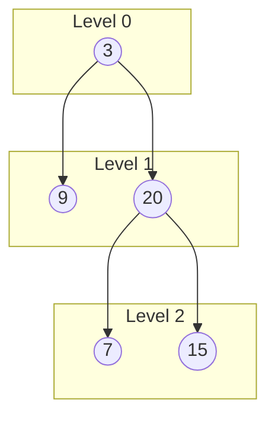
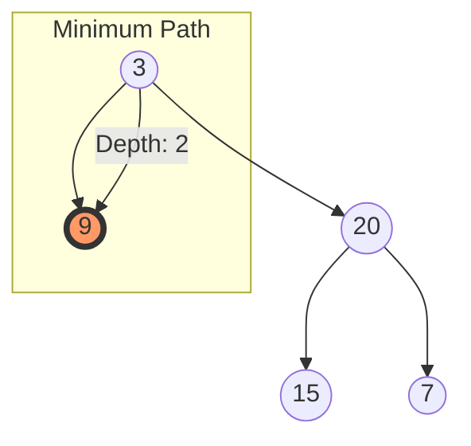
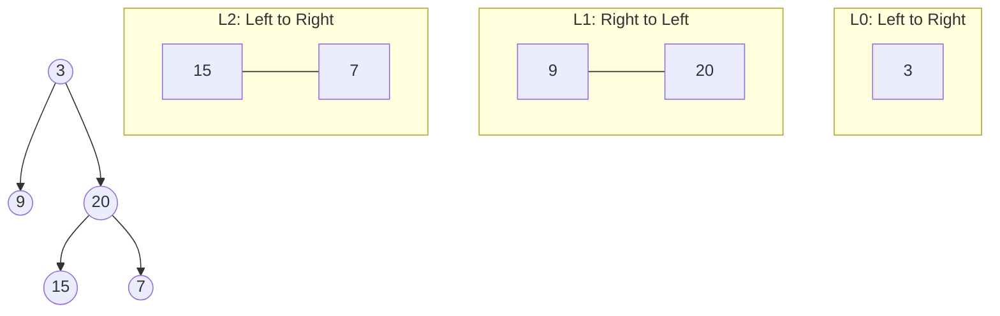
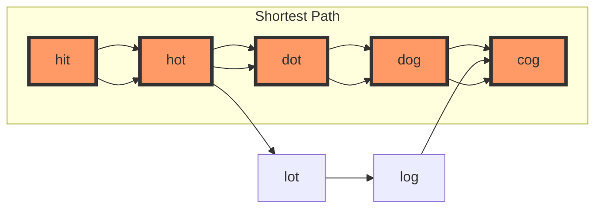
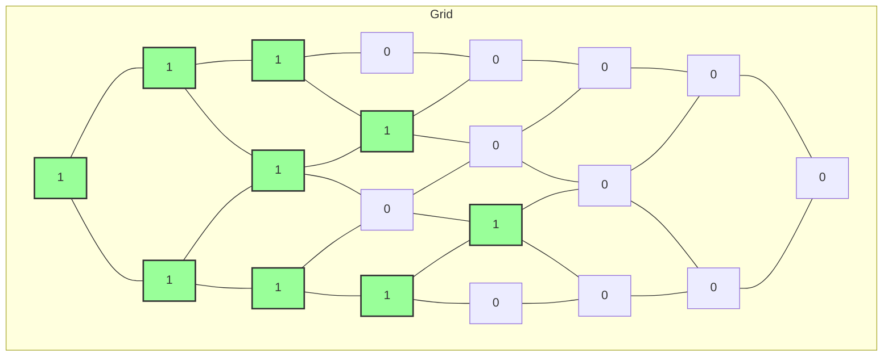
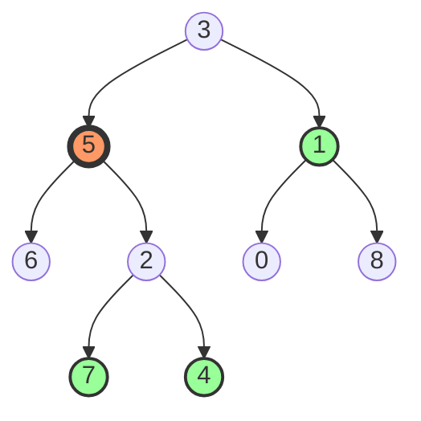

# 🎯 BFS in Coding Interviews

> [!NOTE]
> In this lesson, we'll explore common interview questions that use BFS and strategies to solve them effectively.

## Common BFS Interview Questions 📝

BFS is a popular topic in coding interviews. Here are some common questions you might encounter, organized by category:

## Tree-Based BFS Problems 🌲

### 1. Binary Tree Level Order Traversal

**Problem**: Given a binary tree, return the level order traversal of its nodes' values (i.e., from left to right, level by level).

**Example**:
```
Input:
    3
   / \
  9  20
    /  \
   15   7

Output: [[3], [9, 20], [15, 7]]
```

**Visual Explanation**:


**Solution**:
```javascript
function levelOrder(root) {
  if (!root) return [];
  
  const queue = [root];
  const result = [];
  
  while (queue.length) {
    const levelSize = queue.length;
    const currentLevel = [];
    
    for (let i = 0; i < levelSize; i++) {
      const node = queue.shift();
      currentLevel.push(node.val);
      
      if (node.left) queue.push(node.left);
      if (node.right) queue.push(node.right);
    }
    
    result.push(currentLevel);
  }
  
  return result;
}
```

**Solution Walkthrough**:

1. We use a queue to perform BFS, starting with the root node
2. For each level:
   - We determine how many nodes are at that level (`levelSize`)
   - We process exactly that many nodes from the queue
   - We add their values to the current level's array
   - We enqueue all their children for the next level
3. We add the current level's array to our result and continue
4. Once the queue is empty, we return the result containing all levels

**Time Complexity**: O(n) where n is the number of nodes in the tree
**Space Complexity**: O(n) for the queue and result arrays

### 2. Minimum Depth of Binary Tree

**Problem**: Find the minimum depth of a binary tree (the number of nodes along the shortest path from the root node down to the nearest leaf node).

**Example**:
```
Input:
    3
   / \
  9  20
    /  \
   15   7

Output: 2
```

**Visual Explanation**:


**Solution**:
```javascript
function minDepth(root) {
  if (!root) return 0;
  
  const queue = [{ node: root, depth: 1 }];
  
  while (queue.length) {
    const { node, depth } = queue.shift();
    
    // If we found a leaf node, return its depth
    if (!node.left && !node.right) {
      return depth;
    }
    
    if (node.left) queue.push({ node: node.left, depth: depth + 1 });
    if (node.right) queue.push({ node: node.right, depth: depth + 1 });
  }
  
  return 0;
}
```

**Solution Walkthrough**:

1. We use BFS with a queue to explore the tree level by level
2. For each node, we keep track of its depth (distance from root)
3. The first leaf node we encounter will have the minimum depth
4. We return that depth as soon as we find it

**Key Insight**: BFS guarantees that we'll find the shallowest leaf node first, as we're exploring level by level.

### 3. Binary Tree Right Side View

**Problem**: Given a binary tree, imagine yourself standing on the right side of it. Return the values of the nodes you can see ordered from top to bottom.

**Example**:
```
Input:
    1
   / \
  2   3
   \   \
    5   4

Output: [1, 3, 4]
```

**Visual Explanation**:
```mermaid
graph TD;
    1((1)) --> 2((2))
    1 --> 3((3))
    2 --> |""|x1((" "))
    2 --> 5((5))
    3 --> |""|x2((" "))
    3 --> 4((4))
    
    style 1 fill:#f96,stroke:#333,stroke-width:4px
    style 3 fill:#f96,stroke:#333,stroke-width:4px
    style 4 fill:#f96,stroke:#333,stroke-width:4px
    style x1 fill:#fff,stroke:#fff,stroke-width:0px
    style x2 fill:#fff,stroke:#fff,stroke-width:0px
    
    subgraph "Right Side View"
        1
        3
        4
    end
```

**Solution**:
```javascript
function rightSideView(root) {
  if (!root) return [];
  
  const queue = [root];
  const result = [];
  
  while (queue.length) {
    const levelSize = queue.length;
    
    for (let i = 0; i < levelSize; i++) {
      const node = queue.shift();
      
      // If it's the last node in the current level, add it to the result
      if (i === levelSize - 1) {
        result.push(node.val);
      }
      
      if (node.left) queue.push(node.left);
      if (node.right) queue.push(node.right);
    }
  }
  
  return result;
}
```

**Solution Walkthrough**:

1. We perform a level-order traversal using BFS
2. For each level, we only add the last node (rightmost) to our result
3. We identify the last node using the index `i` compared to `levelSize - 1`

**Time Complexity**: O(n) where n is the number of nodes in the tree
**Space Complexity**: O(n) for the queue and result arrays

## Advanced Tree Problems 🔍

### 4. Zigzag Level Order Traversal

**Problem**: Given a binary tree, return the zigzag level order traversal of its nodes' values (i.e., from left to right, then right to left for the next level and alternate between).

**Example**:
```
Input:
    3
   / \
  9  20
    /  \
   15   7

Output: [[3], [20, 9], [15, 7]]
```

**Visual Explanation**:


**Solution**:
```javascript
function zigzagLevelOrder(root) {
  if (!root) return [];
  
  const queue = [root];
  const result = [];
  let leftToRight = true;
  
  while (queue.length) {
    const levelSize = queue.length;
    const currentLevel = [];
    
    for (let i = 0; i < levelSize; i++) {
      const node = queue.shift();
      
      // Add to current level based on direction
      if (leftToRight) {
        currentLevel.push(node.val);
      } else {
        currentLevel.unshift(node.val);
      }
      
      if (node.left) queue.push(node.left);
      if (node.right) queue.push(node.right);
    }
    
    result.push(currentLevel);
    leftToRight = !leftToRight;  // Toggle direction for next level
  }
  
  return result;
}
```

**Solution Walkthrough**:

1. We use the standard level-order BFS approach
2. We maintain a boolean `leftToRight` to track the current direction
3. If going left-to-right, we add values to the end of the current level array
4. If going right-to-left, we add values to the beginning of the array
5. After each level, we toggle the direction

**Time Complexity**: O(n) where n is the number of nodes in the tree
**Space Complexity**: O(n) for the queue and result arrays

## Graph-Based BFS Problems 🕸️

### 5. Word Ladder

**Problem**: Given two words (beginWord and endWord) and a dictionary, find the length of the shortest transformation sequence from beginWord to endWord, such that:
- Only one letter can be changed at a time.
- Each transformed word must exist in the word list.

**Example**:
```
Input:
beginWord = "hit"
endWord = "cog"
wordList = ["hot","dot","dog","lot","log","cog"]

Output: 5
Explanation: The shortest transformation is "hit" -> "hot" -> "dot" -> "dog" -> "cog"
```

**Visual Explanation**:


**Solution**:
```javascript
function ladderLength(beginWord, endWord, wordList) {
  const wordSet = new Set(wordList);
  
  // If endWord is not in the dictionary, return 0
  if (!wordSet.has(endWord)) return 0;
  
  const queue = [{ word: beginWord, level: 1 }];
  const visited = new Set([beginWord]);
  
  while (queue.length) {
    const { word, level } = queue.shift();
    
    // Try changing each character of the word
    for (let i = 0; i < word.length; i++) {
      // Try all possible characters
      for (let c = 97; c <= 122; c++) {
        const newChar = String.fromCharCode(c);
        const newWord = word.slice(0, i) + newChar + word.slice(i + 1);
        
        // If we found the end word, return the level + 1
        if (newWord === endWord) return level + 1;
        
        // If the new word is in the dictionary and not visited, add it to the queue
        if (wordSet.has(newWord) && !visited.has(newWord)) {
          visited.add(newWord);
          queue.push({ word: newWord, level: level + 1 });
        }
      }
    }
  }
  
  return 0;  // No transformation sequence found
}
```

**Solution Walkthrough**:

1. We treat each word as a node in a graph
2. Two words are connected if they differ by exactly one letter
3. We use BFS to find the shortest path from beginWord to endWord
4. For each word, we try changing each character to every possible letter
5. We only explore words that are in our dictionary
6. We keep track of the level (or distance) from the beginWord
7. We use a visited set to avoid cycles

**Time Complexity**: O(M² × N), where M is the length of each word and N is the number of words in the word list
**Space Complexity**: O(M × N) for the queue and visited set

### 6. Number of Islands

**Problem**: Given a 2D grid of '1's (land) and '0's (water), count the number of islands. An island is surrounded by water and is formed by connecting adjacent lands horizontally or vertically.

**Example**:
```
Input:
[
  ["1","1","1","1","0"],
  ["1","1","0","1","0"],
  ["1","1","0","0","0"],
  ["0","0","0","0","0"]
]
Output: 1
```

**Visual Explanation**:


**Solution**:
```javascript
function numIslands(grid) {
  if (!grid || !grid.length) return 0;
  
  const rows = grid.length;
  const cols = grid[0].length;
  let count = 0;
  
  // Helper function to perform BFS from a land cell
  function bfs(r, c) {
    const queue = [[r, c]];
    grid[r][c] = '0';  // Mark as visited
    
    // Directions: up, right, down, left
    const directions = [[-1, 0], [0, 1], [1, 0], [0, -1]];
    
    while (queue.length) {
      const [row, col] = queue.shift();
      
      // Check all four directions
      for (const [dr, dc] of directions) {
        const newRow = row + dr;
        const newCol = col + dc;
        
        // Check if the new position is valid and is land
        if (
          newRow >= 0 && newRow < rows &&
          newCol >= 0 && newCol < cols &&
          grid[newRow][newCol] === '1'
        ) {
          queue.push([newRow, newCol]);
          grid[newRow][newCol] = '0';  // Mark as visited
        }
      }
    }
  }
  
  // Iterate through the grid
  for (let r = 0; r < rows; r++) {
    for (let c = 0; c < cols; c++) {
      if (grid[r][c] === '1') {
        count++;
        bfs(r, c);  // Perform BFS from this land cell
      }
    }
  }
  
  return count;
}
```

**Solution Walkthrough**:

1. We iterate through each cell in the grid
2. When we find a land cell ('1'), we increment our island count
3. We use BFS to explore all connected land cells in this island
4. We mark visited cells by changing them to '0'
5. After BFS completes, all cells of the current island are marked as visited
6. We continue scanning for the next unvisited land cell

**Time Complexity**: O(M × N) where M is the number of rows and N is the number of columns
**Space Complexity**: O(min(M, N)) in the worst case for the queue

## Tree-Graph Conversion Problems 🔄

### 7. Find Distance K Nodes

**Problem**: Given a binary tree, a target node, and an integer K, return all nodes that are at distance K from the target node.

**Example**:
```
Input:
    3
   / \
  5   1
 / \  / \
6  2 0  8
  / \
 7  4

target = 5, K = 2

Output: [7, 4, 1]
```

**Visual Explanation**:


**Solution**:
```javascript
function distanceK(root, target, K) {
  // First, build a graph representation with parent pointers
  const graph = new Map();
  
  function buildGraph(node, parent) {
    if (!node) return;
    
    if (!graph.has(node.val)) {
      graph.set(node.val, []);
    }
    
    if (parent) {
      graph.get(node.val).push(parent.val);
      graph.get(parent.val).push(node.val);
    }
    
    buildGraph(node.left, node);
    buildGraph(node.right, node);
  }
  
  buildGraph(root, null);
  
  // Now perform BFS from the target node
  const queue = [{ node: target.val, distance: 0 }];
  const visited = new Set([target.val]);
  const result = [];
  
  while (queue.length) {
    const { node, distance } = queue.shift();
    
    if (distance === K) {
      result.push(node);
      continue;
    }
    
    for (const neighbor of graph.get(node)) {
      if (!visited.has(neighbor)) {
        visited.add(neighbor);
        queue.push({ node: neighbor, distance: distance + 1 });
      }
    }
  }
  
  return result;
}
```

**Solution Walkthrough**:

1. We first convert the binary tree to an undirected graph by adding parent pointers
2. This allows us to traverse in all directions (left, right, and up to parent)
3. We then perform a standard BFS from the target node
4. We keep track of the distance from the target node
5. When we reach nodes at distance K, we add them to our result
6. We use a visited set to avoid cycles

**Key Insight**: Converting the tree to a graph allows us to navigate upwards as well as downwards, which is necessary for this problem.

## Interview Strategies for BFS Problems 🧠

Here are some strategies to help you tackle BFS problems in interviews:

### 1. Identify When to Use BFS 🔍

BFS is ideal for:
- Level-order traversal of trees
- Finding the shortest path in unweighted graphs
- Problems that require processing nodes level by level

> [!TIP]
> If the problem involves finding the shortest path or distance, BFS is often the way to go!

### 2. Master the BFS Template 📋

Most BFS solutions follow this template:

```javascript
function bfs(start) {
  const queue = [start];
  const visited = new Set([start]);
  
  while (queue.length) {
    const current = queue.shift();
    
    // Process current node
    
    // Add unvisited neighbors to the queue
    for (const neighbor of getNeighbors(current)) {
      if (!visited.has(neighbor)) {
        visited.add(neighbor);
        queue.push(neighbor);
      }
    }
  }
}
```

### 3. Level-Aware BFS Template 📏

For problems that require tracking levels:

```javascript
function levelAwareBFS(root) {
  if (!root) return [];
  
  const queue = [root];
  const result = [];
  
  while (queue.length) {
    const levelSize = queue.length;
    const currentLevel = [];
    
    for (let i = 0; i < levelSize; i++) {
      const node = queue.shift();
      currentLevel.push(node.val);
      
      // Add children to queue
      if (node.left) queue.push(node.left);
      if (node.right) queue.push(node.right);
    }
    
    result.push(currentLevel);
  }
  
  return result;
}
```

### 4. Track Additional Information 📊

Depending on the problem, you might need to track:

```javascript
// Track distance/depth
const queue = [{ node: start, distance: 0 }];

// Track path
const queue = [{ node: start, path: [start] }];

// Track parent-child relationships
const parents = new Map(); // child -> parent
```

### 5. Graph Conversion Strategy 🔄

For tree problems that require traversal in all directions:

```javascript
// Convert tree to graph
function buildGraph(tree) {
  const graph = new Map();
  
  function dfs(node, parent) {
    if (!node) return;
    
    if (!graph.has(node.val)) {
      graph.set(node.val, []);
    }
    
    if (parent) {
      graph.get(node.val).push(parent.val);
      graph.get(parent.val).push(node.val);
    }
    
    dfs(node.left, node);
    dfs(node.right, node);
  }
  
  dfs(tree, null);
  return graph;
}
```

### 6. Handle Edge Cases ⚠️

Always consider:
- Empty trees or graphs
- Single-node trees
- Disconnected graphs
- Cycles in graphs (use a visited set)

## Debugging BFS Solutions 🐞

Common bugs in BFS solutions and how to fix them:

1. **Forgetting to mark nodes as visited**:
   ```javascript
   // Wrong
   queue.push(neighbor);
   
   // Right
   visited.add(neighbor);
   queue.push(neighbor);
   ```

2. **Marking nodes as visited at the wrong time**:
   ```javascript
   // Wrong - might miss nodes if multiple paths lead to the same node
   visited.add(neighbor);
   queue.push(neighbor);
   
   // Right for shortest path problems
   visited.add(neighbor); // Mark as visited when enqueueing
   queue.push(neighbor);
   
   // Alternative for some problems
   const node = queue.shift();
   if (visited.has(node)) continue; // Skip if already visited
   visited.add(node); // Mark as visited when processing
   ```

3. **Missing level tracking**:
   ```javascript
   // Wrong - doesn't track levels
   while (queue.length) {
     const node = queue.shift();
     // Process node...
   }
   
   // Right - tracks levels
   while (queue.length) {
     const levelSize = queue.length;
     for (let i = 0; i < levelSize; i++) {
       const node = queue.shift();
       // Process node...
     }
   }
   ```

## Knowledge Check ✅

<details>
<summary>What is the key difference between tree BFS and graph BFS?</summary>

**Tree BFS**:
- No cycles, so no need to track visited nodes
- Children are accessed directly via node properties (node.left, node.right)
- Traversal always starts from a single root

**Graph BFS**:
- May contain cycles, so must track visited nodes
- Neighbors are typically accessed via an adjacency list or matrix
- Can start from any node, and may need to try starting from different nodes
</details>

<details>
<summary>When implementing level-order traversal, why do we need to track the level size?</summary>

We track the level size (number of nodes at the current level) to know exactly how many nodes to process before moving to the next level.

Without tracking the level size, we wouldn't be able to group nodes by level or process levels separately, because the queue would contain a mix of nodes from different levels.

By processing exactly `levelSize` nodes in each iteration, we ensure we've completed the current level before adding nodes from the next level to our result.
</details>

## Practice Problem: Complete Binary Tree Checker 🏋️‍♂️

<details>
<summary>Problem Description</summary>

A complete binary tree is a binary tree in which every level, except possibly the last, is completely filled, and all nodes are as far left as possible.

Write a function that determines if a binary tree is a complete binary tree.

```
Example 1:
    1
   / \
  2   3
 / \  /
4  5 6

Output: true

Example 2:
    1
   / \
  2   3
 /   / \
4   5   6

Output: false
```
</details>

<details>
<summary>Solution Approach</summary>

We can use BFS with a twist:
1. Once we encounter a null node, all subsequent nodes should also be null
2. If we find a non-null node after a null node, the tree is not complete

```javascript
function isCompleteTree(root) {
  if (!root) return true;
  
  const queue = [root];
  let seenNull = false;
  
  while (queue.length) {
    const node = queue.shift();
    
    if (!node) {
      seenNull = true;
    } else {
      // If we've already seen a null node and we encounter a non-null node,
      // the tree is not complete
      if (seenNull) return false;
      
      queue.push(node.left);
      queue.push(node.right);
    }
  }
  
  return true;
}
```
</details>

## Think About This 🧠

<details>
<summary>How would you modify BFS to find all nodes at a distance K from a target node in a binary tree?</summary>

This is exactly Problem #7 above! The key insight is to convert the tree to an undirected graph by adding parent pointers, then run a standard BFS from the target node to find all nodes at distance K.

```javascript
function distanceK(root, target, K) {
  // First, build a graph representation with parent pointers
  const graph = new Map();
  
  function buildGraph(node, parent) {
    if (!node) return;
    
    if (!graph.has(node.val)) {
      graph.set(node.val, []);
    }
    
    if (parent) {
      graph.get(node.val).push(parent.val);
      graph.get(parent.val).push(node.val);
    }
    
    buildGraph(node.left, node);
    buildGraph(node.right, node);
  }
  
  buildGraph(root, null);
  
  // Now perform BFS from the target node
  const queue = [{ node: target.val, distance: 0 }];
  const visited = new Set([target.val]);
  const result = [];
  
  while (queue.length) {
    const { node, distance } = queue.shift();
    
    if (distance === K) {
      result.push(node);
      continue;
    }
    
    for (const neighbor of graph.get(node)) {
      if (!visited.has(neighbor)) {
        visited.add(neighbor);
        queue.push({ node: neighbor, distance: distance + 1 });
      }
    }
  }
  
  return result;
}
```

This solution first builds an undirected graph representation of the tree, then performs BFS to find all nodes at distance K from the target.
</details>

In the next and final lesson, we'll summarize what we've learned and provide resources for further study! 