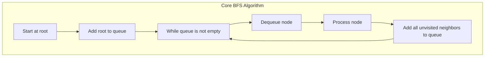

# 🎓 Conclusion and Further Resources

> [!NOTE]
> Congratulations on completing this comprehensive guide to Binary Tree Breadth-First Search (BFS)! Let's summarize what we've learned and explore resources for further study.

## What We've Learned 📚

Throughout this series of lessons, we've covered:

1. **The Fundamentals of BFS**: Understanding what BFS is and how it differs from other traversal algorithms like DFS.

2. **Key Data Structures**: Learning how queues are essential for implementing BFS and ensuring level-order traversal.

3. **Iterative Implementation**: Mastering the standard iterative approach to BFS using a queue.

4. **Recursive Implementation**: Exploring an alternative recursive approach to BFS.

5. **Applications and Variations**: Discovering real-world applications and common variations of the BFS algorithm.

6. **Interview Questions**: Tackling common interview problems that utilize BFS and learning strategies to solve them effectively.

## BFS in a Nutshell 🌰



## Key Takeaways 💡

Here are the most important concepts to remember about BFS:

- **Level-Order Traversal**: BFS processes nodes level by level, from top to bottom and left to right.

- **Queue-Based Implementation**: A queue is the perfect data structure for BFS because it ensures First-In-First-Out (FIFO) processing.

- **Time and Space Complexity**: BFS has O(n) time complexity and O(n) space complexity in the worst case.

- **Shortest Path Property**: In unweighted graphs, BFS finds the shortest path between nodes.

- **Versatility**: BFS can be adapted to solve a wide range of problems, from tree traversal to graph search to puzzle solving.

## Common Pitfalls to Avoid ⚠️

As you continue to work with BFS, be mindful of these common pitfalls:

1. **Forgetting to Check for Null Nodes**: Always validate that a node exists before accessing its properties.

2. **Not Handling Cycles in Graphs**: Use a visited set to prevent infinite loops when applying BFS to graphs.

3. **Using the Wrong Data Structure**: Using a stack instead of a queue would result in depth-first search, not breadth-first search.

4. **Memory Management**: For very large trees or graphs, be aware of the memory usage of your queue.

5. **Missing Level Information**: When level-specific operations are needed, make sure to track the level size properly.

## BFS vs. DFS: When to Use Each 🤔

| Aspect | BFS | DFS |
|--------|-----|-----|
| **Data Structure** | Queue | Stack/Recursion |
| **Traversal Pattern** | Level by level | Branch by branch |
| **Memory Usage** | Higher (width of tree/graph) | Lower (height of tree/graph) |
| **Finds Shortest Path** | Yes (in unweighted graphs) | No |
| **Good For** | Shortest path, level-order operations | Exploring all paths, deep structures |
| **Implementation** | Usually iterative | Can be recursive or iterative |

## Comprehensive Self-Assessment Quiz 📝

Test your understanding of BFS with this quiz:

<details>
<summary>1. What data structure is essential for implementing an iterative BFS?</summary>

**Answer**: Queue (FIFO - First In, First Out)

The queue ensures that nodes are processed in the order they are discovered, which is essential for the level-by-level traversal pattern of BFS.
</details>

<details>
<summary>2. What is the time complexity of BFS on a binary tree with n nodes?</summary>

**Answer**: O(n)

Each node is visited exactly once, resulting in O(n) time complexity.
</details>

<details>
<summary>3. What is the space complexity of BFS in the worst case?</summary>

**Answer**: O(n)

In the worst case (for a complete binary tree), the queue might contain up to n/2 nodes at its maximum size (the largest level in a binary tree can have up to n/2 nodes).
</details>

<details>
<summary>4. Which of these problems is best suited for BFS?</summary>

**Answer**: Finding the shortest path in an unweighted graph

BFS guarantees finding the shortest path in unweighted graphs because it explores nodes level by level, reaching nodes at shortest distance first.
</details>

<details>
<summary>5. How do you modify a standard BFS to return nodes grouped by level?</summary>

**Answer**: Track the level size and process that many nodes in each iteration:

```javascript
while (queue.length) {
  const levelSize = queue.length;
  const currentLevel = [];
  
  for (let i = 0; i < levelSize; i++) {
    const node = queue.shift();
    currentLevel.push(node.val);
    
    if (node.left) queue.push(node.left);
    if (node.right) queue.push(node.right);
  }
  
  result.push(currentLevel);
}
```
</details>

<details>
<summary>6. What is the key difference between BFS for trees and BFS for graphs?</summary>

**Answer**: For graphs, we need to track visited nodes to avoid cycles.

In trees, we don't need to worry about cycles. In graphs, we must keep track of visited nodes to prevent revisiting and getting caught in infinite loops.
</details>

<details>
<summary>7. How can you find the minimum depth of a binary tree using BFS?</summary>

**Answer**: Return the depth of the first leaf node encountered during BFS:

```javascript
function minDepth(root) {
  if (!root) return 0;
  
  const queue = [{ node: root, depth: 1 }];
  
  while (queue.length) {
    const { node, depth } = queue.shift();
    
    if (!node.left && !node.right) {
      return depth; // Found a leaf node
    }
    
    if (node.left) queue.push({ node: node.left, depth: depth + 1 });
    if (node.right) queue.push({ node: node.right, depth: depth + 1 });
  }
  
  return 0;
}
```
</details>

<details>
<summary>8. What's a case where recursive BFS might be preferable to iterative BFS?</summary>

**Answer**: When the level-by-level operation is complex and naturally fits a recursive model.

For example, when each level's processing depends on the results of previous levels, or when the level grouping is inherent to the problem.
</details>

## Interactive Learning Projects 🛠️

Apply your BFS knowledge with these hands-on projects:

### 1. Maze Solver

**Project Description**: Build a program that finds the shortest path through a maze using BFS.

**Features to Implement**:
- Parse maze input from a text file or user input
- Implement BFS to find the shortest path from start to finish
- Visualize the maze and the solution path
- Add obstacles and multiple possible paths

**Starting Point**:
```javascript
function solveMaze(maze, start, end) {
  // Your BFS implementation here
}

const maze = [
  ['S', '.', '#', '#', '.'],
  ['.', '.', '.', '#', '.'],
  ['#', '#', '.', '.', '.'],
  ['.', '#', '#', '#', '.'],
  ['.', '.', '.', 'E', '#']
];
```

### 2. Social Network Visualizer

**Project Description**: Create a simple application that visualizes social network connections using BFS.

**Features to Implement**:
- Build a graph representation of a social network
- Implement BFS to find friends within N degrees of separation
- Identify friend recommendations (friends of friends who aren't already friends)
- Visualize the network with different colors for different degrees of connection

### 3. Web Crawler

**Project Description**: Implement a basic web crawler that uses BFS to discover and index web pages.

**Features to Implement**:
- Start with a seed URL and find all linked pages
- Use BFS to explore pages level by level
- Extract and index content from pages
- Implement depth limits and domain restrictions

## Further Resources 📖

To deepen your understanding of BFS and related algorithms, here are some excellent resources:

### Books 📚

- **"Introduction to Algorithms"** by Cormen, Leiserson, Rivest, and Stein (Chapter 22: Elementary Graph Algorithms)
- **"Algorithms"** by Robert Sedgewick and Kevin Wayne (Chapter 4: Graphs)
- **"Grokking Algorithms"** by Aditya Bhargava (Chapter 6: Breadth-first search)
- **"Cracking the Coding Interview"** by Gayle Laakmann McDowell (Chapter 4: Trees and Graphs)
- **"The Algorithm Design Manual"** by Steven S. Skiena

### Online Courses 🎓

- [Coursera: Algorithms Specialization](https://www.coursera.org/specializations/algorithms) - Stanford University
- [edX: Algorithm Design and Analysis](https://www.edx.org/course/algorithm-design-and-analysis) - PennX
- [Udemy: JavaScript Algorithms and Data Structures Masterclass](https://www.udemy.com/course/js-algorithms-and-data-structures-masterclass/) - Colt Steele
- [Coursera: Graph Search, Shortest Paths, and Data Structures](https://www.coursera.org/learn/algorithms-graphs-data-structures) - Stanford University
- [MIT OpenCourseWare: Introduction to Algorithms](https://ocw.mit.edu/courses/electrical-engineering-and-computer-science/6-006-introduction-to-algorithms-fall-2011/)

### Interactive Visualizations 🖥️

- [Visualgo: BFS Visualization](https://visualgo.net/en/dfsbfs) - Interactive visualization tool
- [University of San Francisco: BFS Interactive Tool](https://www.cs.usfca.edu/~galles/visualization/BFS.html) - Step-by-step animation
- [Algorithm Visualizer: BFS](https://algorithm-visualizer.org/) - Customize and visualize BFS
- [PathFinding.js](https://qiao.github.io/PathFinding.js/visual/) - Interactive pathfinding visualization
- [D3 Graph Theory](https://d3gt.com/unit.html?bfs) - Interactive BFS visualization with D3.js

### Practice Problems 🏋️‍♂️

- [LeetCode: BFS Problems](https://leetcode.com/tag/breadth-first-search/) - Collection of BFS-related problems
- [HackerRank: Graph Theory](https://www.hackerrank.com/domains/algorithms?filters%5Bsubdomains%5D%5B%5D=graph-theory) - Graph theory problems
- [CodeSignal: Graph Algorithms](https://app.codesignal.com/arcade) - Interactive coding challenges
- [Codeforces: BFS/DFS Problems](https://codeforces.com/problemset?tags=dfs+and+similar) - Competitive programming problems
- [AtCoder: Graph Problems](https://atcoder.jp/contests/dp) - Japanese competitive programming site

### Video Tutorials 🎥

- [Tushar Roy - Breadth First Search Algorithm](https://www.youtube.com/watch?v=0u78hx-66Xk) - Clear explanation with examples
- [MIT OpenCourseWare - Breadth-First Search](https://www.youtube.com/watch?v=s-CYnVz-uh4) - Academic lecture on BFS
- [HackerRank - BFS Shortest Reach](https://www.youtube.com/watch?v=0XgVhsMOcQM) - Problem-solving approach
- [FreeCodeCamp - Graph Algorithms](https://www.youtube.com/watch?v=09_LlHjoEiY) - Comprehensive coverage of graph algorithms
- [mycodeschool - Graph Theory](https://www.youtube.com/watch?v=gXgEDyodOJU) - Fundamentals of graph traversals

## Next Steps in Your Learning Journey 🚀

Now that you've mastered BFS, here are some related topics to explore next:

1. **Depth-First Search (DFS)**: Learn the complementary traversal algorithm to BFS.

2. **Dijkstra's Algorithm**: Extend your knowledge to weighted graphs and finding the shortest path.

3. **A* Search Algorithm**: Combine BFS with heuristics for more efficient pathfinding.

4. **Graph Theory**: Deepen your understanding of graphs and their applications.

5. **Dynamic Programming**: Learn how to solve complex problems by breaking them down into simpler subproblems.

6. **Topological Sort**: Explore this algorithm for ordering directed acyclic graphs.

7. **Minimum Spanning Trees**: Learn about Prim's and Kruskal's algorithms.

8. **Network Flow Algorithms**: Study maximum flow problems and the Ford-Fulkerson algorithm.

## Career Applications of BFS 💼

BFS skills are valuable in many career contexts:

- **Software Development**: Implementing navigation systems, recommendation engines, and search features
- **Data Science**: Network analysis, clustering, and relationship mapping
- **Game Development**: Pathfinding, AI movement, and level generation
- **Web Development**: Site crawling, SEO optimization, and social features
- **Artificial Intelligence**: State space exploration, puzzle solving, and decision trees

## Final Thoughts 💭

BFS is a fundamental algorithm that serves as a building block for many more complex algorithms and applications. By mastering BFS, you've added a powerful tool to your problem-solving toolkit.

Remember that the best way to solidify your understanding is through practice. Try implementing BFS in different contexts, solve related problems, and explore variations of the algorithm.

> [!TIP]
> The journey of learning algorithms is ongoing. Keep challenging yourself with new problems and continuously refine your understanding!

<details>
<summary>🧠 Challenge Yourself</summary>

Here's a final challenge to test your understanding:

Implement a function that determines if a binary tree is a complete binary tree using BFS. A complete binary tree is a binary tree in which every level, except possibly the last, is completely filled, and all nodes are as far left as possible.

```javascript
function isCompleteTree(root) {
  if (!root) return true;
  
  const queue = [root];
  let seenNull = false;
  
  while (queue.length) {
    const node = queue.shift();
    
    if (!node) {
      seenNull = true;
    } else {
      // If we've already seen a null node and we encounter a non-null node,
      // the tree is not complete
      if (seenNull) return false;
      
      queue.push(node.left);
      queue.push(node.right);
    }
  }
  
  return true;
}
```

This function uses BFS to traverse the tree level by level. If we encounter a null node before a non-null node at the same level, the tree is not complete.
</details>

Congratulations again on completing this comprehensive guide to Binary Tree BFS! 🎉 