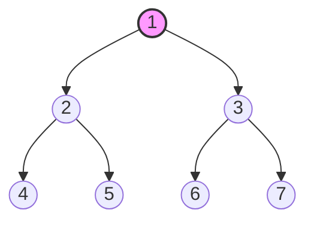
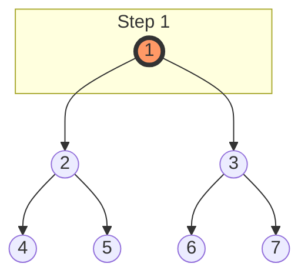
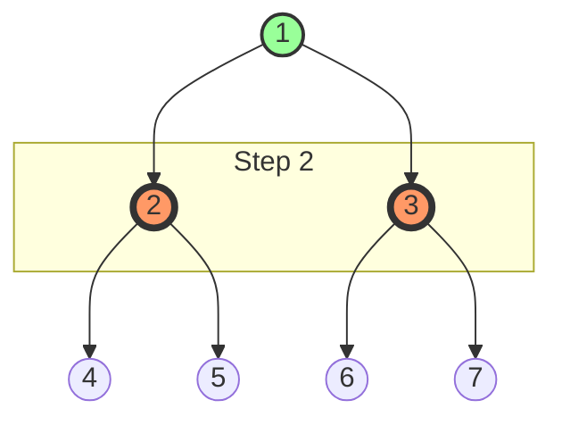
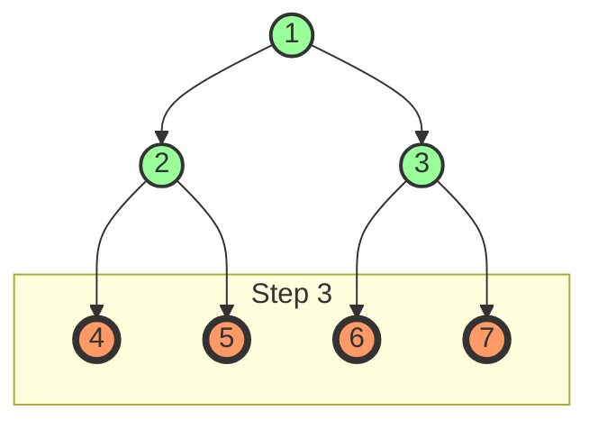
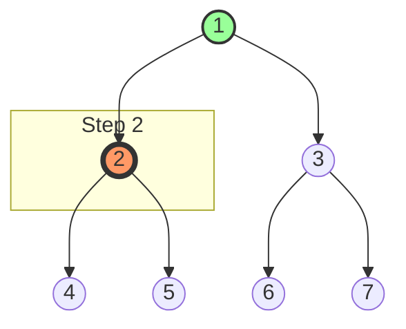
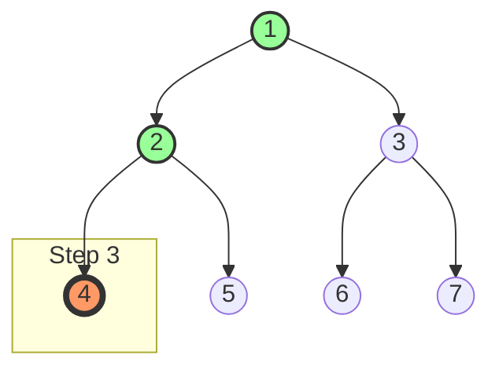

# 🔄 BFS vs DFS: A Comprehensive Comparison

> [!NOTE]
> This guide provides a detailed comparison between Breadth-First Search (BFS) and Depth-First Search (DFS), helping you understand when to use each approach.

## Introduction 📋

Both BFS and DFS are fundamental graph traversal algorithms, but they follow significantly different strategies. Understanding the strengths and weaknesses of each approach is crucial for selecting the right algorithm for your specific problem.

## Core Differences Visualized 🖼️

Let's visualize how BFS and DFS traverse the same binary tree:



### BFS Traversal Order:
1 → 2 → 3 → 4 → 5 → 6 → 7 (Level by level, left to right)







### DFS Traversal Order (Pre-order):
1 → 2 → 4 → 5 → 3 → 6 → 7 (Follow left branches to the bottom, then backtrack)






## Key Characteristics Compared ⚖️

| Characteristic | BFS | DFS |
|----------------|-----|-----|
| **Traversal Order** | Level by level | Branch by branch |
| **Data Structure** | Queue (FIFO) | Stack/Recursion (LIFO) |
| **Space Complexity** | O(w) where w is the maximum width | O(h) where h is the maximum height |
| **Implementation** | Usually iterative | Can be recursive or iterative |
| **Complete** | Yes (finds all nodes) | Yes (finds all nodes) |
| **Optimal for Shortest Path** | Yes (in unweighted graphs) | No |
| **Memory Usage** | Higher for wide trees/graphs | Lower for deep trees/graphs |
| **Finding All Solutions** | Less efficient | More efficient |

## Implementation Comparison 💻

### BFS Implementation

```javascript
function bfs(root) {
  if (!root) return [];
  
  const queue = [root];
  const result = [];
  
  while (queue.length) {
    const node = queue.shift();
    result.push(node.val);
    
    if (node.left) queue.push(node.left);
    if (node.right) queue.push(node.right);
  }
  
  return result;
}
```

### DFS Implementation (Recursive)

```javascript
function dfs(root) {
  if (!root) return [];
  
  const result = [];
  
  function preorder(node) {
    if (!node) return;
    
    result.push(node.val);
    preorder(node.left);
    preorder(node.right);
  }
  
  preorder(root);
  return result;
}
```

### DFS Implementation (Iterative)

```javascript
function dfs(root) {
  if (!root) return [];
  
  const stack = [root];
  const result = [];
  
  while (stack.length) {
    const node = stack.pop();
    result.push(node.val);
    
    // Push right child first so left is processed first (stack is LIFO)
    if (node.right) stack.push(node.right);
    if (node.left) stack.push(node.left);
  }
  
  return result;
}
```

## When to Use BFS 🌟

BFS is typically the better choice when:

1. **Finding the shortest path** in unweighted graphs
   - Example: Finding the shortest route between two locations in a map where all roads take the same time to travel
   
2. **Level-order operations** are required
   - Example: Printing a tree level by level, finding the minimum depth of a tree
   
3. **The solution is likely to be closer to the root**
   - Example: Finding a person in your social network within 2 degrees of connection
   
4. **Working with a wide but shallow structure**
   - Example: Navigating a menu system with many options at each level
   
5. **Complete exploration of all possible states is needed**
   - Example: Finding all possible ways to solve a puzzle within a certain number of moves

## When to Use DFS 🌟

DFS is typically the better choice when:

1. **Exploring all possible paths** to a goal
   - Example: Finding all possible solutions to a maze
   
2. **The solution is likely to be deep in the tree/graph**
   - Example: Searching for a specific file deep in a directory structure
   
3. **Memory is a constraint**
   - Example: Working with very deep trees where BFS would require too much memory
   
4. **Topological sorting** is needed
   - Example: Determining the order of course prerequisites
   
5. **Detecting cycles** in a graph
   - Example: Checking if a graph contains cycles for deadlock detection

## Real-World Examples 🌍

### BFS Example: Web Crawling

When crawling a website, BFS ensures that pages closest to the homepage are explored first:

```javascript
function webCrawl(startUrl, maxDepth = 3) {
  const queue = [{ url: startUrl, depth: 0 }];
  const visited = new Set([startUrl]);
  const result = [];
  
  while (queue.length) {
    const { url, depth } = queue.shift();
    result.push(url);
    
    if (depth < maxDepth) {
      const links = getLinksFromPage(url);
      for (const link of links) {
        if (!visited.has(link)) {
          visited.add(link);
          queue.push({ url: link, depth: depth + 1 });
        }
      }
    }
  }
  
  return result;
}
```

### DFS Example: File System Traversal

When searching for a specific file in a directory structure, DFS can be more efficient:

```javascript
function findFile(directory, fileName) {
  const stack = [directory];
  
  while (stack.length) {
    const currentDir = stack.pop();
    
    const files = getFilesInDirectory(currentDir);
    for (const file of files) {
      if (file === fileName) {
        return `${currentDir}/${file}`;
      }
    }
    
    const subdirectories = getSubdirectories(currentDir);
    for (const subdir of subdirectories) {
      stack.push(subdir);
    }
  }
  
  return null; // File not found
}
```

## Performance Comparison 📊

Consider this binary tree:

```
        1
       / \
      2   3
     / \ / \
    4  5 6  7
   / \
  8   9
```

### Memory Usage Comparison

**BFS**:
- Maximum queue size: 4 (when the queue contains nodes 4, 5, 6, 7)
- Space complexity: O(4) = O(n/2) which is O(n)

**DFS**:
- Maximum stack/recursion depth: 4 (path 1→2→4→8)
- Space complexity: O(4) = O(log n) for balanced trees, O(n) for skewed trees

### Path Finding Comparison

Finding path from 1 to 9:

**BFS**:
- Explores all nodes at each level: 1, 2, 3, 4, 5, 6, 7, 8, 9
- 9 nodes explored

**DFS**:
- Explores one branch deeply first: 1, 2, 4, 8, 9
- 5 nodes explored

But finding path from 1 to 3:

**BFS**:
- Explores: 1, 2, 3
- 3 nodes explored (optimal)

**DFS**:
- Explores: 1, 2, 4, 8, 9, 5, 3
- 7 nodes explored (suboptimal)

## Common Mistakes to Avoid ⚠️

1. **Using BFS for deep structures with limited memory**
   - Problem: Queue size can become very large
   - Solution: Use DFS or limit BFS depth
   
2. **Using DFS when shortest path is required**
   - Problem: DFS doesn't guarantee shortest path
   - Solution: Use BFS for unweighted shortest path problems
   
3. **Forgetting to mark nodes as visited in graph traversals**
   - Problem: Infinite loops in cyclic graphs
   - Solution: Always use a visited set for graphs
   
4. **Using the wrong data structure**
   - Problem: Using stack for BFS or queue for DFS
   - Solution: Queue (FIFO) for BFS, Stack (LIFO) for DFS

## Hybrid Approaches 🔄

Sometimes, combining BFS and DFS can yield optimal results:

### Iterative Deepening Depth-First Search (IDDFS)

Combines the memory efficiency of DFS with the completeness of BFS:

```javascript
function iddfs(root, target) {
  let maxDepth = 0;
  
  while (true) {
    const result = depthLimitedSearch(root, target, maxDepth);
    if (result !== null) return result;
    maxDepth++;
  }
}

function depthLimitedSearch(node, target, limit, depth = 0) {
  if (!node) return null;
  if (node.val === target) return depth;
  if (depth === limit) return null;
  
  const leftResult = depthLimitedSearch(node.left, target, limit, depth + 1);
  if (leftResult !== null) return leftResult;
  
  return depthLimitedSearch(node.right, target, limit, depth + 1);
}
```

### Bidirectional Search

Runs BFS from both start and goal nodes, meeting in the middle:

```javascript
function bidirectionalSearch(graph, start, end) {
  const forwardQueue = [start];
  const backwardQueue = [end];
  
  const forwardVisited = { [start]: null };
  const backwardVisited = { [end]: null };
  
  while (forwardQueue.length && backwardQueue.length) {
    // Forward BFS step
    const intersection = bfsStep(graph, forwardQueue, forwardVisited, backwardVisited);
    if (intersection) {
      return reconstructPath(intersection, forwardVisited, backwardVisited);
    }
    
    // Backward BFS step
    const intersection2 = bfsStep(graph, backwardQueue, backwardVisited, forwardVisited);
    if (intersection2) {
      return reconstructPath(intersection2, forwardVisited, backwardVisited);
    }
  }
  
  return null; // No path found
}
```

## Knowledge Check ✅

<details>
<summary>1. In what scenario would BFS be more memory-efficient than DFS?</summary>

**Answer**: BFS would be more memory-efficient than DFS when dealing with deep, narrow trees or graphs.

While BFS generally uses more memory for wide trees/graphs (storing all nodes at a level), DFS can use excessive memory for very deep structures due to the recursion stack or explicit stack. For example, in a tree that is thousands of levels deep but only has one or two children per node, DFS might cause a stack overflow while BFS would handle it efficiently.
</details>

<details>
<summary>2. Why doesn't DFS guarantee finding the shortest path?</summary>

**Answer**: DFS doesn't guarantee finding the shortest path because it explores as far as possible along each branch before backtracking.

Since DFS goes deep into one branch first, it might find a longer path to the destination before finding a shorter one through a different branch. BFS, on the other hand, explores all nodes at the current distance before moving to nodes that are farther away, ensuring the shortest path is found first.
</details>

<details>
<summary>3. Which traversal would be better for topological sorting and why?</summary>

**Answer**: DFS is better for topological sorting.

Topological sorting requires identifying dependencies between nodes, which aligns perfectly with DFS's depth-first approach. By exploring an entire path before backtracking, DFS can naturally identify dependencies. The typical implementation uses DFS with a stack to push nodes when their exploration is complete, naturally yielding the topological order.
</details>

## Conclusion 📝

Both BFS and DFS are powerful algorithms with unique strengths and weaknesses. The choice between them depends on your specific problem:

- **Use BFS** when finding the shortest path, exploring level by level, or when the solution is likely closer to the start.
- **Use DFS** when exploring all possibilities, when memory is a concern, or when the solution is likely deeper in the structure.

Understanding both algorithms thoroughly will enable you to select the right approach for any tree or graph traversal problem you encounter.

Happy traversing! 🚀 