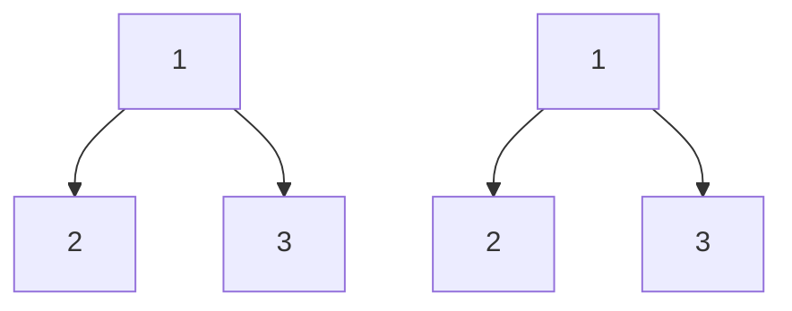
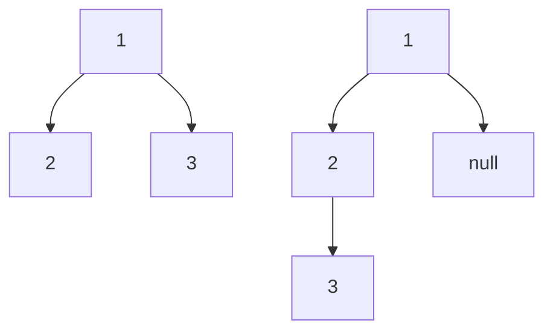

# 🌳 Binary Tree Comparison: Are These Trees Twins? 🌳

> [!NOTE]
> In this lesson, we'll explore the fascinating problem of determining whether two binary trees are identical.

## 🔍 The Problem

Imagine you have two binary trees, and you need to determine if they are exactly the same. But what does "the same" mean for trees?

Two binary trees are considered **identical** if:
1. They have the same **structure** (the same arrangement of nodes)
2. They have the same **values** at corresponding positions

In other words, if you were to draw both trees on paper, they would look exactly the same, with the same numbers in the same places.

## 🎯 Our Goal

We need to write a function that takes the roots of two binary trees as input and returns:
- `true` if the trees are identical
- `false` if they are different in any way

## 📊 Examples

Let's visualize some examples to better understand the problem:

### Example 1: Identical Trees ✅

**Tree 1**: `[1,2,3]`  
**Tree 2**: `[1,2,3]`  
**Result**: `true` (Both trees have the same structure and values)

### Example 2: Different Trees ❌

**Tree 1**: `[1,2,3]`  
**Tree 2**: `[1,2,null,3]`  
**Result**: `false` (Different structure: in Tree 2, node 3 is a child of node 2)

### Example 3: Different Values ❌

**Tree 1**: `[1,2,3]`  
**Tree 2**: `[1,2,4]`  
**Result**: `false` (Different value at the right child of the root)

## 🤔 Think About It

Before we dive into the solution, take a moment to consider:

1. How would you approach comparing two trees?
2. What are the base cases to consider?
3. Could you solve this iteratively? Recursively? Which might be more intuitive?

> [!TIP]
> When working with tree problems, drawing them out can help visualize the solution!

In the next lesson, we'll start building our understanding of how to approach this problem systematically. 