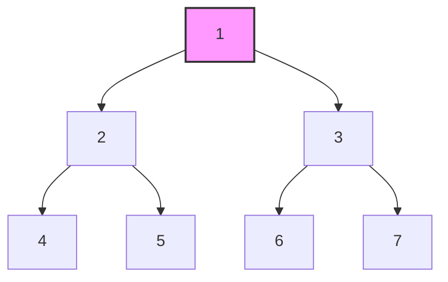
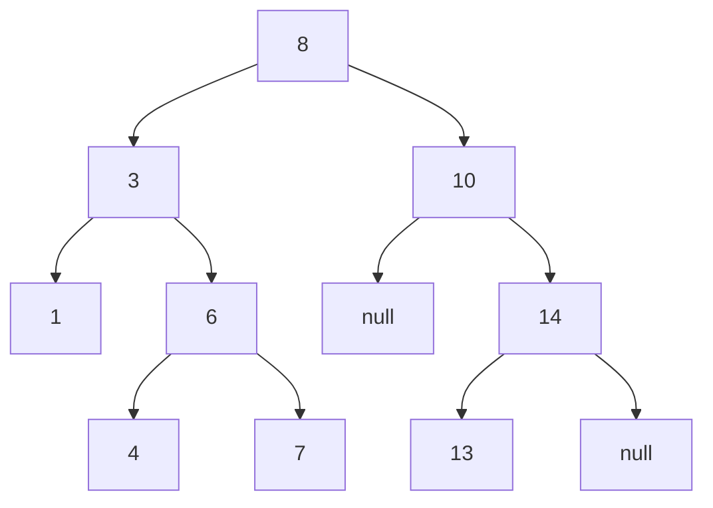

# 👁️ Visualizing Tree Traversal: Seeing the Path 👁️

Before we dive into comparing trees, let's understand how we can systematically visit every node in a tree. This process, called **traversal**, is fundamental to tree algorithms.

## 🔄 Common Traversal Methods

Let's visualize different ways to traverse this tree:



### 1️⃣ Pre-order Traversal (Root → Left → Right)

```mermaid
graph TD;
    A[1] --> B[2]
    A --> C[3]
    B --> D[4]
    B --> E[5]
    C --> F[6]
    C --> G[7]
    
    style A fill:#f9f,stroke:#333,stroke-width:2px,label:"1 (Visit First)"
    style B fill:#bbf,stroke:#333,stroke-width:1px,label:"2 (Visit Second)"
    style D fill:#bfb,stroke:#333,stroke-width:1px,label:"4 (Visit Third)"
    style E fill:#bfb,stroke:#333,stroke-width:1px,label:"5 (Visit Fourth)"
    style C fill:#bbf,stroke:#333,stroke-width:1px,label:"3 (Visit Fifth)"
    style F fill:#bfb,stroke:#333,stroke-width:1px,label:"6 (Visit Sixth)"
    style G fill:#bfb,stroke:#333,stroke-width:1px,label:"7 (Visit Seventh)"
```

**Sequence**: 1, 2, 4, 5, 3, 6, 7

### 2️⃣ In-order Traversal (Left → Root → Right)

```mermaid
graph TD;
    A[1] --> B[2]
    A --> C[3]
    B --> D[4]
    B --> E[5]
    C --> F[6]
    C --> G[7]
    
    style D fill:#bfb,stroke:#333,stroke-width:1px,label:"4 (Visit First)"
    style B fill:#bbf,stroke:#333,stroke-width:1px,label:"2 (Visit Second)"
    style E fill:#bfb,stroke:#333,stroke-width:1px,label:"5 (Visit Third)"
    style A fill:#f9f,stroke:#333,stroke-width:2px,label:"1 (Visit Fourth)"
    style F fill:#bfb,stroke:#333,stroke-width:1px,label:"6 (Visit Fifth)"
    style C fill:#bbf,stroke:#333,stroke-width:1px,label:"3 (Visit Sixth)"
    style G fill:#bfb,stroke:#333,stroke-width:1px,label:"7 (Visit Seventh)"
```

**Sequence**: 4, 2, 5, 1, 6, 3, 7

### 3️⃣ Post-order Traversal (Left → Right → Root)

```mermaid
graph TD;
    A[1] --> B[2]
    A --> C[3]
    B --> D[4]
    B --> E[5]
    C --> F[6]
    C --> G[7]
    
    style D fill:#bfb,stroke:#333,stroke-width:1px,label:"4 (Visit First)"
    style E fill:#bfb,stroke:#333,stroke-width:1px,label:"5 (Visit Second)"
    style B fill:#bbf,stroke:#333,stroke-width:1px,label:"2 (Visit Third)"
    style F fill:#bfb,stroke:#333,stroke-width:1px,label:"6 (Visit Fourth)"
    style G fill:#bfb,stroke:#333,stroke-width:1px,label:"7 (Visit Fifth)"
    style C fill:#bbf,stroke:#333,stroke-width:1px,label:"3 (Visit Sixth)"
    style A fill:#f9f,stroke:#333,stroke-width:2px,label:"1 (Visit Seventh)"
```

**Sequence**: 4, 5, 2, 6, 7, 3, 1

### 4️⃣ Level-order Traversal (Breadth-First)

```mermaid
graph TD;
    A[1] --> B[2]
    A --> C[3]
    B --> D[4]
    B --> E[5]
    C --> F[6]
    C --> G[7]
    
    style A fill:#f9f,stroke:#333,stroke-width:2px,label:"1 (Level 1)"
    style B fill:#bbf,stroke:#333,stroke-width:1px,label:"2 (Level 2)"
    style C fill:#bbf,stroke:#333,stroke-width:1px,label:"3 (Level 2)"
    style D fill:#bfb,stroke:#333,stroke-width:1px,label:"4 (Level 3)"
    style E fill:#bfb,stroke:#333,stroke-width:1px,label:"5 (Level 3)"
    style F fill:#bfb,stroke:#333,stroke-width:1px,label:"6 (Level 3)"
    style G fill:#bfb,stroke:#333,stroke-width:1px,label:"7 (Level 3)"
```

**Sequence**: 1, 2, 3, 4, 5, 6, 7

## 🧩 Implementing Traversals

Let's see how to implement these traversals in code:

### Pre-order Traversal (Recursive)

```javascript
function preorderTraversal(root) {
  const result = [];
  
  function traverse(node) {
    if (node === null) return;
    
    // Visit the node
    result.push(node.val);
    
    // Traverse left subtree
    traverse(node.left);
    
    // Traverse right subtree
    traverse(node.right);
  }
  
  traverse(root);
  return result;
}
```

### In-order Traversal (Recursive)

```javascript
function inorderTraversal(root) {
  const result = [];
  
  function traverse(node) {
    if (node === null) return;
    
    // Traverse left subtree
    traverse(node.left);
    
    // Visit the node
    result.push(node.val);
    
    // Traverse right subtree
    traverse(node.right);
  }
  
  traverse(root);
  return result;
}
```

### Post-order Traversal (Recursive)

```javascript
function postorderTraversal(root) {
  const result = [];
  
  function traverse(node) {
    if (node === null) return;
    
    // Traverse left subtree
    traverse(node.left);
    
    // Traverse right subtree
    traverse(node.right);
    
    // Visit the node
    result.push(node.val);
  }
  
  traverse(root);
  return result;
}
```

### Level-order Traversal (Iterative with Queue)

```javascript
function levelOrderTraversal(root) {
  if (root === null) return [];
  
  const result = [];
  const queue = [root];
  
  while (queue.length > 0) {
    const node = queue.shift();
    
    // Visit the node
    result.push(node.val);
    
    // Add children to the queue
    if (node.left !== null) queue.push(node.left);
    if (node.right !== null) queue.push(node.right);
  }
  
  return result;
}
```

## 🔍 Traversal for Tree Comparison

For comparing trees, we need to traverse both trees simultaneously and compare corresponding nodes. We can use any traversal method, as long as we apply it consistently to both trees.

### Simultaneous Pre-order Traversal (Recursive)

```javascript
function compareTrees(p, q) {
  // Base cases
  if (p === null && q === null) return true;
  if (p === null || q === null) return false;
  
  // Compare current nodes
  if (p.val !== q.val) return false;
  
  // Compare left subtrees
  const leftSame = compareTrees(p.left, q.left);
  if (!leftSame) return false;
  
  // Compare right subtrees
  return compareTrees(p.right, q.right);
}
```

### Simultaneous Level-order Traversal (Iterative)

```javascript
function compareTrees(p, q) {
  const queue = [[p, q]];
  
  while (queue.length > 0) {
    const [node1, node2] = queue.shift();
    
    // Check if both are null
    if (node1 === null && node2 === null) continue;
    
    // Check if one is null but not the other
    if (node1 === null || node2 === null) return false;
    
    // Compare values
    if (node1.val !== node2.val) return false;
    
    // Add children to queue
    queue.push([node1.left, node2.left]);
    queue.push([node1.right, node2.right]);
  }
  
  return true;
}
```

## 🧪 Interactive Traversal Exercise

Try to determine the traversal order for this tree using different methods:



<details>
<summary>Pre-order traversal</summary>
8, 3, 1, 6, 4, 7, 10, null, 14, 13, null
</details>

<details>
<summary>In-order traversal</summary>
1, 3, 4, 6, 7, 8, 10, null, 13, 14, null
</details>

<details>
<summary>Post-order traversal</summary>
1, 4, 7, 6, 3, null, 13, null, 14, 10, 8
</details>

<details>
<summary>Level-order traversal</summary>
8, 3, 10, 1, 6, null, 14, 4, 7, 13, null
</details>

## 🤔 Think About It

1. Which traversal method would be most efficient for comparing trees?
2. How would the traversal order affect the early termination of the comparison algorithm?
3. Could we optimize the traversal for specific types of trees?
4. How would you modify the traversal to handle trees with different structures?

> [!TIP]
> Understanding traversal patterns is key to solving almost any tree problem!

In the next lesson, we'll explore the recursive approach to comparing binary trees, which leverages these traversal concepts. 