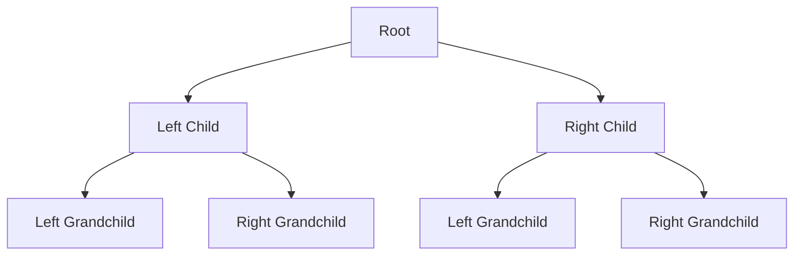
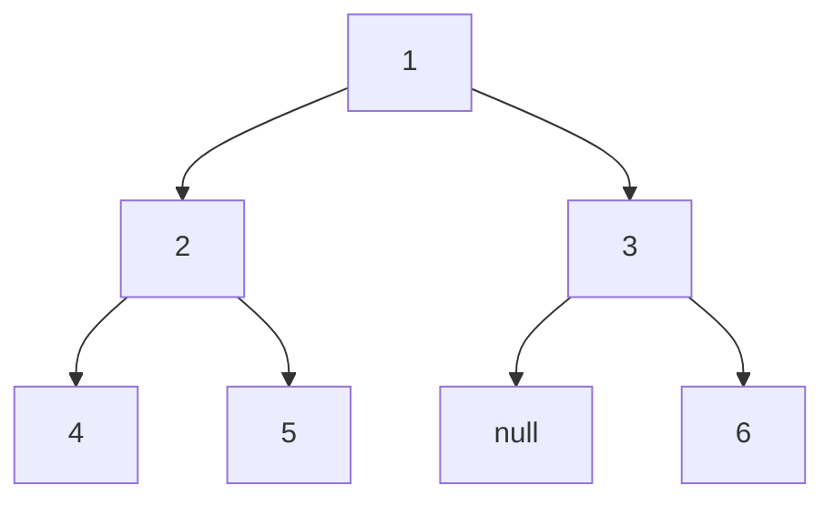

# 🌲 Understanding Binary Trees: The Building Blocks 🌲

Before we dive into comparing binary trees, let's make sure we understand what binary trees are and how they're represented in code.

## 📚 What is a Binary Tree?

A binary tree is a hierarchical data structure where each node has at most two children, referred to as the **left child** and the **right child**.



## 🧩 Binary Tree Node Structure

In most programming languages, a binary tree node is represented as an object or struct with three key components:

```javascript
function TreeNode(val, left, right) {
  this.val = val;           // The value stored in the node
  this.left = left || null; // Reference to the left child
  this.right = right || null; // Reference to the right child
}
```

## 🏗️ Types of Binary Trees

There are several types of binary trees, each with specific properties:

1. **Full Binary Tree**: Every node has either 0 or 2 children
2. **Complete Binary Tree**: All levels are filled except possibly the last, which is filled from left to right
3. **Perfect Binary Tree**: All internal nodes have exactly two children and all leaf nodes are at the same level
4. **Balanced Binary Tree**: The height of the left and right subtrees of any node differ by at most one

> [!NOTE]
> For our comparison algorithm, the type of binary tree doesn't matter. We're simply checking if two trees match exactly in structure and values.

## 🔄 Tree Traversal Methods

There are several ways to traverse (visit all nodes of) a binary tree:

1. **In-order**: Left subtree → Root → Right subtree
2. **Pre-order**: Root → Left subtree → Right subtree
3. **Post-order**: Left subtree → Right subtree → Root
4. **Level-order**: Visit nodes level by level, from left to right

For comparing trees, we'll need to visit corresponding nodes in both trees simultaneously.

## 💡 Visualizing Tree Representation

Let's see how a binary tree is represented in an array format and as a tree structure:

**Array Representation**: `[1, 2, 3, 4, 5, null, 6]`

**Tree Structure**:


<details>
<summary>How array representation works</summary>

In the array representation:
- The root is at index 0
- For any node at index i:
  - Its left child is at index 2i + 1
  - Its right child is at index 2i + 2
- `null` indicates the absence of a node

This is commonly used in heap data structures and for serializing trees.
</details>

## 🤔 Think About It

Consider these questions as we prepare to compare binary trees:

1. How would you check if two nodes are the same?
2. What happens if one tree has a node where the other doesn't?
3. If two nodes match, what should we check next?

> [!TIP]
> When comparing trees, we need to check both structure (the arrangement of nodes) and values (the data in each node).

In the next lesson, we'll explore the recursive approach to comparing binary trees, which leverages the natural recursive structure of trees themselves. 