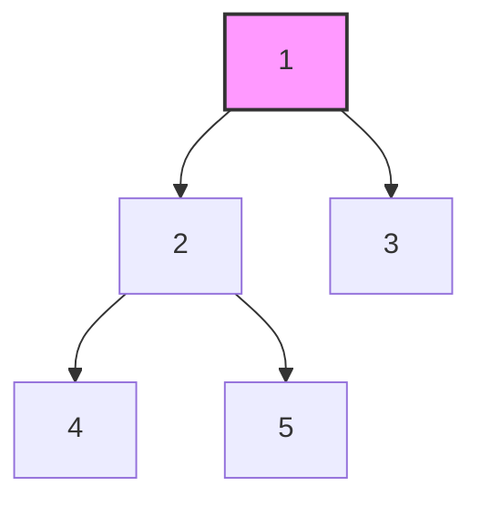

# 🐛 Debugging Tree Algorithms: Finding and Fixing Issues 🐛

Tree algorithms can be tricky to debug due to their recursive nature and complex structure. Let's explore some effective debugging techniques specifically for tree problems.

## 🔍 Common Issues in Tree Algorithms

### 1. Null Pointer Exceptions

The most common error in tree algorithms is failing to check for null nodes:

```javascript
// Buggy code
function countNodes(root) {
  return 1 + countNodes(root.left) + countNodes(root.right); // Will fail on null nodes!
}

// Fixed code
function countNodes(root) {
  if (root === null) return 0;
  return 1 + countNodes(root.left) + countNodes(root.right);
}
```

### 2. Incorrect Base Cases

Another common issue is having incorrect or missing base cases:

```javascript
// Buggy code for tree height
function height(root) {
  if (root === null) return 0;
  return 1 + Math.max(height(root.left), height(root.right));
}

// This is actually correct for height, but would be wrong if we wanted to count edges instead of nodes
// For edge height, we would return -1 for null nodes
function edgeHeight(root) {
  if (root === null) return -1;
  return 1 + Math.max(edgeHeight(root.left), edgeHeight(root.right));
}
```

### 3. Incorrect Return Value Propagation

Failing to properly combine or propagate return values from recursive calls:

```javascript
// Buggy code for checking if a value exists
function contains(root, value) {
  if (root === null) return false;
  if (root.val === value) return true;
  
  // Missing return statement! Results won't propagate up
  contains(root.left, value);
  contains(root.right, value);
}

// Fixed code
function contains(root, value) {
  if (root === null) return false;
  if (root.val === value) return true;
  
  return contains(root.left, value) || contains(root.right, value);
}
```

### 4. Incorrect Tree Modification

When modifying trees, it's easy to lose references or create cycles:

```javascript
// Buggy code for swapping left and right children
function swapChildren(root) {
  if (root === null) return;
  
  // This will lose the reference to left child!
  root.left = root.right;
  root.right = root.left; // This sets right to the new left (which was right)
  
  swapChildren(root.left);
  swapChildren(root.right);
}

// Fixed code
function swapChildren(root) {
  if (root === null) return;
  
  // Save references before swapping
  const temp = root.left;
  root.left = root.right;
  root.right = temp;
  
  swapChildren(root.left);
  swapChildren(root.right);
}
```

## 🧰 Debugging Techniques

### 1. Visualize the Tree

Draw the tree on paper or use a visualization tool to trace the algorithm's execution:



### 2. Print Traversal Path

Add print statements to track the traversal path:

```javascript
function debugTraversal(root) {
  if (root === null) {
    console.log("Visiting: null");
    return;
  }
  
  console.log(`Visiting: ${root.val}`);
  debugTraversal(root.left);
  debugTraversal(root.right);
}
```

### 3. Use Small Test Cases

Start with very simple trees to verify your algorithm:

```javascript
// Single node
const root1 = new TreeNode(1);

// Two nodes
const root2 = new TreeNode(1);
root2.left = new TreeNode(2);

// Three nodes
const root3 = new TreeNode(1);
root3.left = new TreeNode(2);
root3.right = new TreeNode(3);
```

### 4. Track Recursion Depth

Add a depth parameter to track the recursion level:

```javascript
function debugWithDepth(root, depth = 0) {
  const indent = "  ".repeat(depth);
  
  if (root === null) {
    console.log(`${indent}Visiting: null (depth: ${depth})`);
    return;
  }
  
  console.log(`${indent}Visiting: ${root.val} (depth: ${depth})`);
  debugWithDepth(root.left, depth + 1);
  debugWithDepth(root.right, depth + 1);
}
```

### 5. Visualize the Call Stack

For recursive algorithms, it helps to visualize the call stack:

```javascript
function isSameTree(p, q, callId = "root") {
  console.log(`Call ${callId}: Comparing ${p?.val ?? 'null'} and ${q?.val ?? 'null'}`);
  
  if (p === null && q === null) {
    console.log(`Call ${callId}: Both null, returning true`);
    return true;
  }
  
  if (p === null || q === null) {
    console.log(`Call ${callId}: One null, returning false`);
    return false;
  }
  
  if (p.val !== q.val) {
    console.log(`Call ${callId}: Values differ, returning false`);
    return false;
  }
  
  console.log(`Call ${callId}: Checking left children`);
  const leftResult = isSameTree(p.left, q.left, `${callId}-left`);
  
  console.log(`Call ${callId}: Checking right children`);
  const rightResult = isSameTree(p.right, q.right, `${callId}-right`);
  
  console.log(`Call ${callId}: Returning ${leftResult && rightResult}`);
  return leftResult && rightResult;
}
```

## 🧪 Testing Tree Algorithms

### 1. Test Edge Cases

Always test these edge cases:
- Empty tree (null)
- Single node tree
- Left-skewed tree (only left children)
- Right-skewed tree (only right children)
- Perfect binary tree (all levels filled)

```javascript
// Create test cases
const emptyTree = null;
const singleNode = new TreeNode(1);

// Left-skewed tree
const leftSkewed = new TreeNode(1);
leftSkewed.left = new TreeNode(2);
leftSkewed.left.left = new TreeNode(3);

// Right-skewed tree
const rightSkewed = new TreeNode(1);
rightSkewed.right = new TreeNode(2);
rightSkewed.right.right = new TreeNode(3);

// Perfect binary tree
const perfectTree = new TreeNode(1);
perfectTree.left = new TreeNode(2);
perfectTree.right = new TreeNode(3);
perfectTree.left.left = new TreeNode(4);
perfectTree.left.right = new TreeNode(5);
perfectTree.right.left = new TreeNode(6);
perfectTree.right.right = new TreeNode(7);
```

### 2. Use Visualization Tools

Online tools can help visualize trees and algorithm execution:
- [Binary Tree Visualizer](https://visualgo.net/en/bst)
- [Algorithm Visualizer](https://algorithm-visualizer.org/)

### 3. Unit Testing

Write comprehensive unit tests:

```javascript
// Example Jest test for isSameTree
test('identical trees return true', () => {
  const tree1 = new TreeNode(1, new TreeNode(2), new TreeNode(3));
  const tree2 = new TreeNode(1, new TreeNode(2), new TreeNode(3));
  expect(isSameTree(tree1, tree2)).toBe(true);
});

test('different values return false', () => {
  const tree1 = new TreeNode(1, new TreeNode(2), new TreeNode(3));
  const tree2 = new TreeNode(1, new TreeNode(2), new TreeNode(4));
  expect(isSameTree(tree1, tree2)).toBe(false);
});

test('different structures return false', () => {
  const tree1 = new TreeNode(1, new TreeNode(2), null);
  const tree2 = new TreeNode(1, null, new TreeNode(2));
  expect(isSameTree(tree1, tree2)).toBe(false);
});
```

## 🔧 Fixing Common Tree Algorithm Bugs

### 1. Handling Null Nodes

Always check for null nodes before accessing properties:

```javascript
// Before accessing any property
if (node === null) {
  // Handle null case
  return someDefaultValue;
}

// Now it's safe to access node.val, node.left, node.right
```

### 2. Ensuring Proper Return Value Propagation

Make sure recursive calls' results are properly combined and returned:

```javascript
// For OR conditions (e.g., "exists in either subtree")
return recursiveCall(node.left) || recursiveCall(node.right);

// For AND conditions (e.g., "true for both subtrees")
return recursiveCall(node.left) && recursiveCall(node.right);

// For aggregation (e.g., "sum of values")
return node.val + recursiveCall(node.left) + recursiveCall(node.right);
```

### 3. Avoiding Infinite Recursion

Ensure your recursive function makes progress toward a base case:

```javascript
// Bad: No progress toward base case
function badRecursion(node) {
  if (someCondition) return result;
  return badRecursion(node); // Same node, infinite recursion!
}

// Good: Moving toward base case
function goodRecursion(node) {
  if (node === null) return defaultValue;
  return goodRecursion(node.left); // Different node, will eventually reach null
}
```

## 🤔 Think About It

1. What debugging technique would you use for a complex tree algorithm that's not behaving as expected?
2. How would you debug an algorithm that works for most trees but fails for very deep ones?
3. What's the most common bug you've encountered in tree algorithms, and how did you fix it?

> [!TIP]
> When debugging tree algorithms, start with the simplest possible tree that demonstrates the issue. This makes it much easier to trace through the algorithm step by step.

In the next lesson, we'll explore the recursive approach to comparing binary trees, building on these debugging techniques to create robust solutions. 