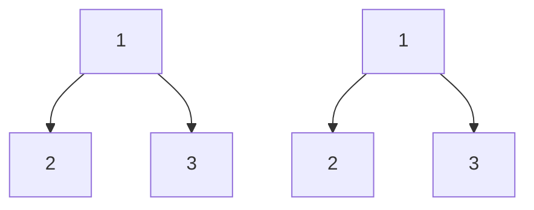

# 🔄 The Recursive Approach: Elegance in Simplicity 🔄

## 🧠 Thinking Recursively

Trees have a naturally recursive structure - each subtree is itself a tree! This makes recursion a perfect fit for tree problems.

> [!NOTE]
> Recursion is a technique where a function calls itself to solve smaller instances of the same problem.

## 🧩 Breaking Down the Problem

To compare two binary trees recursively, we need to:

1. **Compare the current nodes** (roots of the current subtrees)
2. **Recursively compare the left subtrees**
3. **Recursively compare the right subtrees**

The trees are identical only if all three comparisons return true.

## 🚦 Base Cases

Every recursive solution needs base cases to prevent infinite recursion. For tree comparison, we have these base cases:

1. **Both nodes are null**: If we've reached the end of both trees simultaneously, this part is identical.
2. **One node is null, the other isn't**: The trees have different structures, so they're not identical.
3. **Values are different**: If the current nodes have different values, the trees are not identical.

## 📝 The Recursive Algorithm

Here's the recursive algorithm in pseudocode:

```
function isSameTree(p, q):
    // Base case 1: Both nodes are null
    if p is null AND q is null:
        return true
        
    // Base case 2: One node is null, the other isn't
    if p is null OR q is null:
        return false
        
    // Base case 3: Values are different
    if p.val ≠ q.val:
        return false
        
    // Recursive case: Check both subtrees
    return isSameTree(p.left, q.left) AND isSameTree(p.right, q.right)
```

## 🔍 Tracing the Algorithm

Let's trace through the algorithm with a simple example:



<details>
<summary>Step-by-step execution</summary>

1. **Call `isSameTree(A1, A2)`**
   - A1 and A2 are both non-null ✓
   - A1.val = A2.val = 1 ✓
   - Recursively call `isSameTree(B1, B2)` AND `isSameTree(C1, C2)`

2. **Call `isSameTree(B1, B2)`**
   - B1 and B2 are both non-null ✓
   - B1.val = B2.val = 2 ✓
   - Recursively call `isSameTree(null, null)` AND `isSameTree(null, null)`
     - Both return true ✓

3. **Call `isSameTree(C1, C2)`**
   - C1 and C2 are both non-null ✓
   - C1.val = C2.val = 3 ✓
   - Recursively call `isSameTree(null, null)` AND `isSameTree(null, null)`
     - Both return true ✓

4. **Result**: true AND true = true ✓
</details>

## 💻 Implementation in JavaScript

Here's how we implement the algorithm in JavaScript:

```javascript
function isSameTree(p, q) {
  // If both nodes are null, they are identical
  if (p === null && q === null) {
    return true;
  }

  // If one node is null but the other isn't, they are not identical
  if (p === null || q === null) {
    return false;
  }

  // If the values are different, they are not identical
  if (p.val !== q.val) {
    return false;
  }

  // Recursively check left and right subtrees
  return isSameTree(p.left, q.left) && isSameTree(p.right, q.right);
}
```

## ⚖️ Complexity Analysis

- **Time Complexity**: O(n), where n is the number of nodes in the tree
  - In the worst case, we need to visit every node in both trees

- **Space Complexity**: O(h), where h is the height of the tree
  - This accounts for the recursion stack
  - For a balanced tree, this would be O(log n)
  - For a skewed tree (essentially a linked list), this could be O(n)

## 🤔 Think About It

1. What happens if the trees have the same values but different structures?
2. Could we optimize this algorithm further?
3. What are the advantages of the recursive approach for this problem?

> [!TIP]
> The recursive approach is elegant and mirrors the structure of the problem, making it intuitive to understand and implement.

In the next lesson, we'll explore an alternative iterative approach to comparing binary trees. 