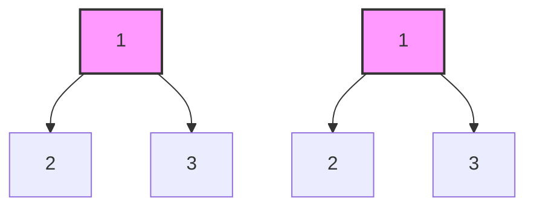
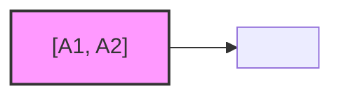
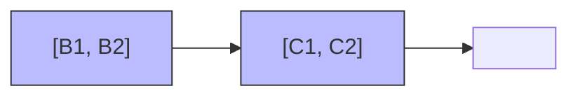
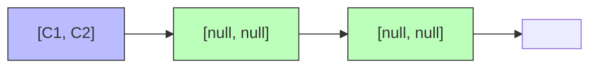
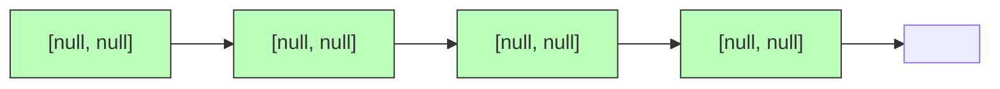

# 🔄 The Iterative Approach: Trading Elegance for Control 🔄

## 🧠 Why Consider an Iterative Approach?

While recursion is elegant for tree problems, an iterative approach offers some advantages:

1. **Avoids recursion stack overflow** for very deep trees
2. **Gives more explicit control** over the traversal process
3. **Can be more efficient** in some programming environments
4. **Easier to debug** as you can inspect the state at any point

> [!NOTE]
> The iterative approach uses a data structure (usually a queue or stack) to keep track of nodes to visit, instead of relying on the call stack.

## 🧩 The Iterative Strategy

For comparing trees iteratively, we'll use a **breadth-first search (BFS)** approach with a queue:

1. **Initialize a queue** with the root nodes of both trees
2. **Process pairs of nodes** from the queue one at a time
3. **Compare the current pair** of nodes
4. **Add child pairs** to the queue for future processing

## 📝 The Iterative Algorithm

Here's the iterative algorithm in pseudocode:

```
function isSameTree(p, q):
    // Create a queue to store pairs of nodes to compare
    queue = new Queue()
    queue.add([p, q])
    
    while queue is not empty:
        [node1, node2] = queue.remove()
        
        // If both nodes are null, continue to the next pair
        if node1 is null AND node2 is null:
            continue
            
        // If one node is null but the other isn't, they are not identical
        if node1 is null OR node2 is null:
            return false
            
        // If the values are different, they are not identical
        if node1.val ≠ node2.val:
            return false
            
        // Add the left and right children to the queue
        queue.add([node1.left, node2.left])
        queue.add([node1.right, node2.right])
    
    // If we've processed all nodes without finding differences, the trees are identical
    return true
```

## 🎬 Queue Animation: Visualizing the BFS Process

Let's visualize how the queue evolves when comparing these trees:



**Initial Queue**: `[[A1, A2]]`



**After processing [A1, A2]**:
- Compare A1.val (1) with A2.val (1) ✓
- Add children to queue



**After processing [B1, B2]**:
- Compare B1.val (2) with B2.val (2) ✓
- Add children to queue



**After processing [C1, C2]**:
- Compare C1.val (3) with C2.val (3) ✓
- Add children to queue



**Process remaining [null, null] pairs**:
- All match ✓
- Queue eventually empties
- Return true ✓

## 🔍 Visualizing the Queue

Let's visualize how the queue evolves for a simple example:


<details>
<summary>Step-by-step queue evolution</summary>

1. **Initialize queue**: `[[A1, A2]]`
2. **Process [A1, A2]**:
   - A1.val = A2.val = 1 ✓
   - Add children: `[[B1, B2], [C1, C2]]`
3. **Process [B1, B2]**:
   - B1.val = B2.val = 2 ✓
   - Add children: `[[C1, C2], [null, null], [null, null]]`
4. **Process [C1, C2]**:
   - C1.val = C2.val = 3 ✓
   - Add children: `[[null, null], [null, null], [null, null], [null, null]]`
5. **Process remaining pairs**:
   - All are [null, null], which are equal ✓
6. **Queue empty**: Return true ✓
</details>

## 💻 Implementation in JavaScript

Here's how we implement the algorithm in JavaScript:

```javascript
function isSameTree(p, q) {
  // Create a queue to store pairs of nodes to compare
  const queue = [[p, q]];

  while (queue.length > 0) {
    const [node1, node2] = queue.shift();

    // If both nodes are null, continue to the next pair
    if (node1 === null && node2 === null) {
      continue;
    }

    // If one node is null but the other isn't, they are not identical
    if (node1 === null || node2 === null) {
      return false;
    }

    // If the values are different, they are not identical
    if (node1.val !== node2.val) {
      return false;
    }

    // Add the left and right children to the queue
    queue.push([node1.left, node2.left]);
    queue.push([node1.right, node2.right]);
  }

  // If we've processed all nodes without finding differences, the trees are identical
  return true;
}
```

## 🔄 Alternative: Stack-Based DFS Approach

We can also use a stack for a depth-first traversal approach:

```javascript
function isSameTreeDFS(p, q) {
  // Create a stack to store pairs of nodes to compare
  const stack = [[p, q]];
  
  while (stack.length > 0) {
    const [node1, node2] = stack.pop(); // Use pop() instead of shift()
    
    // If both nodes are null, continue to the next pair
    if (node1 === null && node2 === null) {
      continue;
    }
    
    // If one node is null but the other isn't, they are not identical
    if (node1 === null || node2 === null) {
      return false;
    }
    
    // If the values are different, they are not identical
    if (node1.val !== node2.val) {
      return false;
    }
    
    // Add children to the stack (right first so left is processed first)
    stack.push([node1.right, node2.right]);
    stack.push([node1.left, node2.left]);
  }
  
  return true;
}
```

This approach will traverse the trees in a different order (depth-first) but still correctly determine if they are identical.

## ⚖️ Complexity Analysis

- **Time Complexity**: O(n), where n is the number of nodes in the tree
  - We still need to visit every node in both trees
  - The time complexity is the same as the recursive approach

- **Space Complexity**: O(w), where w is the maximum width of the tree
  - For the queue-based BFS approach, this is the maximum number of nodes at any level
  - In the worst case, this could be O(n) for a complete binary tree at its widest level
  - For a balanced binary tree, the maximum width is n/2 at the leaf level, which is still O(n)
  - For the stack-based DFS approach, the space complexity is O(h), similar to the recursive approach

## 🔄 Recursive vs. Iterative: A Comprehensive Comparison

| Aspect | Recursive Approach | Iterative Approach (BFS) | Iterative Approach (DFS) |
|--------|-------------------|-------------------|-------------------|
| Code Simplicity | ✅ Simpler, more elegant | ❌ More verbose | ❌ More verbose |
| Memory Usage | ❌ Call stack can overflow for deep trees | ⚠️ Uses more memory for wide trees | ✅ Similar to recursive but explicit control |
| Performance | ⚖️ Depends on language and compiler | ⚖️ Depends on language and compiler | ⚖️ Depends on language and compiler |
| Traversal Order | Depth-first | Breadth-first | Depth-first |
| Readability | ✅ Mirrors the problem structure | ❌ Less intuitive for tree problems | ⚖️ Somewhat intuitive |
| Control Flow | ❌ Implicit (managed by call stack) | ✅ Explicit (managed by queue) | ✅ Explicit (managed by stack) |
| Debugging | ❌ Harder to debug recursive calls | ✅ Easier to inspect queue state | ✅ Easier to inspect stack state |
| Early Termination | ✅ Returns as soon as difference found | ✅ Returns as soon as difference found | ✅ Returns as soon as difference found |

## 🧪 When to Choose Each Approach

- **Choose Recursive** when:
  - The tree is not very deep
  - Code readability is a priority
  - The problem naturally fits recursion

- **Choose Iterative BFS** when:
  - You want to process nodes level by level
  - The tree might be very deep but not very wide
  - You need more explicit control over the traversal

- **Choose Iterative DFS** when:
  - You want depth-first behavior but are concerned about stack overflow
  - You need explicit control while maintaining DFS order
  - You want to avoid recursion while keeping similar traversal order

## 🤔 Think About It

1. In what scenarios might you prefer the iterative approach over the recursive one?
2. Could we use a stack instead of a queue? How would that change the traversal order?
3. How would you modify the iterative approach to use less memory?
4. For very large trees, which approach would you choose and why?

> [!TIP]
> The choice between recursive and iterative approaches often depends on the specific constraints of your environment and the characteristics of your input data.

In the next lesson, we'll explore edge cases and optimizations for the binary tree comparison algorithm. 