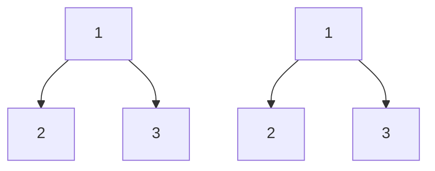

# 🔄 The Iterative Approach: Trading Elegance for Control 🔄

## 🧠 Why Consider an Iterative Approach?

While recursion is elegant for tree problems, an iterative approach offers some advantages:

1. **Avoids recursion stack overflow** for very deep trees
2. **Gives more explicit control** over the traversal process
3. **Can be more efficient** in some programming environments

> [!NOTE]
> The iterative approach uses a data structure (usually a queue or stack) to keep track of nodes to visit, instead of relying on the call stack.

## 🧩 The Iterative Strategy

For comparing trees iteratively, we'll use a **breadth-first search (BFS)** approach with a queue:

1. **Initialize a queue** with the root nodes of both trees
2. **Process pairs of nodes** from the queue one at a time
3. **Compare the current pair** of nodes
4. **Add child pairs** to the queue for future processing

## 📝 The Iterative Algorithm

Here's the iterative algorithm in pseudocode:

```
function isSameTree(p, q):
    // Create a queue to store pairs of nodes to compare
    queue = new Queue()
    queue.add([p, q])
    
    while queue is not empty:
        [node1, node2] = queue.remove()
        
        // If both nodes are null, continue to the next pair
        if node1 is null AND node2 is null:
            continue
            
        // If one node is null but the other isn't, they are not identical
        if node1 is null OR node2 is null:
            return false
            
        // If the values are different, they are not identical
        if node1.val ≠ node2.val:
            return false
            
        // Add the left and right children to the queue
        queue.add([node1.left, node2.left])
        queue.add([node1.right, node2.right])
    
    // If we've processed all nodes without finding differences, the trees are identical
    return true
```

## 🔍 Visualizing the Queue

Let's visualize how the queue evolves for a simple example:



<details>
<summary>Step-by-step queue evolution</summary>

1. **Initialize queue**: `[[A1, A2]]`
2. **Process [A1, A2]**:
   - A1.val = A2.val = 1 ✓
   - Add children: `[[B1, B2], [C1, C2]]`
3. **Process [B1, B2]**:
   - B1.val = B2.val = 2 ✓
   - Add children: `[[C1, C2], [null, null], [null, null]]`
4. **Process [C1, C2]**:
   - C1.val = C2.val = 3 ✓
   - Add children: `[[null, null], [null, null], [null, null], [null, null]]`
5. **Process remaining pairs**:
   - All are [null, null], which are equal ✓
6. **Queue empty**: Return true ✓
</details>

## 💻 Implementation in JavaScript

Here's how we implement the algorithm in JavaScript:

```javascript
function isSameTree(p, q) {
  // Create a queue to store pairs of nodes to compare
  const queue = [[p, q]];

  while (queue.length > 0) {
    const [node1, node2] = queue.shift();

    // If both nodes are null, continue to the next pair
    if (node1 === null && node2 === null) {
      continue;
    }

    // If one node is null but the other isn't, they are not identical
    if (node1 === null || node2 === null) {
      return false;
    }

    // If the values are different, they are not identical
    if (node1.val !== node2.val) {
      return false;
    }

    // Add the left and right children to the queue
    queue.push([node1.left, node2.left]);
    queue.push([node1.right, node2.right]);
  }

  // If we've processed all nodes without finding differences, the trees are identical
  return true;
}
```

## ⚖️ Complexity Analysis

- **Time Complexity**: O(n), where n is the number of nodes in the tree
  - We still need to visit every node in both trees

- **Space Complexity**: O(w), where w is the maximum width of the tree
  - In the worst case, this could be O(n) for a complete binary tree
  - For a balanced binary tree, the maximum width is n/2 at the leaf level, which is still O(n)

## 🔄 Recursive vs. Iterative: A Comparison

| Aspect | Recursive Approach | Iterative Approach |
|--------|-------------------|-------------------|
| Code Simplicity | ✅ Simpler, more elegant | ❌ More verbose |
| Memory Usage | ❌ Call stack can overflow for deep trees | ✅ Controlled memory usage |
| Performance | ⚖️ Depends on language and compiler | ⚖️ Depends on language and compiler |
| Readability | ✅ Mirrors the problem structure | ❌ Less intuitive for tree problems |
| Control Flow | ❌ Implicit (managed by call stack) | ✅ Explicit (managed by queue) |

## 🤔 Think About It

1. In what scenarios might you prefer the iterative approach over the recursive one?
2. Could we use a stack instead of a queue? How would that change the traversal order?
3. How would you modify the iterative approach to use less memory?

> [!TIP]
> The choice between recursive and iterative approaches often depends on the specific constraints of your environment and the characteristics of your input data.

In the next lesson, we'll explore edge cases and optimizations for the binary tree comparison algorithm. 